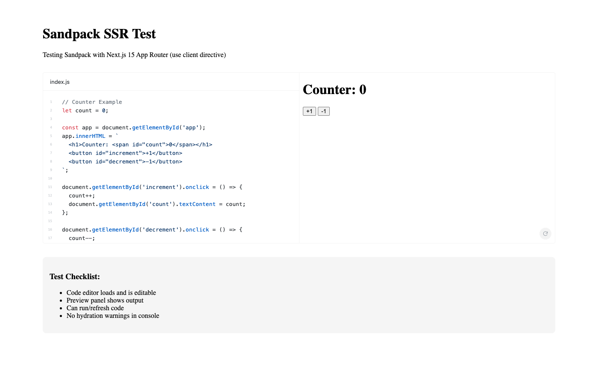

# POC T009: Sandpack SSR Compatibility Results

## Verdict: VALIDATED

Sandpack works with Next.js 15 App Router when using the `"use client"` directive. No SSR errors, no hydration warnings, and all interactive features function correctly.

## Summary

| Aspect | Result |
|--------|--------|
| SSR Build | Passes without errors |
| Hydration | No warnings in browser console |
| Code Editor | Renders and is editable |
| Preview Panel | Shows live output |
| Refresh Button | Works correctly |
| Bundle Size | 216 kB for Sandpack page |

## Test Environment

- **Next.js Version**: 15.5.9
- **Sandpack Version**: @codesandbox/sandpack-react ^2.20.0
- **React Version**: 18.3.1
- **Node.js**: 24.11.0

## Approach Used

Sandpack components were wrapped with `"use client"` directive at the page level:

```tsx
"use client";

import {
  SandpackProvider,
  SandpackLayout,
  SandpackCodeEditor,
  SandpackPreview,
} from "@codesandbox/sandpack-react";
```

This approach:
- Compiles successfully during `next build`
- Renders correct HTML during SSR (code is visible in initial HTML)
- Hydrates without warnings
- All interactive features work after hydration

## Build Output

```
Route (app)                                 Size  First Load JS
├ ○ /sandpack-test                        216 kB         318 kB

○  (Static)  prerendered as static content
```

Key observations:
- Build completes with `Compiled successfully`
- Page is prerendered as static content
- Bundle includes Sandpack at 216 kB
- No SSR-related errors during build

## Browser Console

**Hydration Warnings**: None detected

The browser console was monitored during page load and hydration. No React hydration mismatch warnings were observed.

## Interactive Features Verified

1. **Code Editor**:
   - Renders with syntax highlighting
   - Line numbers visible
   - Tab shows current file (index.js)
   - Clickable and focusable

2. **Preview Panel**:
   - Renders iframe with live preview
   - Shows Counter app with +1/-1 buttons
   - Updates when code changes

3. **Refresh Button**:
   - Visible in preview panel
   - Clickable and refreshes the preview

## Screenshot



## Workarounds Required

**None required for basic usage.**

The only requirement is using `"use client"` directive, which is standard practice for interactive components in Next.js App Router.

### Note on ESLint

There was an ESLint configuration conflict with the parent Docs repo that caused a warning during build:
```
ESLint: Converting circular structure to JSON
```

This is not related to Sandpack - it's due to conflicting ESLint configs between the poc-nextjs folder and the parent Docs repo. In a real migration, this would be resolved by proper ESLint configuration.

## Comparison with Known Issues

The [GitHub issue #1093](https://github.com/codesandbox/sandpack/issues/1093) mentioned SSR problems with App Router. Based on this POC:

- **Issue Status**: Appears to be resolved in current Sandpack version (2.20.0)
- **No `dynamic(() => import(...), { ssr: false })` needed**
- Standard `"use client"` directive is sufficient

## Recommendations

1. **Proceed with Next.js migration** - Sandpack is compatible
2. **Use `"use client"` directive** on pages/components containing Sandpack
3. **Monitor bundle size** - Sandpack adds ~216KB to page bundle
4. **Test with actual Docs examples** - This POC used a simple counter; test with Ably SDK examples

## Files Created

```
poc-nextjs/
├── app/
│   ├── layout.tsx
│   ├── page.tsx
│   └── sandpack-test/
│       └── page.tsx          # Main test page with Sandpack
├── package.json
├── tsconfig.json
├── next.config.js
├── build_output.txt
└── sandpack-working.png      # Screenshot of working Sandpack
```
