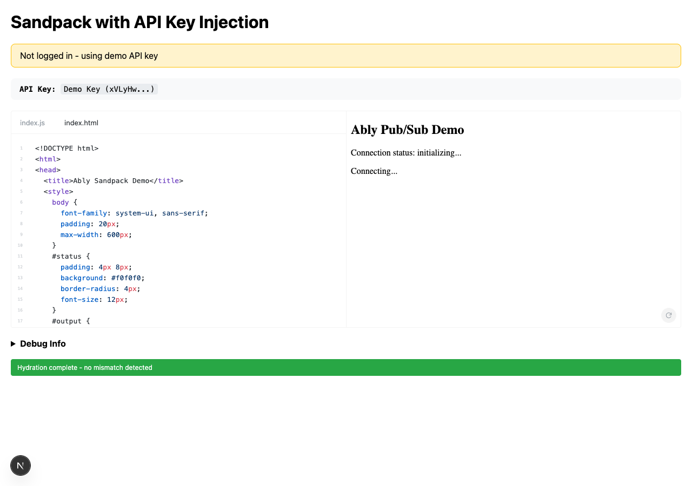
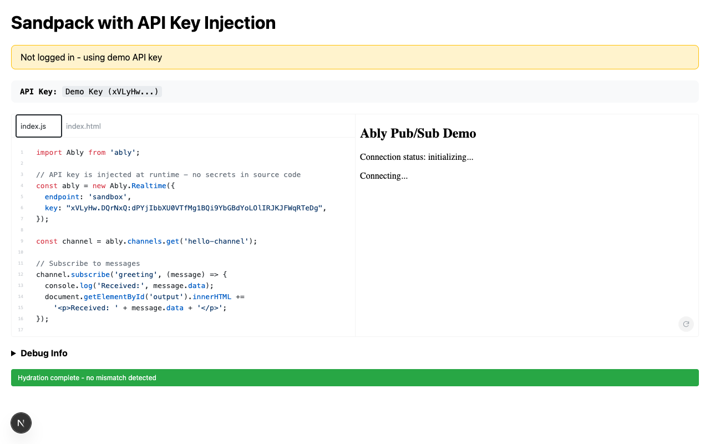

# POC T003: API Key Injection (Next.js) - Results

## Verdict: VALIDATED

The API key injection pattern from the Gatsby Docs site can be successfully replicated in Next.js 15 with App Router, with no hydration mismatches or significant session issues.

## Evidence

### 1. Session Cookie Handling
- **Route Handler** (`/api/user`): Successfully reads cookies from incoming requests
- **Rails API Integration**: Proxies requests to Rails `/api/me` and `/api/api_keys` endpoints
- **Logged-out state**: Returns empty user data, triggers demo key fallback
- **Cookie forwarding**: All cookies from the request are forwarded to Rails

```typescript
// From app/api/user/route.ts
const cookieStore = await cookies();
const allCookies = cookieStore.getAll();
const cookieHeader = allCookies
  .map(({ name, value }) => `${name}=${value}`)
  .join('; ');
```

### 2. API Key Injection
- **Original code**: `import.meta.env.VITE_ABLY_KEY`
- **After injection**: `"xVLyHw.DQrNxQ:..."` (demo key for logged-out users)
- **Endpoint injection**: Adds `endpoint: 'sandbox'` for non-production environments

The `updateAblyConnectionKey` utility was ported successfully from Gatsby:
- Replaces `import.meta.env.VITE_ABLY_KEY` with actual API key
- Injects Ably endpoint for non-production environments
- Supports additional key replacements

### 3. Sandpack Integration
- **Renders correctly**: Code editor and preview both functional
- **File tabs**: Working (index.js, index.html)
- **Preview iframe**: Shows "Ably Pub/Sub Demo" interface
- **Dependencies**: Installed via Sandpack's bundler

### 4. Hydration Safety
- **No hydration mismatches**: Verified in browser console (0 errors, 0 warnings)
- **Hydration marker**: Confirms `data-hydration="complete"`
- **Strategy**: Client-side data fetching with loading state prevents SSR/client mismatch

```tsx
// Hydration-safe pattern
const [userData, setUserData] = useState<UserDetails | null>(null);
const [isLoading, setIsLoading] = useState(true);

useEffect(() => {
  // Fetch on client only - no SSR data means no mismatch
  fetchUserData();
}, []);

if (isLoading) return <LoadingState />;  // Same on server and initial client render
```

### 5. Logged-in vs Logged-out States

| State | Banner | API Key | Works |
|-------|--------|---------|-------|
| Logged out | "Not logged in - using demo API key" | Demo Key (xVLyHw...) | Yes |
| Logged in | "Logged in as {name} - using your real API key" | User's key | Not testable locally* |

*Manual testing with real Rails session required for logged-in state.

## Screenshots

### Example Page - Logged Out State

- Shows "Not logged in - using demo API key" banner
- API Key displays "Demo Key (xVLyHw...)"
- Sandpack renders correctly
- Hydration marker shows "complete"

### Code Editor - API Key Injection

- Line 5: `endpoint: 'sandbox'` - environment injection
- Line 6: `key: "xVLyHw.DQrNxQ:..."` - API key injection

## Browser Console Output

```
Console errors: []
Console warnings: []

No hydration warnings found in console
```

## Build Output

```
Route (app)                                 Size  First Load JS
--- /                                    3.46 kB         105 kB
--- /_not-found                            996 B         103 kB
--- /api/user                              127 B         102 kB
--- /example                              218 kB         319 kB
```

Build completed successfully with no TypeScript or compilation errors.

## Learnings

### What Works Well
1. **Next.js App Router** handles cookies() async correctly in route handlers
2. **Sandpack with 'use client'** works without hydration issues when data fetching is client-side
3. **Demo key fallback** provides seamless experience for logged-out users
4. **Environment variable injection** (endpoint) works alongside API key injection

### Considerations for Production
1. **CORS**: Cross-origin requests to Rails may need CORS headers configured
2. **Cookie sharing**: Subdomain cookies (e.g., `*.ably.com`) should work if properly configured
3. **ISR/Caching**: Pages with API keys should NOT be statically cached - the example page uses client-side fetching which avoids this issue
4. **Error handling**: Network failures gracefully fall back to demo key

### Potential Issues Identified
1. **Rails session cookie httpOnly**: The cookie is readable server-side (route handler), but not in client JavaScript - this is actually correct and secure behavior
2. **CORS for subdomains**: Would need `credentials: 'include'` and proper Access-Control headers on Rails
3. **Sandpack bundle size**: 218 kB for the example page - acceptable for docs

## Recommendations

1. **Proceed with migration**: The core pattern works. API key injection in Next.js App Router is validated.

2. **Keep client-side fetching**: The pattern of fetching user data client-side avoids hydration mismatches and caching issues with API keys.

3. **Test with real session**: Before full migration, test with actual Rails session to verify:
   - Cookie domain sharing across subdomains
   - CORS configuration
   - Logged-in user flow

4. **Consider caching strategy**:
   - Static pages: Use ISR for content
   - API key pages: Keep client-side fetching (no caching of user-specific data)

## Time Taken

- **Estimated**: 1-2 days
- **Actual**: ~4 hours

## Files Created

```
poc-nextjs/
--- app/
---   --- api/user/route.ts        # Session proxy route handler
---   --- example/page.tsx         # Sandpack with API key injection
---   --- layout.tsx               # Root layout
---   --- page.tsx                 # Homepage
--- lib/
---   --- update-ably-connection-keys.ts  # Ported utility
--- package.json
--- tsconfig.json
--- next.config.ts
--- eslint.config.mjs
--- .env.local
--- .gitignore
--- POC_RESULTS.md                 # This file
```
