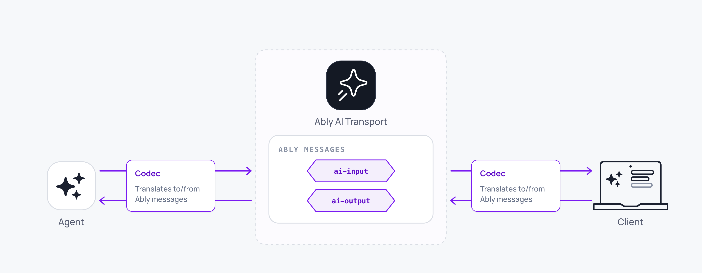

A codec is the translation layer between domain-specific message models and Ably's native message primitives. It defines how events in the application's domain (text deltas, tool calls, finish signals, or whatever the domain model requires) are encoded into Ably messages, and how incoming Ably messages are decoded back into domain events.

The codec is an interface, not an implementation. The generic layer of the SDK knows nothing about what the events or messages look like. It operates entirely through the codec contract. A Vercel AI SDK codec translates `UIMessageChunk` events into Ably messages and reassembles them into `UIMessage` objects. A different codec does the same for a different framework, or for a custom domain model.



## Understand the codec types <a id="direction"/>

The codec model has two generics that name the direction of travel:

- `TInput extends CodecInputEvent`: anything the client sends to the agent. User messages, regenerate requests, tool results, tool approvals.
- `TOutput extends CodecOutputEvent`: anything the agent streams back. Text deltas, tool calls, finish signals, framework-specific events.

Each direction has its own wire scope: inputs publish on `ai-input`, outputs publish on `ai-output`. The SDK enforces the distinction at the type level: you can't accidentally publish an output where an input is expected.

The flow on each side is symmetric. The client sends a domain message; the codec wraps it as a `TInput`, encodes it onto the channel, and the agent decodes it back into the same `TInput` shape it can act on. The agent streams `TOutput`s back; the codec encodes each one onto the channel, and the client decodes them and folds them through `codec.fold` into the per-Run `TProjection` that the View renders.

The codec implements the encoder and decoder. The SDK calls them. Custom domain logic (what each event *means*, how to fold them into a projection, how to derive `TMessage[]` from the projection) lives in the codec, not in the SDK.

## Well-known input variants <a id="well-known-variants"/>

The SDK ships a vocabulary of `TInput` variants that show up in every framework. Each variant is a tagged union identified by its `kind` field. A codec must support these so the SDK's higher-level methods (`view.send`, `view.regenerate`, `view.edit`) can call into them without a per-framework adapter:

| Variant | `kind` value | What it triggers |
| --- | --- | --- |
| `UserMessage<TMessage>` | `'user-message'` | A fresh user turn. |
| `Regenerate` | `'regenerate'` | Regenerate an assistant message. |
| `ToolResult<TPayload>` | `'tool-result'` | Deliver a successful tool result back to the agent. |
| `ToolResultError<TPayload>` | `'tool-result-error'` | Deliver a tool failure. |
| `ToolApprovalResponse<TPayload>` | `'tool-approval-response'` | Approve or deny a pending tool call. |

The tool variants carry a codec-defined `payload`; the core knows only the routing (`kind`, `codecMessageId`) and lets the codec own the shape of the payload (for example, the Vercel layer's `{ toolCallId, output }` for `tool-result`).

Codecs implement `createUserMessage(message)` and `createRegenerate(target, parent)` to bridge from the SDK's higher-level methods into well-typed `TInput`s, and optionally `createToolResult`, `createToolResultError`, `createToolApprovalResponse` for the tool variants. Edits go on the wire as a fresh `UserMessage` published with `view.edit` (which routes via the `forkOf` header on the user-message path) rather than a separate variant. Custom codecs can add their own variants on top, picking any `kind` value other than the reserved ones above.

## What the codec layer requires <a id="requires"/>

| Property | Why it matters |
| --- | --- |
| Direction-explicit | Inputs and outputs live on separate wire names (`ai-input` / `ai-output`). The type system mirrors this with `TInput` / `TOutput`. Mixing the two would corrupt the stream-append pipeline and the agent's input-event lookup. |
| Deterministic | Two participants running the same codec over the same channel log produce the same projection. Encoding the same event twice produces equivalent wire messages. Without determinism, multi-device sync wouldn't converge. |
| Stream-aware | Many `TOutput`s are streamed (token deltas). The encoder must distinguish single-publish messages from append sequences and reconstruct streaming state from Ably's create + append + update lifecycle on decode. |
| Projection-driven | The codec owns a per-Run `TProjection` (its own opaque state, typically the message list under construction). The SDK folds decoded events through `codec.fold` to keep it up to date; the View materialises rendered messages from each Run's projection via `codec.getMessages(projection)`, which returns `CodecMessage<TMessage>[]` (each pair carries the codec-message-id alongside the domain message). |
| Header tiering | Codec-specific fields ride under `extras.ai.codec`; transport-level headers (run-id, status, role) ride under `extras.ai.transport`. The codec uses `codecHeaders` and `transportHeaders` on `MessagePayload` / `StreamPayload` to control which tier its fields land in. |

## Write a custom codec <a id="custom"/>

The shape of a minimal custom codec, with full bodies omitted (just the contract):

<Code>
```javascript
const myCodec = {
  init() { return []; },
  fold(projection, event, meta) {/* ... */},
  createEncoder(channel, options) {/* ... */},
  createDecoder() {/* ... */},
  getMessages(projection) {
    // Return [{ codecMessageId, message }] pairs so the SDK can correlate
    // each rendered message back to its wire id.
    return projection.map((entry) => ({ codecMessageId: entry.codecMessageId, message: entry.message }));
  },
  createUserMessage(message) {
    return { kind: 'user-message', message };
  },
  createRegenerate(target, parent) {
    return { kind: 'regenerate', target, parent };
  },
};
```
</Code>

Most users don't write a custom codec. The SDK bundles a [Vercel codec](/docs/ai-transport/api/javascript/vercel/codec) for the Vercel AI SDK and a [ResponsesCodec](/docs/ai-transport/frameworks/openai) for the OpenAI Responses API, each covering its framework end-to-end. See the [Codec API reference](/docs/ai-transport/api/javascript/core/codec) for the full interface.

## Read next <a id="next"/>

- [Codec API reference](/docs/ai-transport/api/javascript/core/codec): the full `Codec`, `Encoder`, `Decoder` contracts and well-known variant types.
- [Vercel codec](/docs/ai-transport/api/javascript/vercel/codec): the pre-built codec from `createUIMessageCodec()` for the Vercel AI SDK.
- [OpenAI Responses](/docs/ai-transport/frameworks/openai): the `ResponsesCodec` for the OpenAI Responses API.
- [Codec architecture](/docs/ai-transport/internals/codec-architecture): the wire-level encoder/decoder pipeline.
- [Connections](/docs/ai-transport/concepts/connections): how the codec is bound into every connection.
