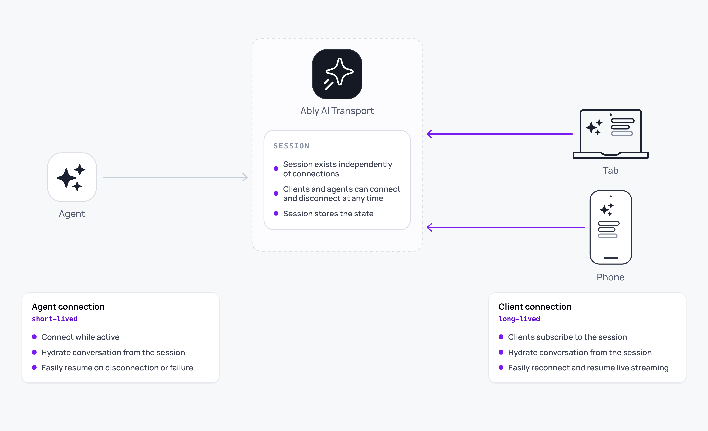

A connection handles communication between a participant and the [session](/docs/ai-transport/concepts/sessions). There are two connection types: `ClientSession` for client applications, and `AgentSession` for agent processes. Both subscribe to the channel, encode outgoing events, and decode incoming ones. A pluggable codec bridges your AI framework's events to Ably messages, so the same connection works with any framework without modification.

A connection is not the session. It is one participant's hold on the session. Multiple connections attach to the same session simultaneously, each with its own pagination and branch state, all sharing the same conversation on the channel.



## Why connections exist <a id="why-connections"/>

Multiple things need to talk to a session: a user's browser tab, the user's second device, an agent's HTTP handler, an agent's retry process after a serverless cold start. Each one needs to subscribe to the channel, decode messages through the codec, route cancels to the right [Run](/docs/ai-transport/concepts/runs), and tear down cleanly when its work is done, without disrupting the session for anyone else. The connection is the lifecycle-owning object that does all of this.

## Understand the connection types <a id="types"/>

The two connection types differ in what they own and how long they live:

| Connection | Lifetime | Owns | Doesn't own |
| --- | --- | --- | --- |
| `ClientSession` | Long-lived (the lifetime of the user's app or tab). | Channel subscription, the read path into the tree, default `view`, cancel publish path. | The channel itself, the Ably client, the conversation state. |
| `AgentSession` | Typically short-lived (one HTTP handler invocation). | Channel attach for cancel routing, the write path for Run lifecycle events and the streamed response. | Long-lived state, retry coordination across invocations. |

Both expose `connect()`, `close()`, and the SDK's lifecycle gate: methods that publish or subscribe throw `InvalidArgument` until `connect()` resolves.

## What the connection layer requires <a id="requires"/>

| Property | Why it matters |
| --- | --- |
| Lifecycle gate | `connect()` separates construction from use. Until it resolves the SDK can't guarantee the channel is attached or that publishes will be delivered. The gate prevents subtle races where a `sendMessage` lands before the subscription is in place. |
| Independence | Each connection has its own subscription, branch selections, and pagination window. A second `ClientSession` in another tab doesn't see the first one's branch state. |
| Cancel routing | Cancels are channel publishes that name a `runId`. Both `ClientSession.cancel(runId)` and the agent's `Run.abortSignal` rely on the connection being attached to the right channel. |
| Codec binding | The codec is wired into the connection at construction. Switching codecs means a new connection. |
| Clean teardown | `close()` releases the subscription and clears handlers locally. It does not end Runs on the wire. Active Runs on the channel keep running until the agent ends them. |

## Understand connection lifecycle <a id="lifecycle"/>

A connection moves through four stages. Construct it with `createClientSession` or `createAgentSession`. Call `connect()` to subscribe to the channel. Use it through `sendMessage`, `cancel`, `createView`, and `on('error')`. Tear it down with `close()`.

`connect()` is the gate. Every operation that touches the channel throws `InvalidArgument` until the connect promise resolves. `connect()` is also idempotent: subsequent calls return the same promise, useful when a component mounts twice or a retry path re-runs initialisation.

## Coexist with other participants <a id="coexist"/>

Several `ClientSession` instances can be open against the same session simultaneously. Each one independently:

- Materialises the tree from the channel (the same tree, on the wire).
- Selects its own branch via the [`view.selectSibling`](/docs/ai-transport/api/javascript/core/client-session#view) method.
- Holds its own pagination window over older Runs.

What they share is the channel-backed state. A message one client publishes lands on every other client's tree via the channel subscription. A cancel one client publishes is observed by the agent (and by every other client) through their own subscriptions.

The `AgentSession` is symmetric: an agent process can hold one short-lived `AgentSession` per HTTP invocation, or a long-lived one that serves multiple Runs. Either pattern works because the channel, not the connection, owns the conversation.

## Open a connection <a id="open"/>

A minimal client-side connection:

<Code>
```javascript
import * as Ably from 'ably';
import { createClientSession } from '@ably/ai-transport';
import { UIMessageCodec } from '@ably/ai-transport/vercel';

const ably = new Ably.Realtime({ authUrl: '/auth' });

const session = createClientSession({
  client: ably,
  channelName: 'conversation-42',
  codec: UIMessageCodec,
});

await session.connect();
// session.view, session.tree, session.cancel(...) are now safe to use
```
</Code>

The agent-side mirror. See the [AgentSession reference](/docs/ai-transport/api/javascript/core/agent-session) for the full pattern.

## Bind a codec to the connection <a id="codec"/>

A connection is bound to a codec at construction. The codec is what makes the same connection carry Vercel `UIMessage`, an OpenAI-style payload, or a custom domain shape. See the [Codecs concept](/docs/ai-transport/concepts/codecs) for the model; see the [Codec reference](/docs/ai-transport/api/javascript/core/codec) for the interface.

## Read next <a id="next"/>

- [Sessions](/docs/ai-transport/concepts/sessions): the shared conversation that connections connect to.
- [Runs](/docs/ai-transport/concepts/runs): the unit of work each connection publishes and observes.
- [Authentication](/docs/ai-transport/concepts/authentication): how each connection's Ably client gets its credentials.
- [Codecs](/docs/ai-transport/concepts/codecs): the translation layer bound into every connection.
