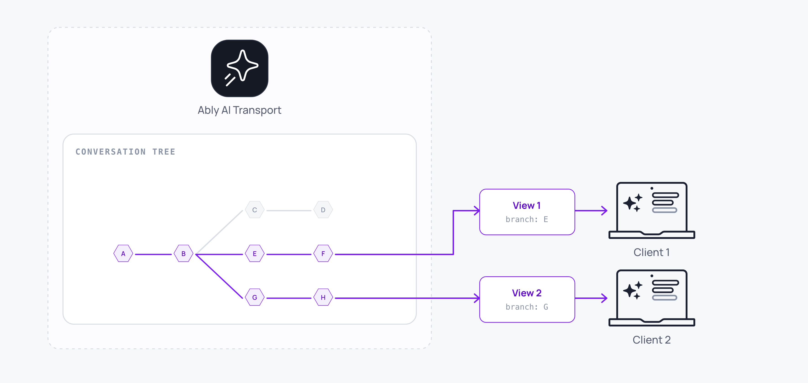

Every conversation in AI Transport is a tree of messages. Each message has a unique identity and a position in the tree, and the tree preserves every path through the conversation. Edits and regenerations create branches, so no content is ever lost.



## Understand messages <a id="messages"/>

A message is one unit of content in the conversation: a user's input, an assistant's response, a tool call, or a tool result. Each message has a unique identity and a position in the tree defined by pointers to its parent or its siblings.

A message arrives on the session either as a single publish or as a sequence of operations that share one message ID. A streamed assistant response starts with a publish and builds up through a series of appends, one per token, until a final append marks it complete. Those appends are not separate messages.

## Understand the conversation tree <a id="tree"/>

The tree holds the complete branching history of a conversation. Every message that has ever been part of the [session](/docs/ai-transport/concepts/sessions) is a node in the tree, whether it is currently visible or not.

The tree is not a linear list. When you regenerate a response, the new response becomes a sibling of the old one instead of replacing it. When you edit a message, the edited version forks from the same parent as the original, and the earlier version stays in the tree as a sibling on an alternative branch. [Conversation branching](/docs/ai-transport/features/branching) covers how to create branches and navigate between siblings.

Messages are ordered by their serial, so tree construction is deterministic. The same sequence of messages always produces the same tree, which is why two clients reading the same session agree on the shape of the conversation.

## Understand views <a id="views"/>

A view is one linear path through the tree. It selects one sibling at each branch point and produces the flat sequence of messages a client works with: the conversation as it appears in a chat UI, or the message history an agent sends to a model.

When a conversation has been regenerated three times at one point, the tree holds all three responses as siblings. The view selects one and presents the conversation as though that response is the only one, while still allowing navigation to the others.

Each view handles three jobs on top of that selection:

- Branch selection. Each client holds its own selections, so two clients looking at the same session view different branches.
- Pagination. Older messages are withheld and loaded on demand. The view tracks the boundary between visible and withheld messages and provides the means to widen the window.
- Scoped events. The view emits update and lifecycle events only for the branch it is showing, so a component subscribed to a view re-renders only when something it displays changes.

You also write through the view. Sending a message, regenerating a response, and editing a message are all operations on a view, and the view uses its current position in the tree to set the correct parent and fork pointers on whatever it publishes.

## Work with the tree and views <a id="example"/>

On the client, the session exposes a default view as a property. Iterate the visible messages on the selected branch through `getMessages()`, where each entry pairs the domain message with its codec message id:

<Code>
```javascript
// Client: read the visible messages on the selected branch.
const view = session.view;

for (const { codecMessageId, message } of view.getMessages()) {
  const text = message.parts
    .filter((p) => p.type === 'text')
    .map((p) => p.text)
    .join('');
  console.log(codecMessageId, message.role, text);
}
```
</Code>

Create additional views over the same tree with `session.createView()`.

## Read next <a id="next"/>

- [Sessions](/docs/ai-transport/concepts/sessions): the persistent, shared conversation state the tree belongs to.
- [Runs](/docs/ai-transport/concepts/runs): how agent work is structured within the session.
- [Conversation branching](/docs/ai-transport/features/branching): create branches with edit and regenerate, and navigate between them.
- [Optimistic updates](/docs/ai-transport/features/optimistic-updates): insert messages locally and reconcile them with the published tree.
- [Conversation tree internals](/docs/ai-transport/internals/conversation-tree): sibling resolution, regenerate groups, and the header pointers that build the tree.
