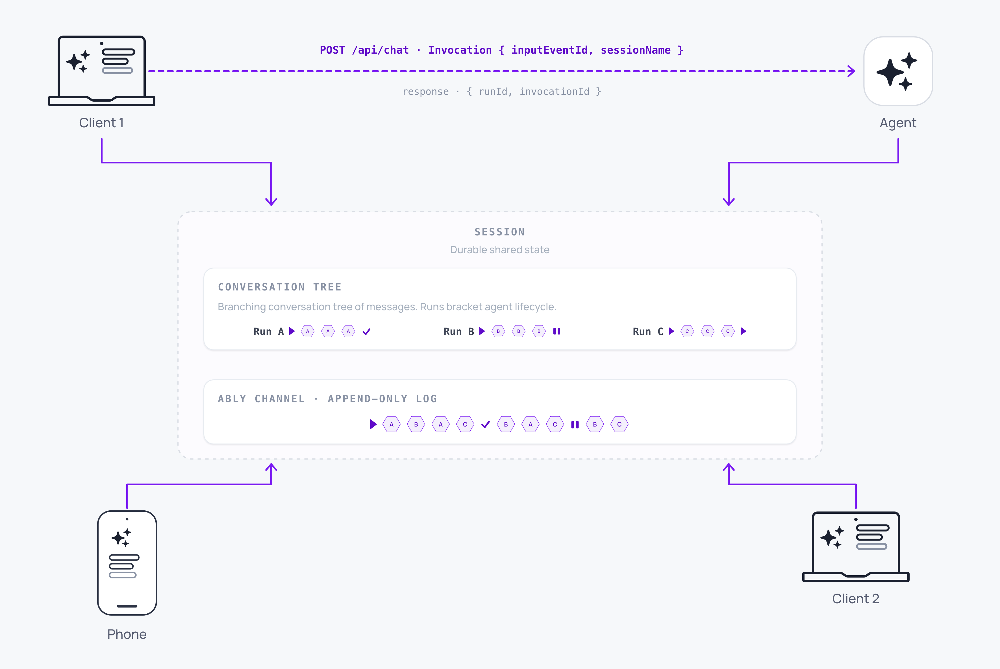

AI Transport is built around the following concepts. The session is the durable conversation, connections are how participants attach to it, the Run is one unit of agent work inside the session, the Invocation is the trigger that creates or continues a Run, the codec translates between your framework and Ably, the conversation tree organises every Run and message, and the infrastructure is the platform that holds it all together at scale.

These concepts compose. The session is the anchor: it contains the conversation tree, hosts Runs, and is read and written through connections. Connections carry codec-encoded messages over a channel. Invocations bridge the client publish and the agent's Run creation. The infrastructure is what makes any of it reliable across reconnects, regions, and load.

## The session is the state <a id="session"/>

The [session](/docs/ai-transport/concepts/sessions) is the persistent, shared state of a conversation. It exists independently of any participant: clients connect and disconnect, agents spin up and terminate, and the session endures.

Every other concept on this page operates on or within a session.

## A connection attaches to the session <a id="connection"/>

A [connection](/docs/ai-transport/concepts/connections) is one participant's hold on the session. `ClientSession` for client applications is long-lived and subscribes to the channel for the duration of the user's app. `AgentSession` for agent processes is typically short-lived and handles one HTTP invocation at a time.

Multiple connections attach to the same session simultaneously and dispose independently.

## A Run is one unit of agent work <a id="run"/>

A [Run](/docs/ai-transport/concepts/runs) is AI Transport's unit of work for one turn: one prompt-response cycle. It has an identity, a lifecycle, and an end reason. The Run is the level at which you start, observe, and cancel work.

A session contains many Runs. Runs coexist on the same session and have independent lifecycles.

## An Invocation triggers a Run <a id="invocation"/>

An [Invocation](/docs/ai-transport/concepts/invocations) is the trigger a client posts to the agent endpoint to start or continue a Run. It carries the `inputEventId` and the session name; run identity is resolved from the triggering input event on the channel.

The same Run can be triggered by many Invocations: tool results, regenerates, retries. The agent mints `runId` (for a fresh run) and a fresh `invocationId` per HTTP request, and returns both on the response so the caller can observe them.

## The codec translates between your framework and Ably <a id="codec"/>

A [codec](/docs/ai-transport/concepts/codecs) is the boundary between your domain (text deltas, tool calls, finish events for whatever framework you use) and Ably's message primitives. The codec is direction-typed: `TInput` for client-to-agent events, `TOutput` for agent-to-client events.

The SDK ships a vocabulary of well-known input variants the codec supports so the standard operations (send, regenerate, edit, tool result, tool approval) work across any framework.

## The conversation tree holds every branch <a id="conversation-tree"/>

The [conversation tree](/docs/ai-transport/concepts/conversation-tree) is how Runs and messages are organised inside the session. Every Run and every message, including every branch from an edit or regenerate, is preserved as a node in the tree.

A view is a linear path through the tree: the conversation as a participant sees it. The tree is what makes branching, edit, and regenerate work without losing history.

## Authentication runs at three layers <a id="authentication"/>

[Authentication](/docs/ai-transport/concepts/authentication) covers three concerns at once: an Ably token for channel access, HTTP headers for the agent endpoint, and a server-side hook that authorises cancel signals.

The first two are standard Ably auth; the third is specific to how AI Transport handles cancellation across participants.

## The infrastructure carries it at scale <a id="infrastructure"/>

The [infrastructure](/docs/ai-transport/concepts/infrastructure) page describes the four guarantees the session layer depends on: integrity (exactly-once, in order), reliability (multi-region, no single point of failure), performance (low latency wherever the user connects from), and availability (horizontal scale).

If you are evaluating whether the session layer will hold in production, this is the page to read.

## Read next <a id="next"/>

- [Getting started with the Vercel AI SDK](/docs/ai-transport/getting-started/vercel-ai-sdk): build a working app in a few minutes.
- [Frameworks](/docs/ai-transport/frameworks/vercel-ai-sdk-ui): see how AI Transport composes with your AI framework.
- [Features](/docs/ai-transport/features/token-streaming): browse what AI Transport does once you have a session running.
