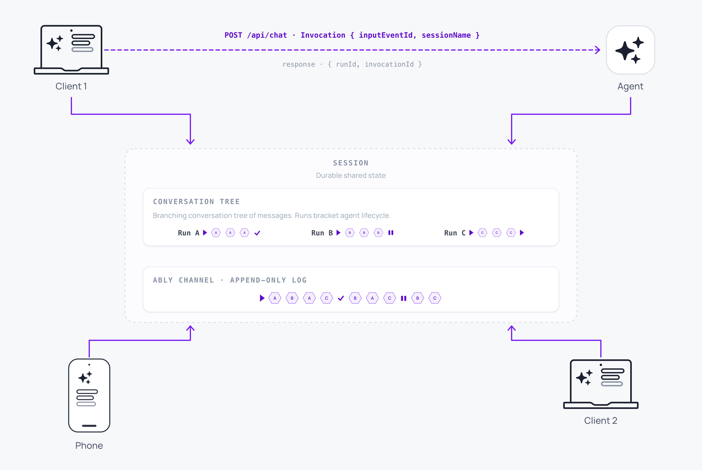

The [session](/docs/ai-transport/concepts/sessions) is the durable conversation that clients and agents attach to, and it outlives any connection. A [run](/docs/ai-transport/concepts/runs) is one turn of agent work inside a session, with its own identity, lifecycle, and end reason. The [conversation tree](/docs/ai-transport/concepts/conversation-tree) is how the session's messages are organised, which is what lets a user edit or regenerate a message without losing what came before.

<Aside data-type='note'>
You do not need this section before you start building. Pick a [getting started guide](/docs/ai-transport/getting-started/vercel-ai-sdk) and come back when you want to know why something behaves the way it does.
</Aside>

## Topics <a id="topics"/>

<Tiles>
{[
  {
    title: 'Sessions',
    description: 'The durable conversation, how it materialises from an Ably channel, and the ClientSession and AgentSession objects your code attaches with.',
    link: '/docs/ai-transport/concepts/sessions',
  },
  {
    title: 'Runs',
    description: 'One turn of agent work: its lifecycle and end reason, the invocation that triggers it, and the steps it publishes output through.',
    link: '/docs/ai-transport/concepts/runs',
  },
  {
    title: 'Conversation tree',
    description: 'How messages form a branching history, and how a view selects one linear path through it for each client.',
    link: '/docs/ai-transport/concepts/conversation-tree',
  },
]}
</Tiles>

## Read next <a id="next"/>

- [Getting started with the Vercel AI SDK](/docs/ai-transport/getting-started/vercel-ai-sdk): build a working application.
- [Why AI Transport](/docs/ai-transport/why): the problem a durable session layer solves.
- [Token streaming](/docs/ai-transport/features/token-streaming): what AI Transport does once you have a session running.
- [Internals](/docs/ai-transport/internals): the wire protocol, the codec, and the tree, for anyone building a custom codec.
