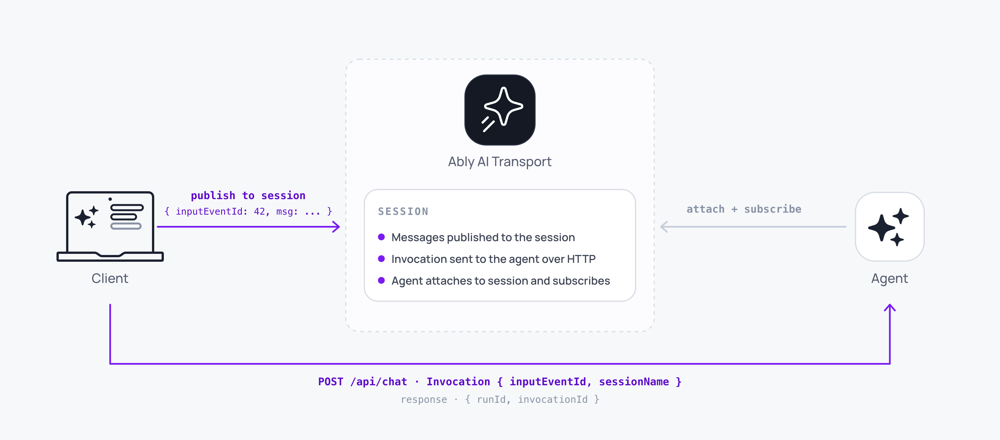

An Invocation is the trigger posted to an agent endpoint to start or continue a [Run](/docs/ai-transport/concepts/runs). It carries the input event identity and the session's channel name in the HTTP POST body so the agent can attach to the right channel and wait for the right input event.



The client SDK mints `inputEventId` (and the message's `codecMessageId`) when you call `view.sendMessage()` / `sendInput()` / `regenerate()` / `edit()` and stamps them on the channel publish. The HTTP POST is owned by your application code (or by the bundled Vercel [`ChatTransport`](/docs/ai-transport/api/javascript/vercel/chat-transport)): call `activeRun.toInvocation().toJSON()` to get the wire body and POST it to the agent. The agent mints the `runId` and `invocationId` when it creates the Run, and returns them on the HTTP response so the caller can observe them.

The same Run can be triggered more than once: a fresh send triggers a fresh Invocation; a tool result follow-up creates another; a retry after a serverless cold start creates another. Each HTTP request produces one agent-minted `invocationId`. The `runId` is fresh on the first invocation and reused on every subsequent continuation.

## Why Invocations exist <a id="why-invocations"/>

The client and the agent are separated by an unreliable network and a stateless HTTP boundary. The client publishes input on the channel and your application code posts to the agent endpoint. The agent receives the POST, possibly minutes later, and needs to know exactly which work to do:

- Which input event triggered the work, so the agent's [`Run.start`](/docs/ai-transport/api/javascript/core/agent-session#run-start) can wait for the exact event on the channel.
- Which channel, since the agent doesn't know the session's channel name except via the trigger.

These two identifiers are the Invocation's payload (`inputEventId`, `sessionName`). They're carried in the HTTP POST body so the agent has them before the channel is observable. Everything else lives on the channel: run identity is resolved from the triggering input event's wire headers (the agent mints `runId` for a fresh run, or reads the existing `runId` off the input event for a continuation). The `invocationId` is minted by the agent per HTTP request.

## The Invocation model <a id="model"/>

An `InvocationData` is the wire shape: the JSON body in the POST.

| Field | What it carries |
| --- | --- |
| `inputEventId` | The input event on the channel that triggered this invocation. The agent's `Run.start()` waits for the channel message carrying this `event-id` (rewind + live). |
| `sessionName` | The session's logical name, used as the Ably channel name. |

The `Invocation` class is the runtime view of that data. The client side uses `ActiveRun.toInvocation()` to obtain one from a returned `ActiveRun`; the agent side uses `Invocation.fromJSON(data)` to construct one from the parsed POST body, then hands it to `session.createRun(invocation, runtime?)`. `createRun` mints the `invocationId` (one per HTTP request) and, for a fresh run, the `runId`; for a continuation the agent reads the existing `runId` off the triggering input event's wire headers. The application returns `run.runId` and `run.invocationId` on the HTTP response so the caller can observe them.

End-to-end: the client publishes the input event on the channel and gets back an `ActiveRun`. The client knows `inputCodecMessageId` immediately, before the agent has minted the run; the `runId` resolves later, once the agent's `ai-run-start` event lands. The application POSTs `activeRun.toInvocation().toJSON()` to the agent endpoint. The agent rebuilds the Invocation, calls `createRun` (which mints `invocationId` and resolves `runId` either by minting for a fresh run or by reading the input event for a continuation), and `run.start()` waits for the matching input event to arrive on the channel via rewind and live. Output events the agent publishes carry the `run-id`, `invocation-id`, and `input-codec-message-id` headers; the client resolves `ActiveRun.runId` once `ai-run-start` lands. The application returns `run.runId` and `run.invocationId` on the HTTP response so the original caller can observe the agent-minted identifiers directly.

## What the Invocation layer requires <a id="requires"/>

| Property | Why it matters |
| --- | --- |
| Stable identity | The triggering input event must be addressable from both sides. The client stamps `event-id` on the channel publish, and your code posts the same `inputEventId` in the body. If they diverged, the agent's lookup would fail. |
| Deterministic generation | The client mints `inputEventId` and `codecMessageId` inside `view.sendMessage()` (and the other write methods). Defaults to `crypto.randomUUID()`; override via [`SendOptions`](/docs/ai-transport/api/javascript/core/client-session#view) for deterministic tests. The agent mints `runId` and `invocationId` per request; supply `RunRuntime.runId` / `RunRuntime.invocationId` to override in tests. |
| Idempotency | The agent endpoint may receive the same Invocation more than once (network retry, queue redelivery). The agent must treat duplicate Invocations safely, typically by checking whether the input event has already produced a Run on the channel. |
| Decoupled timing | The POST may arrive before, simultaneously with, or after the input event on the channel. The agent's `Run.start()` waits for the input event with rewind + live lookup, so the order doesn't matter. |
| Continuation support | A tool-result delivery or a regenerate produces a new Invocation; the client stamps the existing `run-id` on the new input event's wire headers when publishing. The agent's `createRun` reads that `run-id` from the input event instead of minting a fresh one, and the SDK treats it as a continuation. |

## Receive an Invocation <a id="receive"/>

The agent's HTTP handler:

<Code>
```javascript
import { Invocation } from '@ably/ai-transport';

export async function POST(req) {
  const data = await req.json();
  const invocation = Invocation.fromJSON(data);

  const session = createAgentSession({ /* ... */ });
  await session.connect();

  const run = session.createRun(invocation, { signal: req.signal });
  await run.start(); // waits for the input event with id `invocation.inputEventId`
  // ...

  return Response.json({ runId: run.runId, invocationId: run.invocationId });
}
```
</Code>

On the client, the [`view.sendMessage`](/docs/ai-transport/api/javascript/core/client-session#view) call generates the identifiers, stamps them on the channel publish, and returns the `ActiveRun`. Your application code (or the [Vercel `ChatTransport`](/docs/ai-transport/api/javascript/vercel/chat-transport) wrapper) calls `activeRun.toInvocation().toJSON()` to build the POST body and sends it to the agent endpoint.

## Read next <a id="next"/>

- [Runs](/docs/ai-transport/concepts/runs): what an Invocation creates or continues.
- [Connections](/docs/ai-transport/concepts/connections): `ClientSession` publishes the input; your code POSTs the Invocation; `AgentSession` receives the POST and creates the Run.
- [AgentSession reference](/docs/ai-transport/api/javascript/core/agent-session): `Invocation.fromJSON` and `createRun` in detail.
- [Tool calling](/docs/ai-transport/features/tool-calling): tool results produce continuation Invocations.
