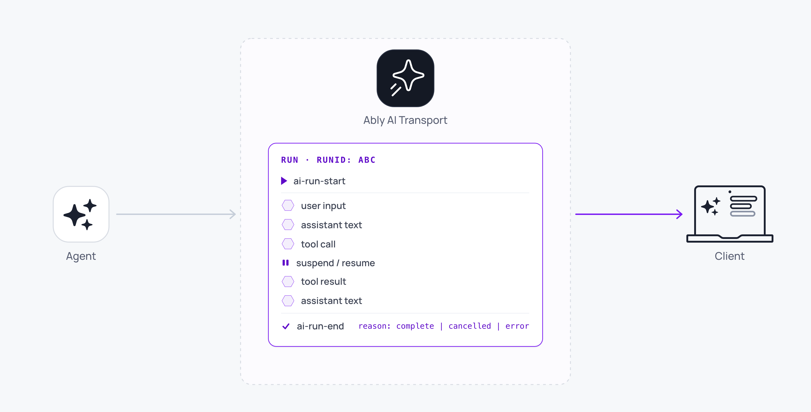

A Run is one unit of agent work, initiated in response to user intent. It encompasses everything that happens in service of that intent: the user's input, the agent's response, any tool calls the agent makes, any intermediate messages required to resolve those tool calls (approvals, tool outputs), the agent's continued work after resolution, and the final completion.

AI Transport implements each user prompt and LLM turn as a Run.



## Why Runs exist <a id="why-runs"/>

An agent's work in response to a single user prompt isn't atomic. It can involve reasoning over time, gathering external information, executing tools, and waiting for humans or other systems to respond. Across that span, multiple participants (multiple devices, multiple browser tabs, a serverless function that restarts mid-execution) need to agree on *which work is which*, *when it started*, *when it ended*, and *whether it was cancelled*. The Run is the SDK primitive that carries this identity end-to-end.

## The Run model <a id="model"/>

A Run has four invariants that the SDK enforces on every channel:

- A unique `runId`.
- A bracketing pair of lifecycle events on the channel: `ai-run-start` and `ai-run-end`.
- An owner: the `clientId` of the Ably client that published `ai-run-start`.
- A terminal `RunEndReason` once it ends: `'complete'`, `'cancelled'`, or `'error'`. (A Run that pauses awaiting input takes `RunInfo.status === 'suspended'` via `Run.suspend()`, which is non-terminal.)

Within those brackets, the Run owns a window of channel messages: the user input that triggered it, the agent's streamed outputs, any tool-call or tool-result messages. The conversation [Tree](/docs/ai-transport/concepts/conversation-tree) groups those messages into a `RunNode`; the [View](/docs/ai-transport/api/javascript/core/client-session#view) surfaces projection-free [`RunInfo`](/docs/ai-transport/api/javascript/core/client-session#view) snapshots for the UI.

A Run is triggered by an [`Invocation`](/docs/ai-transport/concepts/invocations): the trigger the client posts to the agent endpoint that says "create or continue a Run with these identifiers." The Invocation is a separate concept because the same Run can be re-triggered (a tool result, a regenerate request); each trigger is one Invocation.

## What the Run layer requires <a id="requires"/>

| Property | Why it matters |
| --- | --- |
| Stable identity | The same `runId` must be readable to every participant: the client that started the Run, every other connected client, the agent process. Without it, cancellation has no target and observation has no scope. |
| Lifecycle brackets | `ai-run-start`, `ai-run-suspend`, `ai-run-resume`, and `ai-run-end` mark the Run on the wire. A view filtering "active Runs" reads `RunInfo.status === 'active'`; `'suspended'` and the terminal `RunEndReason` values cover the other states. |
| Cancel routing | A cancel message names a `runId`. The agent's [`Run.abortSignal`](/docs/ai-transport/api/javascript/core/agent-session#run) fires only for matching cancels, so unrelated Runs on the same session continue. |
| Durable execution | An agent can restart its process mid-Run (serverless cold start, container redeploy). The Run's identity plus the channel's persistence let the new agent rehydrate via [`Run.loadConversation`](/docs/ai-transport/api/javascript/core/agent-session#load-conversation) and continue without the client noticing. |
| Multiple participants | Several clients may observe the same Run (multi-device, support handover). They all see the lifecycle events; they all hold the same `RunInfo`. |

## Understand the Run lifecycle <a id="lifecycle"/>

A Run progresses from start to terminal end. Along the way it can pause to wait for external input and be resumed when that input arrives. Each phase is reflected on `RunInfo.status`:

- `'active'` while the agent is working. Set when the Run first starts and again whenever a paused Run is resumed.
- `'suspended'` while the Run is paused awaiting input (a tool approval, a human-in-the-loop response). The Run is not over; a later trigger re-activates it.
- A terminal `RunEndReason` once the Run finishes:
  - `'complete'` is the success path.
  - `'cancelled'` is set when the Run is cancelled.
  - `'error'` is set when reasoning, output streaming, or a tool execution fails unrecoverably.

A Run is the unit of cancellation. There is no user-facing cancel below the Run level. Internal failures (a stream dying, a model call retrying, a serverless cold start) fail the *execution attempt*, not the Run; the Run stays active and the SDK retries underneath.

## Trigger a Run <a id="trigger"/>

A minimal client-side send returns an `ActiveRun` that exposes the Run's identity and a per-Run cancel. The application then POSTs `activeRun.toInvocation().toJSON()` to its agent endpoint to wake the agent; see [Invocations](/docs/ai-transport/concepts/invocations).

<Code>
```javascript
const activeRun = await session.view.sendMessage({
  id: crypto.randomUUID(),
  role: 'user',
  parts: [{ type: 'text', text: 'Plan a 3-day trip to Lisbon.' }],
});

// The agent assigns the runId on the server, so activeRun.runId is a
// Promise. Await it to read the id.
const runId = await activeRun.runId;
console.log('Run started:', runId);

// Stop button: activeRun.cancel() works immediately, even before
// the runId promise resolves.
await activeRun.cancel();
```
</Code>

On the agent side, the symmetric primitive is [`AgentSession.createRun(invocation, runtime?)`](/docs/ai-transport/api/javascript/core/agent-session#create-run). The agent mints `runId` (for a fresh run) or reads the existing `runId` off the triggering input event (for a continuation), and stamps it on every event it publishes; the client observes it via `ActiveRun.runId`.

## Run concurrent Runs <a id="concurrent"/>

A session can hold multiple Runs in flight at the same time. They share the channel; they don't share state. See [concurrent turns](/docs/ai-transport/features/concurrent-turns) for the patterns that arise when more than one Run is `'active'`.

## Read next <a id="next"/>

- [Sessions](/docs/ai-transport/concepts/sessions): the shared conversation state Runs live within.
- [Invocations](/docs/ai-transport/concepts/invocations): the trigger that creates or continues a Run.
- [Connections](/docs/ai-transport/concepts/connections): how `ClientSession` and `AgentSession` connect to a session and publish Runs.
- [Cancellation](/docs/ai-transport/features/cancellation): control who cancels Runs and how cancel signals are routed.
- [Concurrent turns](/docs/ai-transport/features/concurrent-turns): multiple Runs in flight on the same session.
