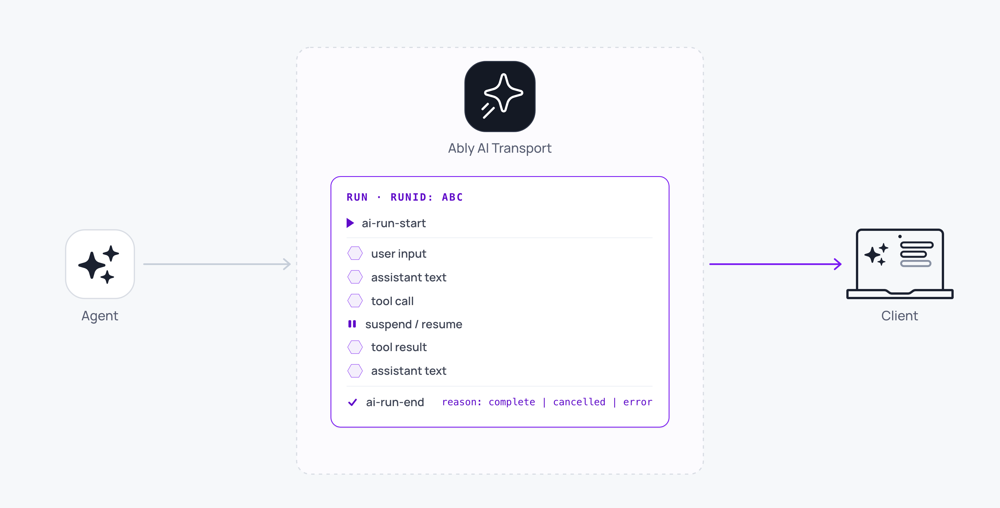

A run is one unit of agent work, started in response to something the user asked for. It covers everything that happens in service of that intent: the user's input, the agent's response, any tool calls the agent makes, the approvals and tool outputs needed to resolve them, the agent's continued work afterwards, and the final completion.



## Why runs exist <a id="why-runs"/>

An agent's work in response to a single prompt is not atomic. It reasons over time, gathers external information, executes tools, and waits for humans or other systems to reply. Across that span several parties need to agree on which work is which, when it started, when it ended, and whether it was cancelled. Those parties include the user's other devices, a second browser tab, and a serverless function that restarts mid-execution. The run is the primitive that gives them all one identity to agree on.

## Understand the run model <a id="model"/>

A run is made up of: 
- A unique `runId`. 
- A number of lifecycle events for that run, including `ai-run-start` and `ai-run-end`.
- An owner, which is the `clientId` of the Ably client that published `ai-run-start`.
- An end state, which is one of `'complete'`, `'cancelled'`, or `'error'`.

Between the lifecycle events, the run owns a series of messages on the session: the user input that triggered it, the agent's streamed output, and any tool-call or tool-result messages. The [conversation tree](/docs/ai-transport/concepts/conversation-tree) groups those messages together so the UI can render the run as one turn.

## Understand the run lifecycle <a id="lifecycle"/>

A run starts, has some content produced within it, and ends. Once a run ends, it will not be started again. But runs can be suspended while waiting for external input, and resumed when that input arrives. 
The run has a status which reflects each phase:

- `'active'` while the agent is working. The SDK sets this when the run first starts, and again whenever a suspended run resumes.
- `'suspended'` while the run waits for input, such as a tool approval or a human-in-the-loop response. The run is not over, and a later user input can reactivate it.
- A terminal `RunEndReason` once the run finishes. `'complete'` is the success path, `'cancelled'` is set when the run is cancelled, and `'error'` is set when reasoning, output streaming, or a tool execution fails unrecoverably.

The run is also the unit of user-cancellation. When a user cancels a request or a prompt, they are cancelling the whole run. Internal failures such as an LLM stream dying, a retrying model call, or a serverless cold start fail do not fail a run and can be retried.

## Read a run from either side <a id="read-model"/>

Both sides of a run expose the same read model, so the same accessor means the same thing on the client and on the agent. A client's `view.send()` returns a `ClientRun` and an agent's `createRun()` returns an `AgentRun`. Each has:

- `runId`, the run's identifier. The agent knows it synchronously. On the client it is empty until the agent's run-start is observed, so await `clientRun.started` first.
- `status`, the lifecycle status, read live off the conversation tree.
- `error`, the terminal error, present exactly when `status` is `'error'`.
- `messages`, all of the run's messages, its triggering input followed by its streamed output across any suspend and resume. This is the unit to persist, which [database hydration](/docs/ai-transport/features/database-hydration) covers.

Each side then adds its own verbs. `ClientRun` adds `started` and `cancel()`. `AgentRun` adds `located`, which resolves once the triggering input has been observed on the session, along with the lifecycle methods `start()`, `pipe()`, `suspend()`, and `end()`.

## Trigger a run with an invocation <a id="invocations"/>

Starting a run takes two steps, because the input and the trigger travel by different routes. The client publishes the user's input on the session, and your application posts to your agent endpoint to wake the agent. That POST is the invocation.

The SDK does not make the POST for you. `clientRun.toInvocation().toJSON()` gives you the body, which carries the id of the input event and the session name so the agent knows which session to attach to and which event to wait for. The bundled Vercel [`ChatTransport`](/docs/ai-transport/api/javascript/vercel/chat-transport) will make the request for you if you use it, which is part of the Vercel ChatTransport contract.

On the client, publish the input and then wake the agent:

<Code>
```javascript
// Client: publish the input, then wake the agent.
const clientRun = await session.view.send(createUIMessageCodec().createUserMessage({
  id: crypto.randomUUID(),
  role: 'user',
  parts: [{ type: 'text', text: 'Plan a 3-day trip to Lisbon.' }],
}));

await fetch('/api/chat', {
  method: 'POST',
  headers: { 'Content-Type': 'application/json' },
  body: JSON.stringify(clientRun.toInvocation().toJSON()),
});

// The agent mints the runId, so read it once run-start has been observed.
await clientRun.started;
console.log('Run started:', clientRun.runId);
```
</Code>

On the agent side, `Invocation.fromJSON(body)` rebuilds the invocation and `session.createRun(invocation)` creates the run. The session generates a `runId` for a new run, and for a continuation it reads the existing `runId` off the triggering input event. The [AgentSession reference](/docs/ai-transport/api/javascript/core/agent-session) shows the full handler.

Ordering between the two routes does not matter. `run.start()` waits until the input event has been observed, whether it arrives live or is paged in from history, so the POST can land before, with, or after the user's input is published to the session.

One run can be triggered more than once. A tool result, a regenerate request, and a retry after a serverless cold start each produce another invocation against the same `runId`. `clientRun.cancel()` works throughout, including before the run-start has been observed.

## Publish output as steps <a id="steps"/>

A run publishes its output through steps rather than writing to the session directly. A step brackets one contiguous unit of output: the tokens of one model call, the payload of one tool result, or any other burst of writes the agent code frames as a single unit. Every output message carries the id of the step it belongs to, and each step has its own `ai-step-start` and `ai-step-end` events and its own terminal reason of `'complete'`, `'failed'`, or `'cancelled'`.


Exactly one step is active on a run at a time, and the run stays open across them. A step ending is not a run ending, so the agent code decides whether to open another step, suspend, or end the run.

Steps exist so that a retry has a safe boundary. Two `ai-step-start` events under the same `stepId` are the same step re-attempting, and the later attempt supersedes the earlier one's output rather than appending beside it. That is what lets a run execute inside a workflow engine such as [Temporal](/docs/ai-transport/frameworks/temporal) or [Vercel WDK](/docs/ai-transport/frameworks/vercel-wdk), where each retryable activity publishes its own step under an id the engine keeps stable. [Durable execution](/docs/ai-transport/features/durable-execution) covers that pattern, including how a fresh process adopts a run that another process opened. But you can re-use the same steps pattern for stanard LLM model request retries even if you don't use a durable execution framework.

## Steer a run <a id="steer"/>

Steering allows a client to send a follow-up message into a run while it is still active. The message carries the active run's `runId`, so the agent adds it to the existing run and picks it up on the next loop iteration instead of starting a new run. [Interruption and steering](/docs/ai-transport/features/interruption-and-steering#steer) covers how to call it and how to write the agent's loop.

Steering allows you to change the direction of an LLM agent without invoking an entirely new agent.

## Run several runs at once <a id="concurrent"/>

A session holds multiple runs in flight at the same time. They share the session and they do not share state, and [concurrent turns](/docs/ai-transport/features/concurrent-turns) covers the patterns that arise when more than one run is active.

## Read next <a id="next"/>

- [Sessions](/docs/ai-transport/concepts/sessions): the shared conversation state that contains runs.
- [Conversation tree](/docs/ai-transport/concepts/conversation-tree): how a run's messages are organised alongside every other branch.
- [Cancellation](/docs/ai-transport/features/cancellation): control who cancels runs and how cancel signals are routed.
- [Durable execution](/docs/ai-transport/features/durable-execution): keep a run open across process boundaries and workflow-engine retries.
- [AgentSession reference](/docs/ai-transport/api/javascript/core/agent-session): `createRun`, `adoptRun`, `createStep`, and the run lifecycle methods.
