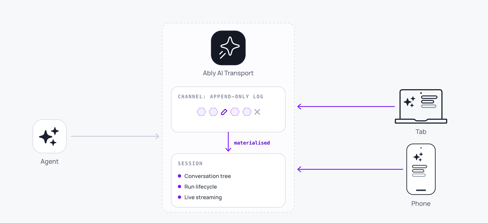

A session is the complete, persistent state of a conversation. It exists independently of any participant. Clients connect and disconnect, agents spin up and terminate, and the session endures. It is what all participants share, and it is what makes the conversation a first-class resource rather than a side effect of a connection.

The session contains the full branching [tree of messages](/docs/ai-transport/concepts/conversation-tree), the [Run lifecycle](/docs/ai-transport/concepts/runs), and any in-progress streaming state. Two participants that materialise the same session from the same data arrive at the same state.



## Understand the session and channel relationship <a id="session-and-channel"/>

A session is built on top of an Ably channel. A session is not the same thing as a channel.

The channel is an Ably realtime channel: a durable, ordered, append-only log of messages. Every event in the session passes through the channel in real time, and every connected participant receives it. Messages on the channel have a total order defined by their serial, assigned by the Ably service on publish. This ordering is deterministic: two participants reading the same log produce the same sequence.

The session is the structured, navigable conversation that those events produce. The channel is the ordered log of events; the session is the result of interpreting that log. The relationship is analogous to a database transaction log and the tables it produces. The log is the authoritative sequence of operations, and the useful state is the result of applying them.

## Materialise a session <a id="materialisation"/>

A session can be materialised from two sources.

By default, the session materialises from the Ably channel, which serves as both the live delivery layer and the historical record. When the channel retains the full history, the channel alone is sufficient and no external infrastructure is required.

Alternatively, you supply historical messages from your own database, with the channel providing only live and in-progress activity. In both cases, the session merges historical and live data into a single consistent state.

Materialisation is not a simple replay of the log. Certain events on the channel affect how prior events are interpreted. A cancel event changes how the turn is represented and an 'edit' event changes the content of a user prompt, even though those preceding messages still exist on the channel. The channel retains the full, unedited log, and the materialisation process applies these events as instructions that reshape what the session contains. The session is the result of interpreting the log.

## Understand what the session layer requires <a id="properties"/>

In direct HTTP streaming over Server-Sent Events or WebSocket, the stream is the connection. If the connection dies, the stream dies with it. A session inverts this: the session is an independently addressable resource that agents write to and clients subscribe to. Connections come and go; the session persists.

Delivering this reliably requires several specific properties:

| Property | Why it matters |
| --- | --- |
| Independently addressable | Any participant connects to the session by name. There is no requirement that the client that initiated a request is the one that receives the response. |
| Persistent | Messages outlive any single connection. An agent that crashes and restarts can resume publishing. A client that reconnects can resume consuming. The session state is not held in memory on either end. |
| Ordered and resumable | Messages have a total order. A client that disconnects mid-stream reconnects and resumes from the exact point of disconnection without replaying the entire conversation or re-invoking the agent. |
| Bidirectional | Any participant publishes to the session at any time. This is what makes cancel, steer, and multi-client interaction possible. |
| Fan-out | Multiple clients subscribe to the same session simultaneously. A second tab, a phone, or a new client joining later all receive the same ordered stream of activity. |
| Multiplexed | Multiple concurrent interactions (turns, agents, tool calls) coexist on the same session. An orchestrator agent and its sub-agents all publish independently without routing through a single bottleneck. |

These properties enable three capabilities that direct HTTP streaming does not provide:

1. Resilient delivery. Streams survive connection drops, device switches, page refreshes, and process restarts. The client resumes from a known position. The agent continues publishing regardless of client connectivity. No events are lost and no events are duplicated.
2. Continuity across surfaces. The session follows the user, not the connection. Open a second tab, switch to a phone, come back hours later. Every surface sees the same session state.
3. Live control. Any participant communicates with any other participant through the session while work is in progress. Cancel a generation from a different device. Steer an agent mid-response. Send a follow-up before the current response finishes.

A session is materialised by attaching a client session to the channel that backs it:

<Code>
```javascript
import * as Ably from 'ably';
import { createClientSession } from '@ably/ai-transport/vercel';

const ably = new Ably.Realtime({ authUrl: '/api/auth/token' });

const session = createClientSession({ client: ably, channelName: 'conversation-42' });
await session.connect();
```
</Code>

`createClientSession` from `@ably/ai-transport/vercel` is pre-bound with the Vercel codec. The core entry point at `@ably/ai-transport` exposes the same factory with `codec` required. The core SDK never POSTs; the application wakes its agent by POSTing `run.toInvocation().toJSON()` (or by using `createChatTransport`, which does it for you). See [Set up authentication](/docs/ai-transport/getting-started/authentication) for how `authUrl` is wired up.

## Share a session across participants <a id="sharing"/>

The session is the unit of sharing. When a second client joins, it joins the session. When an agent hydrates context for an LLM call, it hydrates the session. When a message is published, it is published to the session via the channel. Every participant's interaction with the conversation is mediated by the session.

No participant needs to be present for any other participant to function, and no participant's arrival or departure corrupts session state.

Agent lifecycle does not affect the session. An agent hydrates the session, processes a turn, and may terminate. The session survives because it lives on the channel (or in an external store), not in the agent's memory. A different agent instance handles the next turn with the same session state.

Clients are resilient to disconnection. A client that drops its connection loses nothing. On reconnect, the client's Ably connection resumes from the last received serial, and any messages published during the disconnection are delivered.

New participants join at any time. A second client attaching to the channel hydrates the full session from history and receives live updates going forward. No handshake or coordination is required between participants.

To see which participants are currently connected, use presence: the session channel carries Ably Presence, exposed directly as `session.presence`. See [Agent presence](/docs/ai-transport/features/agent-presence).

The session channel also carries Ably LiveObjects, exposed directly as `session.object`, for shared mutable state that the user and the agent both read and write, such as the page the user is on or a record they have selected. The agent reacts to it without polling, and the user sees the agent's own state change in real time. See [LiveObjects State](/docs/ai-transport/features/liveobjects).

## Support persistence models <a id="persistence"/>

The channel serves two distinct roles: live delivery and historical persistence. It always serves as the live delivery layer. Whether it also serves as the historical persistence layer depends on the configuration.

When channel history retention covers the session's lifetime, the channel is sufficient to hydrate the full session. No external infrastructure is required. This is the zero-configuration path.

When you store completed messages in your own database, the external store provides historical session data and the channel provides live and in-progress activity. The session is hydrated from the external store for past messages and from the channel subscription for current activity. This is appropriate when channel retention is limited, the conversation is long-lived, or you need to enrich or index conversation data in your own systems.

In both cases, the channel carries all live activity: in-progress streams, turn lifecycle events, cancel signals, and newly published messages.

## Detach or end a session <a id="detach-vs-end"/>

An `AgentSession` exposes two teardown methods. Pick the one that matches whether the current process owns the Run's terminal.

Use [`session.detach()`](/docs/ai-transport/api/javascript/core/agent-session#detach) when the Run is intentionally left open on the channel for another process to continue. It unsubscribes from cancels, aborts local abort controllers, and releases the channel without publishing any Run terminal. This is the teardown a durable-workflow activity uses between Steps so the next activity can adopt the Run.

Use [`session.end()`](/docs/ai-transport/api/javascript/core/agent-session#session-end) for the final teardown of a turn that runs in a single process, or the outermost catch of a workflow when activity retries are exhausted. It closes every still-open Run this session owns as `'cancelled'` and then detaches. A fire-and-forget turn that forgets its own `run.end()` still unsticks every observer's UI this way.

The two are not interchangeable. Calling `end()` mid-workflow marks the Run terminal, so the next activity's `adoptRun` rejects with `InvalidArgument` because the Run is read-only. See [Durable execution](/docs/ai-transport/features/durable-execution) for the full pattern.

## Read next <a id="next"/>

- [Conversation tree](/docs/ai-transport/concepts/conversation-tree): how messages form a branching conversation history.
- [Runs](/docs/ai-transport/concepts/runs): the unit of agent work within a session.
- [Connections](/docs/ai-transport/concepts/connections): how clients and agents connect to a session.
