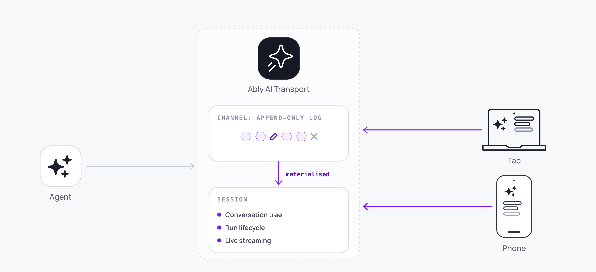

A session is the complete, persistent state of a conversation, and it exists independently of anything that connects to it. Clients connect and disconnect, agents spin up and terminate, and the session endures. Your application addresses the session by name.

The session holds the branching tree of messages, the state of any agent work in progress, and any partially streamed output. Two clients that build the same session from the same data arrive at the same state.



## Understand sessions and channels <a id="session-and-channel"/>

A session is built on top of an Ably channel, and the two are not the same thing.

The channel is a durable, ordered, append-only log of messages. Every event in the session passes through the channel in realtime, and every connected client receives it. Messages on the channel all have a total order defined by their serial, which is a unique identifier the Ably service assigns to the message on publish. Two clients reading the same log therefore produce the same sequence.

The session is the structured conversation that those events produce.

## Materialise a session <a id="materialisation"/>

A session materialises from one of two sources.

By default it materialises from the Ably channel, which serves as both the live delivery layer and the historical record. When channel history retention covers the session's lifetime, the channel alone is enough and you need no external storage or configuration.

Alternatively you supply historical messages from your own database, and the channel provides only live and in-progress activity. Use this when channel retention is shorter than the conversation, or when you need to index conversation data in your own systems. The session merges the two into one consistent state, and [database hydration](/docs/ai-transport/features/database-hydration) covers how to wire it up.

Materialisation is more than a replay of the log. Some events change how earlier events are interpreted. A cancel event changes how a run is represented, and an edit event changes the content of a user prompt, even though the original messages are still on the channel. The channel keeps the full unedited log, and materialisation applies these events as instructions that reshape what the session contains.

## Understand what a session depends on <a id="requires"/>

In direct HTTP streaming over Server-Sent Events or a WebSocket, the stream is the connection, so the stream dies when the connection dies. A session is an independently addressable resource that agents write to and clients subscribe to, and it outlives the connections attached to it.

Delivering that reliably depends on five properties of the channel underneath:

| Property | Why it matters |
| --- | --- |
| Persistent | Messages outlive any single connection. An agent that restarts resumes publishing and a client that reconnects resumes consuming, because neither end holds the session state in memory. |
| Ordered and resumable | Messages have a total order. A client that drops mid-stream reconnects and resumes from the exact point of disconnection without replaying the conversation or re-invoking the agent. |
| Bidirectional | Any client publishes to the session at any time. This is what makes cancel, steering, and multi-client interaction possible. |
| Fan-out | Several clients subscribe to the same session at once. A second tab, a phone, or a client joining an hour later all receive the same ordered stream of activity. |
| Multiplexed | Several concurrent [runs](/docs/ai-transport/concepts/runs) coexist on one session. An orchestrating agent and its sub-agents publish independently without routing through a single bottleneck. |

## Connect to a session <a id="connect"/>

Your code reaches a session through a session object, either `ClientSession` or `AgentSession`. 
- `ClientSession` runs in the browser for as long as the user's tab is open, subscribes to the channel, and publishes user input and cancel signals. 
- `AgentSession` usually runs for one HTTP handler invocation, and it publishes the run lifecycle events and the streamed response.

Neither object owns the conversation. Each one is a connection to a session that lives on the channel, so several agents or clients can connect and disconnect to the same session at once and independently.

Both are constructed and then connected, as this client-side example shows:

<Code>
```javascript
import * as Ably from 'ably';
import { createClientSession } from '@ably/ai-transport';
import { createUIMessageCodec } from '@ably/ai-transport/vercel';

const ably = new Ably.Realtime({ authUrl: '/auth' });

const session = createClientSession({
  client: ably,
  channelName: 'conversation-42',
  codec: createUIMessageCodec(),
});

await session.connect();
// session.view, session.tree, and session.cancel(...) are now safe to use.
```
</Code>

Every operation that touches the channel throws `InvalidArgument` until the connect promise resolves, which stops a `view.send` landing before the subscription is in place. `connect()` is also idempotent, so a component that mounts twice gets the same promise back. Tear a client down with `close()` and an agent with `end()`. An agent that hands an in-flight run to another process uses `detach()` instead, which [durable execution](/docs/ai-transport/features/durable-execution#close-once) covers.

The `codec` argument is the translation layer between your framework's events and Ably messages. The Vercel codec is bundled, and `createClientSession` imported from `@ably/ai-transport/vercel` comes pre-bound with it, so you can leave the argument out. Writing your own is covered in [codec architecture](/docs/ai-transport/internals/codec-architecture).

## Share a session across participants <a id="sharing"/>

The session is the unit of sharing. A second client joins the session, an agent hydrates the session to build context for a model call, and every published message goes to the session. No client needs to be present for any other to work, and no arrival or departure corrupts the state.

Agent lifecycle does not affect the session. An agent hydrates the session, works through a run, and terminates. The session survives because it lives on the channel rather than in the agent's memory, so a different agent instance handles the next run with the same state. Clients are equally resilient. A client that drops its connection loses nothing, because on reconnect the Ably connection resumes from the last received serial and any messages published during the gap are delivered.

New clients join at any time. A second client attaching to the channel hydrates the full session from history and receives live updates from then on, with no handshake between clients.

The session channel carries two Ably features directly. [Presence](/docs/ai-transport/features/agent-presence) is exposed as `session.presence` and tells you which participants are currently connected. [LiveObjects](/docs/ai-transport/features/liveobjects) is exposed as `session.object` and holds shared mutable state that the user and the agent both read and write, such as the record the user has selected. The agent reacts to it without polling, and the user sees the agent's changes in realtime.

## Read next <a id="next"/>

- [Runs](/docs/ai-transport/concepts/runs): the unit of agent work inside a session.
- [Conversation tree](/docs/ai-transport/concepts/conversation-tree): how the session's messages form a branching history.
- [Multi-device sessions](/docs/ai-transport/features/multi-device): one session across a laptop, a phone, and a second tab.
- [ClientSession reference](/docs/ai-transport/api/javascript/core/client-session): every client-side method and property.
- [AgentSession reference](/docs/ai-transport/api/javascript/core/agent-session): every agent-side method and property.
