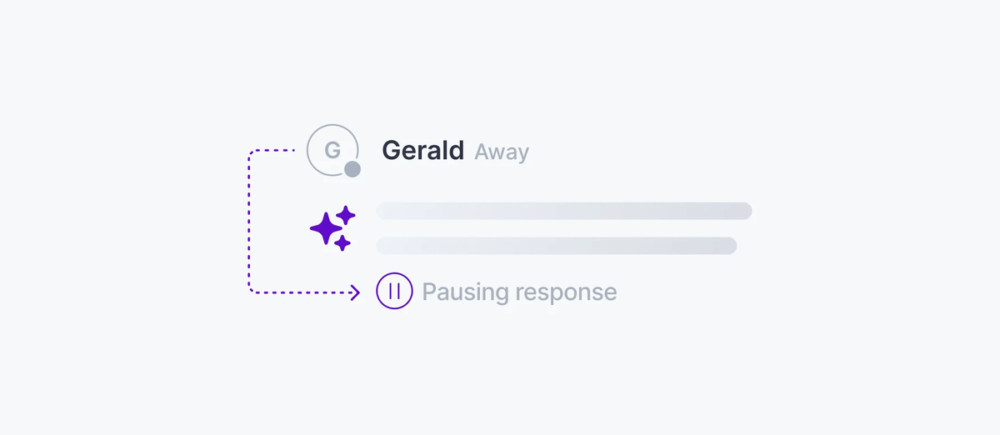

Agent presence gives session participants a real-time view of which agents are active and what they are doing. Agent presence uses Ably's native [Presence](/docs/presence-occupancy/presence) API on the AI Transport session channel. This works for a single orchestrator agent or a fleet of sub-agents, and conveys whether the agent is streaming, thinking, idle, or offline.



<Aside data-type='note'>
Agent presence is not built into the AI Transport SDK. It uses the Ably Presence API alongside AI Transport.
</Aside>

## How it works <a id="how-it-works"/>

The agent enters presence on the AI Transport session channel with status data. As the agent moves through its turn lifecycle (receiving a message, thinking, streaming, finishing), it updates its presence data. Every connected client receives these updates in real time.

<Code>
```javascript
// Server: agent enters presence when it connects.
const channel = ably.channels.get(sessionChannelName);
await channel.presence.enter({ status: 'idle' });

app.post('/api/chat', async (req, res) => {
  const invocation = Invocation.fromJSON(await req.json());
  const session = createAgentSession({ client: ably, channelName: invocation.sessionName, codec: UIMessageCodec });
  await session.connect();
  const run = session.createRun(invocation, { signal: req.signal });

  await run.start();
  await run.loadConversation();
  await channel.presence.update({ status: 'thinking' });

  const result = streamText({
    model: openai('gpt-4o'),
    messages: run.messages,
    abortSignal: run.abortSignal,
  });

  await channel.presence.update({ status: 'streaming' });
  const { reason } = await run.pipe(result.toUIMessageStream());
  await run.end(reason);
  await channel.presence.update({ status: 'idle' });
  session.close();
  res.json({ ok: true });
});
```
</Code>

## Subscribe to agent status <a id="subscribing"/>

On the client, subscribe to presence events to track the agent's current state:

<Code>
```javascript
const channel = ably.channels.get(sessionChannelName);

channel.presence.subscribe((member) => {
  if (member.clientId === 'agent') {
    console.log(`Agent is ${member.data.status}`);
  }
});

const members = await channel.presence.get();
const agent = members.find((m) => m.clientId === 'agent');
```
</Code>

## Combine presence with active runs <a id="combining-with-active-turns"/>

For richer status indicators, combine presence data with the active Runs on the view. Presence tells you the agent's self-reported state. `session.view.runs()` tells you which Runs are in progress:

<Code>
```javascript
const { session } = useClientSession();
const agentStatus = useAgentPresence(channel); // your custom hook

const isStreaming = session.view.runs().some((r) => r.status === 'active' && r.clientId === 'agent');
const isIdle = agentStatus === 'idle' && !isStreaming;
const isOffline = agentStatus === null;
```
</Code>

This is enough information for the UI to show a typing indicator while the agent thinks, a streaming animation while tokens arrive, and an offline badge when the agent disconnects.

## Edge cases and unhappy paths <a id="edge-cases"/>

- An agent that exits without calling `presence.leave()` (for example, a crashed process) is automatically removed from presence after a timeout. The agent is treated as present until the timeout fires. Wire a graceful shutdown that calls `leave` for the best user experience.
- A serverless agent that comes up for one turn and tears down should enter and leave presence per turn; entering once and leaving once at the end is fine for a long-running agent.
- Presence updates do not guarantee strict ordering with channel messages. A `streaming` presence update sometimes arrives slightly after the first token. Drive the UI off `session.view.runs()` for token-level state and use presence for higher-level status.
- Multi-agent setups need unique `clientId` per agent. Two agents with the same `clientId` collide in the presence set.
- A client without `presence` capability cannot subscribe to updates. Capability scoping is part of [authentication](/docs/ai-transport/concepts/authentication).

## FAQ <a id="faq"/>

### Does presence cost a message? <a id="faq-pricing"/>

Presence enter, update, and leave each consume a message on the channel. See [the platform pricing](/docs/platform/pricing) for current rates.

### Can clients enter presence too? <a id="faq-clients"/>

Yes. Presence is symmetric. A client that enters presence shows up alongside agents in the presence set. Use the `clientId` to distinguish.

### How long does presence persist after a disconnect? <a id="faq-timeout"/>
Until Ably's presence timeout fires (currently around 15 seconds). Active connections are not affected; this is for ungraceful disconnects.

### What is the difference between presence and the view's active runs? <a id="faq-vs-active-runs"/>

Presence is self-reported by the agent. `session.view.runs()` is observable from the channel by inspecting run lifecycle events. Presence reports intent; active runs report fact. Both together produce richer status.

### Can I pause inference when no users are connected? <a id="faq-pause"/>

Yes. Subscribe to presence and check whether any non-agent participants are present. If none, end the turn or short-circuit the LLM call. This is one of the cost-saving patterns presence enables.

## Related features <a id="related"/>

- [Presence](/docs/presence-occupancy/presence): the Ably Presence API used for agent status.
- [Concurrent turns](/docs/ai-transport/features/concurrent-turns): tracking active turns across clients.
- [Multi-device sessions](/docs/ai-transport/features/multi-device): presence works across every connected device.
