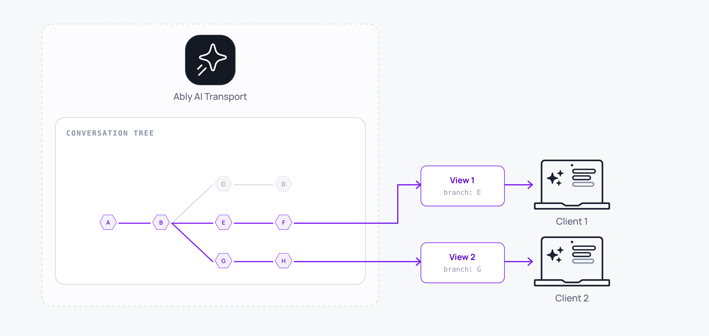

Your users can revise the past without losing it. The original message stays, the new content forks alongside, and the UI flips between branches. AI Transport handles the tree shape on the wire; you wire up edit, regenerate, and the navigation arrows.



A minimal regenerate:

<Code>
```javascript
await view.regenerate(assistantMessageId);
```
</Code>

## How it works <a id="how-it-works"/>

Every node on the channel carries `parent` and (optionally) `fork-of` or `msg-regenerate` headers. The [conversation tree](/docs/ai-transport/concepts/conversation-tree) reads these to build the branching structure: an edit produces a sibling `InputNode` whose `forkOf` points at the original user message's `codec-message-id`; a regenerate produces a same-parent sibling `RunNode` whose `regeneratesCodecMessageId` points at the original assistant message.

Branches are message-anchored: the branch decision lives on a `codecMessageId`, not on a `runId`. UIs render navigation arrows next to the bubble: the user's prompt for edit forks, the assistant slot for regenerate groups.

The View resolves the branch state on demand. Call `view.branchSelection(codecMessageId)` for any message and get back `{ hasSiblings, siblings, index, selected }`. Call `view.selectSibling(codecMessageId, index)` to switch.

## Regenerate <a id="regenerate"/>

Regenerate creates a sibling Run of an assistant message and starts a fresh turn from the same user prompt. The original response stays in the tree.

<Code>
```javascript
const { regenerate } = useView();
await regenerate(assistantMessageId);
```
</Code>

The SDK publishes a `Regenerate` well-known input variant that points at the assistant `codecMessageId`. The agent receives the [Invocation](/docs/ai-transport/concepts/invocations), creates a new Run with `regeneratesCodecMessageId` set, and streams the alternative response.

## Edit a user message <a id="edit"/>

Edit replaces a user message and starts a new turn from that point. The original user message and everything below it stays in the tree as a separate branch.

<Code>
```javascript
const { edit } = useView();
await edit(messageId, {
  kind: 'user-message',
  message: {
    id: crypto.randomUUID(),
    role: 'user',
    parts: [{ type: 'text', text: 'Make it 5 days, focused on food.' }],
  },
});
```
</Code>

Multiple inputs in a single edit are inserted as a sequence on the new branch:

<Code>
```javascript
await view.edit(messageId, [
  { kind: 'user-message', message: { id: crypto.randomUUID(), role: 'user', parts: [{ type: 'text', text: 'Make it 5 days.' }] } },
  { kind: 'user-message', message: { id: crypto.randomUUID(), role: 'user', parts: [{ type: 'text', text: 'And focus on food.' }] } },
]);
```
</Code>

The SDK publishes the replacement inputs as fresh `UserMessage`s with the `forkOf` header pointing at the `codecMessageId` being replaced. The agent forks the Run and starts a fresh response from the edited content.

## Navigate between siblings <a id="navigate"/>

When a message has siblings, render arrows that switch between them. `branchSelection` returns a safe bundle for any `codecMessageId`:

<Code>
```javascript
function BranchNav({ codecMessageId, view }) {
  const { hasSiblings, siblings, index } = view.branchSelection(codecMessageId);
  if (!hasSiblings) return null;

  return (
    <div>
      <button onClick={() => view.selectSibling(codecMessageId, index - 1)} disabled={index === 0}>←</button>
      <span>{index + 1} of {siblings.length}</span>
      <button onClick={() => view.selectSibling(codecMessageId, index + 1)} disabled={index === siblings.length - 1}>→</button>
    </div>
  );
}
```
</Code>

`branchSelection` always returns a usable object: `hasSiblings: false` for messages that aren't branch anchors, `index: 0` for unknown ids. Safe to call on every rendered bubble without conditionals.

When the user selects a different sibling, the view recomputes the visible branch. Every message below the selection point re-renders to reflect the chosen path.

## Side-by-side branches <a id="side-by-side"/>

Multiple views over the same conversation tree have independent branch selections, so different parts of the UI can render different branches simultaneously:

<Code>
```javascript
const view1 = useCreateView();
const view2 = useCreateView();

// view1 shows branch A, view2 shows branch B; both read the same tree.
```
</Code>

This is the pattern for comparison UIs where the user wants to see two regenerated responses side by side.

## Agent-side handling <a id="agent-side"/>

The agent doesn't usually need bespoke branching logic. The Invocation arrives, `createRun` returns a Run with the right identity, and `loadConversation` walks the ancestor chain along the selected branch automatically:

<Code>
```javascript
const invocation = Invocation.fromJSON(await req.json());
const run = session.createRun(invocation, { signal: req.signal });

try {
  await run.start();
  await run.loadConversation(); // walks ancestor chain along this branch

  const result = streamText({
    model: anthropic('claude-sonnet-4-20250514'),
    messages: run.messages,
    abortSignal: run.abortSignal,
  });

  const { reason } = await run.pipe(result.toUIMessageStream());
  await run.end({ reason });
} catch (err) {
  await run.end({ reason: 'error' });
  throw err;
} finally {
  session.close();
}
```
</Code>

`run.messages` after `loadConversation()` returns the complete branch (ancestor turns and the current user input) in order. Pass it straight to the LLM.

## Edge cases and unhappy paths <a id="edge-cases"/>

- Editing or regenerating mid-stream cancels nothing automatically. Call `session.cancel(runId)` on the active Run first if you do not want both to run.
- Branch selection is per-view. Two devices on the same session can see different branches simultaneously; the tree is shared, the selection is per-view.
- Deeply branched trees can have many siblings. A user can navigate forever; cap or hide branch navigation in your UI if your app has a preferred branch.
- A regenerate against an edited prompt still works. The new branch attaches at the same anchor regardless of what siblings exist.
- The visible branch recomputes when `selectSibling` is called. Avoid heavy work in the render path; updates are frequent during streaming.
- An optimistic edit is folded with the published edit. See [optimistic updates](/docs/ai-transport/features/optimistic-updates) for how the SDK reconciles the local insertion with the wire confirmation.

## FAQ <a id="faq"/>

### Does edit overwrite the original message?

No. The original stays in the tree. A new sibling branch is created with the edited content. Users navigate between branches with `view.selectSibling()`.

### How is regenerate different from sending a new prompt?

Regenerate creates a sibling response for the same user prompt. Sending a new prompt adds a new exchange below the current branch. Use regenerate to compare alternative responses to the same question; use a new prompt to continue the conversation.

### Can two clients edit at the same time?

Yes. Each edit creates a sibling, so concurrent edits produce two new siblings. The tree merges cleanly; each device's view selection determines what it renders.

### What if the LLM produces the same response on regenerate?

You get a sibling with the same content. Use temperature or sampling settings to encourage variety, or expose a "regenerate again" affordance.

### How deep can the tree get?

Tree depth is bounded by the conversation length. Branch breadth grows with edits and regenerations. There's no fixed limit; render performance is the practical constraint.

## Related features <a id="related"/>

- [Conversation tree](/docs/ai-transport/concepts/conversation-tree): the data structure branches live in.
- [Multi-device sessions](/docs/ai-transport/features/multi-device): edits and regenerations sync across devices.
- [Optimistic updates](/docs/ai-transport/features/optimistic-updates): how local-first edits reconcile with the published tree.
