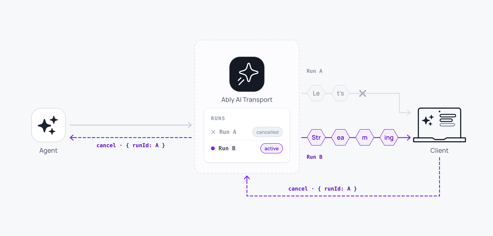

Cancellation is a turn-level operation. The client publishes a cancel signal on the Ably channel; the agent receives it on the run with the matching `runId` and fires its abort signal. Unlike closing an HTTP connection, cancellation is an explicit signal: the session remains intact, other runs continue, and both sides handle cleanup gracefully.



A minimal cancel:

<Code>
```javascript
await activeRun.cancel();
```
</Code>

## How it works <a id="how-it-works"/>

Sessions are bidirectional, so a cancel is just a signal on the channel. The client publishes a cancel message keyed on the triggering input's `codec-message-id` (the synchronous handle the client owns from send time). Once the agent has resolved the cancel to a registered Run, that Run's `abortSignal` fires. The LLM stream stops, the run ends with reason `'cancelled'`, and every subscriber receives the lifecycle update. A cancel published before the agent has minted the run-id is still honoured: the agent buffers it and fires once the input-event lookup resolves.

<Code>
```javascript
// Client: cancel the current run.
// activeRun.cancel() works immediately, even before the runId
// promise on activeRun has resolved.
await activeRun.cancel();

// Or, when you already have a resolved runId (for example from a RunInfo
// in view.runs()):
await session.cancel(someRunInfo.runId);

// Server: abort signal fires automatically
const result = streamText({
  abortSignal: run.abortSignal,
});
```
</Code>

## Cancel one run, several, or all <a id="cancel-filters"/>

`activeRun.cancel()` targets the run the client just kicked off. To cancel several runs, iterate the visible Runs and cancel each by id:

<Code>
```javascript
// Cancel all active runs in the visible view (Stop button)
const active = session.view.runs().filter((r) => r.status === 'active');
await Promise.all(active.map((r) => session.cancel(r.runId)));
```
</Code>

Selecting which runs to cancel is application logic. `RunInfo.clientId` tells you the run owner, so you can scope a cancel to runs started by the current client, a specific user, or all visible runs.

## Server-side handling <a id="server"/>

### Abort signal <a id="abort-signal"/>

Every run exposes an `abortSignal` that fires when the run is cancelled. Pass it to your LLM call:

<Code>
```javascript
const run = session.createRun(invocation, { signal: req.signal });
await run.start();

const result = streamText({
  model: anthropic('claude-sonnet-4-20250514'),
  messages: run.messages,
  abortSignal: run.abortSignal,
});

const { reason } = await run.pipe(result.toUIMessageStream());
await run.end(reason);
```
</Code>

`reason` is `'cancelled'` when the abort fires.

### Authorise the cancel <a id="authorization"/>

The `onCancel` hook on `RunRuntime` authorises or rejects cancel requests:

<Code>
```javascript
const userId = await authenticateUser(req);

const run = session.createRun(invocation, {
  signal: req.signal,
  onCancel: async (request) => request.message.clientId === userId,
});
```
</Code>

`CancelRequest` carries the raw cancel `message` (with the requester's `clientId`) and the `runId` it targets. Resolve the authorised identity from the inbound HTTP request and compare against `request.message.clientId`; the Ably service verifies the publisher's `clientId` before the cancel reaches the agent, so the value is trustworthy. Return `false` to reject; the run continues. If `onCancel` is not provided, all cancel requests are accepted.

### Publish a final note before cancelling <a id="abort-hook"/>

The `onCancelled` hook runs when the abort signal fires, giving you a chance to publish final events before the stream closes:

<Code>
```javascript
const run = session.createRun(invocation, {
  signal: req.signal,
  onCancelled: async (write) => {
    await write({ type: 'text-delta', id: 'cancel-note', delta: '\n[Response cancelled]' });
  },
});
```
</Code>

## Cancel on close <a id="cancel-on-close"/>

`ClientSession.close()` is local-state-only: it does not cancel runs on the wire. To stop in-progress runs before closing, cancel them explicitly:

<Code>
```javascript
const active = session.view.runs().filter((r) => r.status === 'active');
await Promise.all(active.map((r) => session.cancel(r.runId)));
await session.close();
```
</Code>

## Edge cases and unhappy paths <a id="edge-cases"/>

- Cancellation is asynchronous. A few more tokens arrive after `cancel()` returns and before the server's `abortSignal` fires. Render them on the cancelled turn.
- The server is responsible for honouring the abort signal. A tool invocation that does not check the signal continues to run until it completes.
- Cancel signals from a client without the channel [publish capability](/docs/auth/capabilities#capability-operations) will silently fail. Verify capabilities on the [authentication](/docs/ai-transport/concepts/authentication) endpoint.
- An `onCancel` that returns `false` does not notify the requesting client. Surface the rejection through your own application protocol if the user needs to know.
- A cancel sent before the turn starts is delivered to the channel and accumulated; the server applies it as soon as the turn is created.

## FAQ <a id="faq"/>

### Why use cancel signals instead of closing the connection? <a id="faq-vs-close"/>

Closing the connection disconnects a client from the session. The session and connection are distinct and not coupled. A cancel signal notifies the agent to stop the stream but leaves the session intact, so the next message starts a new turn immediately, on every connected device. See [reconnection and recovery](/docs/ai-transport/features/reconnection-and-recovery) for how clients that disconnect mid-stream can reconnect and resume.

### Can a user on another device cancel my turn? <a id="faq-cross-device"/>

Yes, if your `onCancel` hook authorises it. The default accepts all cancel requests. See the authorisation pattern above to scope it to the turn owner.

### What happens if multiple cancel signals match the same turn? <a id="faq-multiple"/>

The turn cancels once. Subsequent matching signals are no-ops; the abort signal does not refire.

### How do I tell a cancelled run apart from one that finished normally? <a id="faq-detect"/>

`run.end(reason)` reports the reason on the channel. Clients receive it through the view's `run` lifecycle event. The reason is `'cancelled'` for a cancel and `'complete'` for a normal finish.

### Does cancel cost a message? <a id="faq-pricing"/>

The cancel signal is a published message on the channel. See [pricing](/docs/platform/pricing) for current rates.

## Related features <a id="related"/>

- [Interruption](/docs/ai-transport/features/interruption): cancel and immediately send a new message.
- [Concurrent turns](/docs/ai-transport/features/concurrent-turns): multiple turns with independent cancel handles.
- [Token streaming](/docs/ai-transport/features/token-streaming): what gets cancelled when the abort fires.
