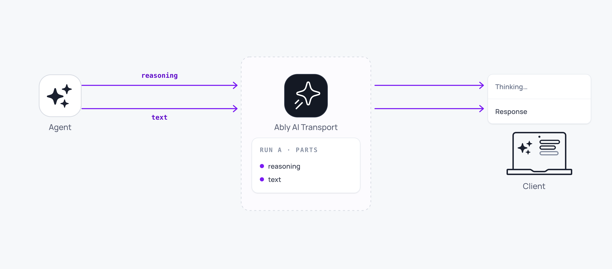

Chain of thought streams reasoning content alongside the main response text. The codec supports multiple stream types within a single turn. Text and reasoning are delivered as separate streams that render independently in the UI.



## How it works <a id="how-it-works"/>

When an LLM produces reasoning or thinking tokens, the codec multiplexes them alongside text tokens on the same Ably channel. Each stream type is tagged so the client routes reasoning content to one part of the UI and response text to another.

With the Vercel AI SDK integration, reasoning arrives as a separate `reasoning` stream type within the UI message stream:

<Code>
```javascript
app.post('/api/chat', async (req, res) => {
  const invocation = Invocation.fromJSON(await req.json());
  const session = createAgentSession({ client: ably, channelName: invocation.sessionName, codec: UIMessageCodec });
  await session.connect();
  const run = session.createRun(invocation, { signal: req.signal });

  await run.start();
  await run.loadConversation();

  const result = streamText({
    model: anthropic('claude-sonnet-4-20250514'),
    messages: run.messages,
    abortSignal: run.abortSignal,
  });

  const { reason } = await run.pipe(result.toUIMessageStream());
  await run.end(reason);
  session.close();
  res.json({ ok: true });
});
```
</Code>

No additional server configuration is needed. If the model produces reasoning tokens, the codec encodes them as a distinct stream within the run.

## Display reasoning in the UI <a id="displaying-reasoning"/>

On the client, message nodes contain both text and reasoning content. Render them separately to show the agent's thinking process:

<Code>
```javascript
const { messages } = useView();

for (const { message } of messages) {
  for (const part of message.parts) {
    if (part.type === 'reasoning') {
      renderThinkingPanel(part.reasoning);
    } else if (part.type === 'text') {
      renderResponsePanel(part.text);
    }
  }
}
```
</Code>

Both streams update in real time. Users see the reasoning appear as the model thinks, followed by (or alongside) the response text.

<Aside data-type='note'>
Chain of thought support depends on the model and the codec. Not all models produce reasoning tokens, and not all codec integrations surface them as separate stream types. Check your framework guide.
</Aside>

## Edge cases and unhappy paths <a id="edge-cases"/>

- A model that produces reasoning but the codec does not surface it folds reasoning into the text stream. Update the codec or the framework integration if you need it separated.
- Reasoning tokens are often longer than the final response. They count toward the channel's message rate and storage like any other tokens. See [token streaming](/docs/ai-transport/features/token-streaming#rollup) for rollup tuning.
- A cancelled run aborts both streams. Partial reasoning content stays with status `cancelled`.
- Two reasoning streams in the same run are exposed in the same order they were emitted by the model. Multiple distinct reasoning episodes are common with tool-augmented agents.
- A client that does not render reasoning parts still receives them on the channel. Filter at the render layer if you want to hide them by default.

## FAQ <a id="faq"/>

### Which models support chain of thought? <a id="faq-models"/>

Anthropic's thinking-enabled models and OpenAI's o-series surface reasoning tokens. Other models do not. Check the model provider documentation.

### Can I hide reasoning from the user? <a id="faq-hide"/>

Yes. Reasoning is a separate part type. Filter it out at the render layer. The content is still on the channel for any client that wants it.

### Does cancelling cut off reasoning too? <a id="faq-cancel"/>

Yes. Both the reasoning and text streams share the turn's abort signal.

### Are reasoning tokens charged the same as text? <a id="faq-pricing"/>

Yes. The channel does not distinguish between part types for billing. The cost depends on the published message count after rollup.

### How do I render reasoning differently after the turn finishes? <a id="faq-post-render"/>

The `node.message.parts` array stays available after the turn ends. Hide or collapse reasoning when the streaming flag flips to false.

## Related features <a id="related"/>

- [Token streaming](/docs/ai-transport/features/token-streaming): how text tokens are streamed and accumulated.
- [Tool calling](/docs/ai-transport/features/tool-calling): another multi-part stream type within a turn.
- [Codec API](/docs/ai-transport/api/javascript/codec): reference for the codec that multiplexes reasoning and text streams.
