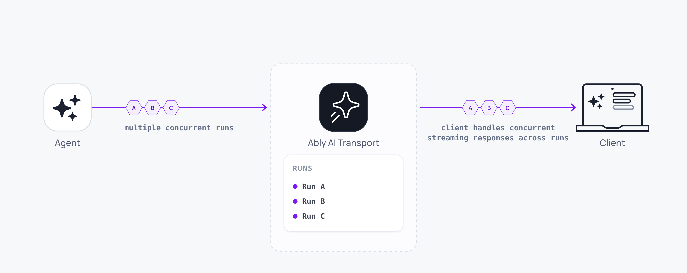

Concurrent turns let multiple request-response cycles run at the same time on one session. Each turn has its own stream, cancel handle, and lifecycle. This is what makes interruption, multi-user sessions, and multi-agent architectures possible.



## How it works <a id="how-it-works"/>

Turns are multiplexed on the Ably channel via `runId`. Every message published during a [Run](/docs/ai-transport/concepts/runs) (text deltas, tool calls, lifecycle events) carries a header identifying its Run. The client session reads these headers and routes each message to the correct Run's stream.

<Code>
```javascript
const run1 = await view.send({
  kind: 'user-message',
  message: { id: crypto.randomUUID(), role: 'user', parts: [{ type: 'text', text: 'Summarize the report' }] },
});
const run2 = await view.send({
  kind: 'user-message',
  message: { id: crypto.randomUUID(), role: 'user', parts: [{ type: 'text', text: 'What are the key risks?' }] },
});

// Subscribe to lifecycle events on the session's tree to observe completion:
const off = session.tree.on('run', (event) => {
  if (event.runId === run1.runId && event.type === 'end') renderToPanel('summary', 'done');
  if (event.runId === run2.runId && event.type === 'end') renderToPanel('risks', 'done');
});
```
</Code>

On the agent side, each Run is handled independently. The agent session creates a separate `Run` per invocation, each with its own abort signal and lifecycle:

<Code>
```javascript
app.post('/api/chat', async (req, res) => {
  const invocation = Invocation.fromJSON(await req.json());
  const session = createAgentSession({ client: ably, channelName: invocation.sessionName, codec: UIMessageCodec });
  await session.connect();
  const run = session.createRun(invocation, { signal: req.signal });

  await run.start();
  await run.loadConversation();

  const result = streamText({
    model: anthropic('claude-sonnet-4-20250514'),
    messages: run.messages,
    abortSignal: run.abortSignal,
  });

  const { reason } = await run.pipe(result.toUIMessageStream());
  await run.end(reason);
  session.close();
  res.json({ ok: true });
});
```
</Code>

## Track active runs <a id="tracking-active-runs"/>

`session.view.runs()` returns the visible Runs as projection-free `RunInfo` snapshots. Filter by status and `clientId`:

<Code>
```javascript
const { session } = useClientSession();
const runs = session.view.runs();

for (const run of runs.filter((r) => r.status === 'active')) {
  console.log(`${run.clientId} has active run ${run.runId}`);
}

const isAgentStreaming = runs.some((r) => r.status === 'active' && r.clientId === 'agent-1');
```
</Code>

The view updates in real time across every connected client. A Run that starts or ends anywhere on the channel updates every subscriber's view immediately.

## Cancel one run without touching the others <a id="scoped-cancellation"/>

Cancel via the handle the client owns synchronously:

<Code>
```javascript
await run1.cancel();
// run2 continues streaming
```
</Code>

To cancel all your active Runs (Stop button), filter `session.view.runs()` first:

<Code>
```javascript
const myClientId = ably.auth.clientId;
const myActive = session.view.runs().filter((r) => r.status === 'active' && r.clientId === myClientId);
await Promise.all(myActive.map((r) => session.cancel(r.runId)));
```
</Code>

See [cancellation](/docs/ai-transport/features/cancellation) for the full cancel API, including agent-side authorisation hooks.

## Wait for runs to complete <a id="waiting-for-runs"/>

Each `ActiveRun` exposes `runId: Promise<string>` (resolves with the agent-minted id once `ai-run-start` is observed). To wait for a Run to terminate, await the id and then subscribe to the session tree's `run` events:

<Code>
```javascript
function whenRunEnds(session, runId) {
  return new Promise((resolve) => {
    const off = session.tree.on('run', (event) => {
      if (event.runId === runId && event.type === 'end') {
        off();
        resolve(event.reason);
      }
    });
  });
}

const run1 = await view.send({
  kind: 'user-message',
  message: { id: crypto.randomUUID(), role: 'user', parts: [{ type: 'text', text: 'Hello' }] },
});
const run1Id = await run1.runId;
await whenRunEnds(session, run1Id);
```
</Code>

Use this to sequence work: send a follow-up only after the first response completes, or disable a submit button until the run resolves.

## Use cases <a id="use-cases"/>

### Interruption <a id="interruption"/>

Cancel the current turn and immediately start a new one:

<Code>
```javascript
const active = session.view.runs().filter((r) => r.status === 'active');
await Promise.all(active.map((r) => session.cancel(r.runId)));

const newRun = await view.send({
  kind: 'user-message',
  message: { id: crypto.randomUUID(), role: 'user', parts: [{ type: 'text', text: 'Actually, focus on the budget instead' }] },
});
```
</Code>

See [Interruption](/docs/ai-transport/features/interruption) for the full pattern.

### Multi-user sessions <a id="multi-user"/>

Two users prompting the same session at the same time. Each user's Run is independent:

<Code>
```javascript
const runA = await viewA.send({
  kind: 'user-message',
  message: { id: crypto.randomUUID(), role: 'user', parts: [{ type: 'text', text: 'What does section 3 mean?' }] },
});

const runB = await viewB.send({
  kind: 'user-message',
  message: { id: crypto.randomUUID(), role: 'user', parts: [{ type: 'text', text: 'Summarize section 5' }] },
});
```
</Code>

Both Runs stream concurrently on the shared channel.

### Multi-agent <a id="multi-agent"/>

An orchestrator dispatches work to multiple sub-agents, each streaming concurrently on the same channel. Each sub-agent receives its own Invocation with a unique `runId`:

<Code>
```javascript
app.post('/api/chat', async (req, res) => {
  const invocation = Invocation.fromJSON(await req.json());
  const session = createAgentSession({ client: ably, channelName: invocation.sessionName, codec: UIMessageCodec });
  await session.connect();

  // The orchestrator creates additional Invocations for sub-agents and POSTs
  // to their endpoints. Each sub-agent runs its own session.createRun(...)
  // against the same channel; their messages multiplex by runId.
  const researchRun = session.createRun(invocation, { signal: req.signal });
  await researchRun.start();
  await runResearchAgent(researchRun);

  res.json({ ok: true });
});
```
</Code>

The client sees both agent responses arriving in parallel, each tagged with its own `runId` and `clientId`.

## Edge cases and unhappy paths <a id="edge-cases"/>

- Concurrent Runs share the channel's message rate. A burst of parallel streams approaches the per-connection rate limit faster than a single stream. See [token streaming](/docs/ai-transport/features/token-streaming#rollup) for rollup behaviour.
- `session.cancel(runId)` against a `runId` that no longer matches an active Run is a no-op. Cancellation does not error on absence.
- A multi-agent setup with the same `runId` across sub-agents collides on the channel. Each Invocation must generate a unique `runId`.
- Two clients sending at the same time produce two Runs. The conversation tree shows both as siblings of the same parent message.

## FAQ <a id="faq"/>

### How many turns run concurrently? <a id="faq-limit"/>

There is no hard limit on the channel side. Practical limits come from your application's concurrency (server compute, model rate limits) and the channel's message rate. Plan for the publish rate, not the turn count.

### Does the client need to track run IDs? <a id="faq-track-ids"/>

The session tracks Run identity internally. Hold onto the `ActiveRun` returned by `view.send()` only if you need to cancel it specifically or wait for it specifically.

### How do I tell which run a message belongs to? <a id="faq-message-turn"/>

Each message carries its `run-id` in `extras.ai.transport`. The session's tree exposes the relationship through `view.runOf(codecMessageId)`; you do not parse headers manually.

### Can two turns run on behalf of the same user? <a id="faq-same-user"/>

Yes. The `clientId` does not constrain how many turns a client has open. Scoped cancellation lets you target one of them.

### Why use run IDs instead of message IDs? <a id="faq-ids"/>

A Run is one unit of agent work that produces multiple messages. The `runId` groups every message the agent publishes for that work, so cancel and wait operate on the unit a user understands.

## Related features <a id="related"/>

- [Cancellation](/docs/ai-transport/features/cancellation): scoped cancel signals and server-side abort handling.
- [Interruption](/docs/ai-transport/features/interruption): cancel and immediately send a new message.
- [Multi-device sessions](/docs/ai-transport/features/multi-device): concurrent turns across devices.
