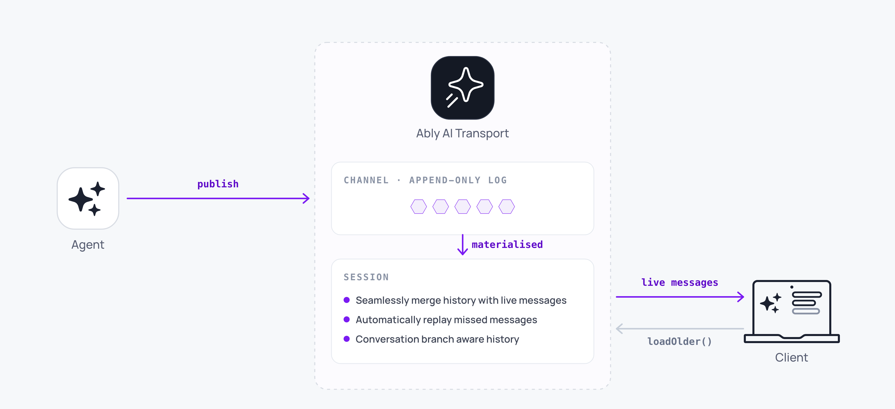

History comes from the Ably channel itself. Every message (user prompts, agent responses, lifecycle events) persists on the channel. Clients load history on connect and paginate backward through the conversation. No separate database is required.



A minimal history-loading hook:

<Code>
```javascript
const { messages, hasOlder, loadOlder } = useView({ limit: 30 });
```
</Code>

## How it works <a id="how-it-works"/>

`useView` loads history using `view.loadOlder()` with the `untilAttach` parameter. `untilAttach` keeps history and the live subscription gapless: every message between the historical window and the latest live message is accounted for.

`loadOlder()` returns `Promise<void>`. It expands the view window internally instead of returning a page; the view's `messages` array updates with the older messages.

<Code>
```javascript
const { messages, hasOlder, loadOlder } = useView({ limit: 30 });

if (hasOlder) {
  await loadOlder();
}
```
</Code>

## Implement scroll-back <a id="scroll-back"/>

Load more messages when the user scrolls toward the top of the conversation:

<Code>
```javascript
const { messages, hasOlder, loading, loadOlder } = useView({ limit: 30 });

function handleScrollToTop() {
  if (hasOlder && !loading) {
    loadOlder();
  }
}
```
</Code>

`loading` is `true` while a history page is being fetched. Use it to show a spinner at the top of the conversation. When `hasOlder` is `false`, the user has reached the beginning of the conversation.

## History and branching <a id="history-and-branching"/>

History includes branch information. Messages carry `parent` and `forkOf` headers that indicate which conversation branch they belong to. When history is loaded, the conversation tree reconstructs branches from these headers and places each message on the correct branch.

Loading history does not produce a flat list of messages. It rebuilds the full tree structure, including any points where the conversation forked because of edits, regenerations, or explicit branching.

## Edge cases and unhappy paths <a id="edge-cases"/>

- Channel history is bounded by your retention policy. A client connecting after retention expires sees only the live stream. Persist completed turns to your own store if you need longer-term retention.
- `loadOlder()` while `loading` is already `true` is a no-op. Guard against double-trigger from rapid scroll events.
- A late joiner that arrives mid-stream receives the streamed message in its accumulated form, not as a replay of every token. The view renders it correctly through the lifecycle tracker.
- A client without `history` capability cannot load anything beyond the live subscription window. Capability scoping is part of [authentication](/docs/ai-transport/concepts/authentication).
- A regenerated branch shows up in history with its `forkOf` header. The view's branch selection determines which sibling renders. See [conversation branching](/docs/ai-transport/features/branching).

## FAQ <a id="faq"/>

### Do I need a database for chat history? <a id="faq-database"/>

Not for AI Transport's own behaviour. The channel is the source of truth within retention. Add a database for analytics, search, longer retention, or external integrations.

### How do I retain history longer than the channel keeps it? <a id="faq-retention"/>

Persist completed turns to your own store as they end. AI Transport supports hydrating a session from an external store; the channel handles live and in-progress activity. See [sessions](/docs/ai-transport/concepts/sessions#persistence).

### Why does `loadOlder()` return `Promise<void>` instead of the messages? <a id="faq-loadolder-shape"/>

The view expands its internal window and emits an update. Components subscribed to `messages` re-render with the older messages. This keeps the view as the single source of truth.

### Does history include cancelled turns? <a id="faq-cancelled"/>

Yes. Cancelled messages keep their partial content with a status of `cancelled`. The view renders them in place.

### Can I paginate forward as well as backward? <a id="faq-forward"/>

`useView` is backward-only because the live subscription handles forward delivery. New messages arrive in real time without an explicit fetch.

## Related features <a id="related"/>

- [Token streaming](/docs/ai-transport/features/token-streaming): how streamed responses are persisted and replayed from history.
- [Reconnection and recovery](/docs/ai-transport/features/reconnection-and-recovery): how history loading fits into reconnection.
- [Conversation branching](/docs/ai-transport/features/branching): how branches are created and navigated.
