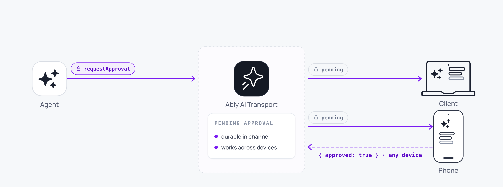

Human-in-the-loop uses the tool-calling primitives to create approval gates. The agent requests approval, the run suspends, and any connected client approves or rejects. Because the session is durable, the approval request reaches the user even after a reconnect or device switch.



## How it works <a id="how-it-works"/>

The pattern builds on [tool calling](/docs/ai-transport/features/tool-calling). The agent defines a tool that requires human approval. When the LLM invokes that tool, the agent calls `run.suspend()` instead of `run.end()` so the Run stays live, and the pending tool call is published to the channel. The client presents the approval request to the user. When the user approves or rejects, the client publishes a `tool-approval-response` input addressed to the suspended assistant, and a continuation invocation resumes the Run under the same `runId`.

The flow:

1. The agent streams a response that includes a tool call requiring approval.
2. The LLM's stream finishes with `finishReason: 'tool-calls'`. The agent calls `run.suspend()` and the pending tool call is visible on the channel.
3. Any connected client renders the pending approval.
4. The user approves or rejects. The client publishes a `tool-approval-response` input addressed to the pending message, then POSTs a continuation invocation to the agent.
5. A continuation invocation enters the same `runId` and the agent picks up the approval result and proceeds.

## Define an approval tool <a id="approval-tool"/>

On the server, define a tool without an `execute` function. The tool's description tells the LLM when to request approval:

<Code>
```javascript
const result = streamText({
  model: anthropic('claude-sonnet-4-20250514'),
  messages: conversationHistory,
  tools: {
    requestApproval: {
      description: 'Request user approval before executing a sensitive action',
      inputSchema: z.object({
        action: z.string().describe('Description of the action to approve'),
        details: z.string().describe('Additional context for the user'),
      }),
      // No execute function: requires client-side approval.
    },
    executeTransfer: {
      description: 'Execute a bank transfer',
      inputSchema: z.object({ amount: z.number(), recipient: z.string() }),
      execute: async ({ amount, recipient }) => {
        return await processTransfer(amount, recipient);
      },
    },
  },
  abortSignal: run.abortSignal,
});

const pipeResult = await run.pipe(result.toUIMessageStream());
const outcome = await vercelRunOutcome(pipeResult, result.finishReason);

if (outcome === 'suspend') {
  await run.suspend();
} else {
  await run.end(outcome);
}
```
</Code>

When the LLM decides an action needs approval, it invokes `requestApproval`. `streamText` finishes with `finishReason: 'tool-calls'`; [`vercelRunOutcome`](/docs/ai-transport/api/javascript/vercel/run-outcome) translates that to `'suspend'`, so the agent calls `run.suspend()` and the pending tool call stays on the channel for any connected client to act on.

## Handle approval on the client <a id="client-approval"/>

On the client, detect pending approval requests and present them to the user:

<Code>
```javascript
const { messages, runOf, send } = useView();

const pending = messages.find(({ message }) =>
  message.parts?.some(
    (p) => p.type === 'dynamic-tool' && p.toolName === 'requestApproval' && p.state === 'approval-requested',
  ),
);

const pendingApproval = pending?.message.parts?.find(
  (p) => p.type === 'dynamic-tool' && p.state === 'approval-requested',
);

if (pending && pendingApproval) {
  const { action, details } = pendingApproval.input;
  const runId = runOf(pending.codecMessageId).runId;

  const respond = async (approved) => {
    const run = await send(
      {
        kind: 'tool-approval-response',
        codecMessageId: pending.codecMessageId,
        payload: { toolCallId: pendingApproval.toolCallId, approved },
      },
      { runId },
    );

    // Wake the agent so it picks up the response and resumes.
    await fetch('/api/chat', {
      method: 'POST',
      body: JSON.stringify(run.toInvocation().toJSON()),
    });
  };

  return (
    <ApprovalDialog
      action={action}
      details={details}
      onApprove={() => respond(true)}
      onReject={() => respond(false)}
    />
  );
}
```
</Code>

The response is addressed to the suspended assistant message by `codecMessageId`, and reusing the original `runId` keeps the resume on the same run. The agent sees the approval as the tool result and proceeds.

## Approve from any device <a id="multi-device"/>

The session is a shared Ably channel, so the approval request is visible on every connected device. Any device submits the approval; the first response wins.

A user starts a conversation on a laptop, steps away, and approves the request on a phone. The agent does not know or care which device approved it. The continuation turn starts as soon as any client submits the result.

## Durable approval requests <a id="durable"/>

Approval requests survive disconnections. If the user is offline when the agent requests approval, the pending tool call persists in the channel history. On reconnect, the view loads the conversation including the pending request, and the approval UI appears.

The agent's turn has already ended, so no connection or timeout is at risk. The continuation turn starts only when the user submits their response, minutes, hours, or days later.

## Edge cases and unhappy paths <a id="edge-cases"/>

- Two devices submitting at the same time race. The first response wins; the second submits to an already-resolved tool call and the agent ignores it. Guard against double-submit at the application layer if both devices need to see a consistent decision.
- A user who rejects must trigger an agent path that handles rejection. The LLM only sees the response you supply; an empty rejection is ambiguous.
- A pending approval that never receives a response stays pending forever. Add an explicit timeout in your application if you need one; AI Transport does not impose one.
- The resume runs as a fresh agent invocation. Make sure your server endpoint hydrates the conversation history correctly so the LLM sees the approval result in context.

## FAQ <a id="faq"/>

### How is this different from a regular tool call? <a id="faq-vs-tool"/>

A regular client-executed tool runs as soon as the client receives the call. Human-in-the-loop blocks until a human submits the result. The mechanics are the same; the user experience is different.

### Can the agent see who approved it? <a id="faq-approver"/>

Yes. Each Ably message carries the publisher's `clientId`. Pass approver identity in the output payload if the LLM needs it inline.

### What if the user closes the app before approving? <a id="faq-closed"/>

The pending approval stays on the channel. The user sees it when they next open the app on any device, within the channel's history retention window.

### How do I escalate an unanswered approval? <a id="faq-escalate"/>

Set a server-side timer or scheduled job that checks for stale pending tool calls and sends a notification. Use [push notifications](/docs/ai-transport/features/push-notifications) for app-level escalation.

### Can a non-human submit the approval? <a id="faq-bot"/>

Yes. Any client with publish capability can submit. The mechanism is generic; "human-in-the-loop" is the common use case.

## Related features <a id="related"/>

- [Tool calling](/docs/ai-transport/features/tool-calling): the underlying mechanism for human-in-the-loop.
- [Multi-device sessions](/docs/ai-transport/features/multi-device): approval from any connected device.
- [Reconnection and recovery](/docs/ai-transport/features/reconnection-and-recovery): approval requests survive disconnections.
