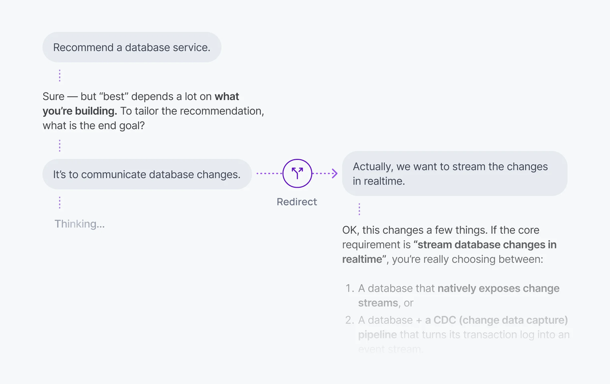

A user changes direction while the agent is still working: they narrow the scope, add a constraint, or press Stop and start over. The session is bidirectional, so the client can send a follow-up into the same active run, cancel the run and start a new one, or open a parallel run on the same session.



On the client, start a run with `view.send()`, then steer it by calling `activeRun.steer()` with a follow-up message:

<Code>
```javascript
const activeRun = await session.view.send(createUIMessageCodec().createUserMessage({
  id: crypto.randomUUID(),
  role: 'user',
  parts: [{ type: 'text', text: 'Plan a 3-day trip to Lisbon.' }],
}));

const { published, outcome } = activeRun.steer(createUIMessageCodec().createUserMessage({
  id: crypto.randomUUID(),
  role: 'user',
  parts: [{ type: 'text', text: 'Make it 5 days, and keep it under £800.' }],
}));
```
</Code>

## How it works <a id="how-it-works"/>

Each turn becomes a [run](/docs/ai-transport/concepts/runs) on the session. While a run is active, the client can do one of three things:

| Pattern | What happens | When to use it |
| --- | --- | --- |
| Steer the active run | A new user message is published to the active run; the agent picks it up on the next loop iteration. | Quick correction or scope clarification while the agent is still working. |
| Cancel and re-prompt | The active run aborts; a new run starts. | The previous direction is wrong; the user wants to start over. |
| Send alongside | A second run starts; both runs stream in parallel. | Quick follow-up that doesn't replace the in-flight reply. |

Steering is the least destructive: it leaves the run running and the stream intact.

## Steer the active run <a id="steer"/>

Call `activeRun.steer(input)` to send a steering message to the agent. The agent picks it up on the next loop iteration. A steering message will not start a new run.

On the client, `steer()` returns two promises:

<Code>
```javascript
const { published, outcome } = activeRun.steer(createUIMessageCodec().createUserMessage({
  id: crypto.randomUUID(),
  role: 'user',
  parts: [{ type: 'text', text: 'Also include vegan options.' }],
}));

const { serial } = await published;
const { consumed, runTerminalReason } = await outcome;
```
</Code>

- `published` resolves once the steering message has been published to the session, carrying the Ably-assigned `serial`.
- `outcome` resolves to `{ consumed: boolean, runTerminalReason?: RunEndReason }` once the agent consumes the steering message, or once the run ends without consuming it:
  - `consumed: true`: the agent saw the steering message before it sent its response. `outcome` resolves at the run's next terminal event, whether the run ends or suspends, so a message consumed before a suspend resolves rather than staying pending.
  - `consumed: false`: the run ended before the agent saw the message.
  - `runTerminalReason`: how the run ended (`'complete'`, `'cancelled'`, or `'error'`). Absent when the agent consumes the message at a `run-suspend`, since the run has not ended.

On the agent side, `Run.hasInput()` controls the loop. It returns `true` while there's input the agent hasn't responded to (the original prompt, or a steering message from the previous iteration), and `false` once the agent has caught up:

<Code>
```javascript
const run = session.createRun(invocation, { signal: req.signal });

// Drain run.view for the full conversation before starting. run.messages is
// only this run's own turn, so feed run.view to the model instead.
while (run.view.hasOlder()) await run.view.loadOlder();
await run.start();

while (run.hasInput()) {
  const conversation = run.view.getMessages().map(({ message }) => message);
  const result = streamText({
    model: anthropic('claude-sonnet-4-20250514'),
    messages: await convertToModelMessages(conversation),
    abortSignal: run.abortSignal,
  });
  await run.pipe(result.toUIMessageStream());
}

await run.end({ reason: 'complete' });
await session.end();
```
</Code>

Each `pipe()` records which steering messages the agent had seen before producing that response. The client uses those records to resolve each message's outcome when the run ends.

### Cancel the in-flight model call <a id="on-steer"/>

The loop above only sees a steering message once the current model call finishes and `hasInput()` is checked again, so the steering message takes effect on the *next* response. To react immediately, pass the optional `onSteer` hook to `createRun()`. It fires the moment a steering message folds into the run. The SDK does not interrupt the model call for you, so wire `onSteer` to abort the current model call; the loop then restarts with the steering message already in the conversation.

On the agent, give each model call its own `AbortController`, abort it from `onSteer`, and pass a signal that fires on either run cancellation or a steering message. The subtlety is that `onSteer` must abort *only* the model call, never the run, and the loop has to distinguish a steering interruption from a genuine cancel before deciding how to end:

<Code>
```javascript
let stepAbort = new AbortController();

const run = session.createRun(invocation, {
  signal: req.signal,
  // Abort only the current model call, never run.abortSignal, so a steering
  // message stops the response without cancelling the run.
  onSteer: () => stepAbort.abort(),
});

while (run.view.hasOlder()) await run.view.loadOlder();
await run.start();

let outcome;
while (run.hasInput()) {
  stepAbort = new AbortController();
  const conversation = run.view.getMessages().map(({ message }) => message);
  const result = streamText({
    model: anthropic('claude-sonnet-4-20250514'),
    messages: await convertToModelMessages(conversation),
    // Abort on a genuine cancel (run.abortSignal) OR a steering message (stepAbort).
    abortSignal: AbortSignal.any([run.abortSignal, stepAbort.signal]),
  });

  const pipeResult = await run.pipe(result.toUIMessageStream());

  // run.pipe races only run.abortSignal, so a steering abort ends the stream
  // cleanly (pipe reason 'complete') while a real cancel ends it 'cancelled'.
  // A steering message interrupted this iteration if the stream ended clean, this
  // iteration's stepAbort fired, and the run itself was not cancelled.
  const steerInterrupted =
    pipeResult.reason === 'complete' &&
    stepAbort.signal.aborted &&
    !run.abortSignal.aborted;

  if (steerInterrupted) {
    // Don't pass an interrupted iteration to vercelRunOutcome: an aborted
    // streamText rejects finishReason abort-like, which maps to 'cancelled' and
    // would end the run. Swallow the rejection so it isn't unhandled, then loop.
    // hasInput() is now true, so the next iteration re-infers with the steering
    // message at the tail of the conversation.
    result.finishReason.catch(() => {});
    continue;
  }

  outcome = await vercelRunOutcome(pipeResult, result.finishReason);
  if (outcome.reason !== 'complete') break;
}

if (outcome?.reason === 'suspend') {
  await run.suspend();
} else {
  await run.end(outcome ?? { reason: 'complete' });
}
await session.end();
```
</Code>

When `onSteer` aborts the model call, `run.pipe()` returns with the partial output published, `run.hasInput()` returns `true` because the steering message has folded into the conversation, and the next iteration streams a fresh response that includes it. `onSteer` takes no arguments and returns `void`; keep it synchronous and cheap, since it runs on the message-handling path.

<Aside data-type='note'>
This immediate-interruption pattern is an optimisation rather than a requirement. The [base loop](#steer) already picks up a steering message on the next iteration once the current response finishes; add `onSteer` only when you need to interrupt an in-flight response rather than wait for it to complete.
</Aside>

## Implement cancel and re-prompt <a id="cancel-and-re-prompt"/>

On the client, to replace the in-flight run with a fresh one, cancel active runs and then send the new message:

<Code>
```javascript
import { useClientSession, useView } from '@ably/ai-transport/react';

function Chat() {
  const { session } = useClientSession();
  const view = useView();

  const handleSend = async (text) => {
    const active = view.runs().filter((run) => run.status === 'active');
    await Promise.all(active.map((run) => session.cancel(run.runId)));

    await view.send(createUIMessageCodec().createUserMessage({
      id: crypto.randomUUID(),
      role: 'user',
      parts: [{ type: 'text', text }],
    }));
  };
}
```
</Code>

`session.cancel(runId)` publishes a cancel signal. The agent's `Run.abortSignal` fires, the LLM stream stops, and the run ends with reason `'cancelled'`. The new message starts a clean run.

## Implement send-alongside <a id="send-alongside"/>

Send a new message without cancelling. Both runs stream concurrently; each `ClientRun` carries its own `runId` and `cancel()`, and both runs' outputs land on the same session where they fold into the conversation tree by `runId`:

<Code>
```javascript
const followUp = await session.view.send(createUIMessageCodec().createUserMessage({
  id: crypto.randomUUID(),
  role: 'user',
  parts: [{ type: 'text', text: 'Also include vegan options.' }],
}));
```
</Code>

Cancel them independently with `session.cancel(specificRunId)` or `activeRun.cancel()`.

## Drive the Stop / Send toggle <a id="stop-send-toggle"/>

`session.view.runs()` returns the visible `RunInfo` snapshots. Filter by `status === 'active'` to drive the Send / Stop toggle:

<Code>
```javascript
const { session } = useClientSession();
const isStreaming = session.view.runs().some((run) => run.status === 'active');

return isStreaming
  ? <StopButton onClick={() => cancelAll()} />
  : <SendButton onClick={handleSend} />;
```
</Code>

## Edge cases and unhappy paths <a id="edge-cases"/>

- If a steering message arrives just as the agent finishes its last `pipe()`, `outcome` resolves to `consumed: false`. This is normal under load. Show the user that the message didn't reach the agent rather than dropping it silently.
- Once a run has ended, `activeRun.steer()` rejects both promises immediately and publishes nothing. Only allow steering while `RunInfo.status === 'active'`.
- If a run is `'suspended'` (waiting on a tool approval, for example), a steering message the agent has not yet consumed keeps its `outcome` pending until the run resumes and consumes it or ends. A message the agent already consumed has resolved as `consumed: true`. Don't block UI updates on a pending outcome.
- `consumed: true` means the agent saw the steering message before it sent its response, which is no guarantee the LLM acted on it; that depends on the model, the system prompt, and what the agent passed in.
- Cancel is asynchronous. A small tail of tokens arrives after `session.cancel(runId)` returns and before the agent's `abortSignal` fires. The view emits them on the cancelled run; treat them as belonging to that run rather than the new one.
- A run cancelled while awaiting a tool result ends with `'cancelled'`. Tool calls triggered before the cancel may still run on your server unless your handler honours the same `AbortSignal`.
- A network drop on the client cancels nothing. The agent keeps streaming into the session. When the client reconnects, the response is still there. Check `session.view.runs()` on reconnect to decide whether to show Stop.
- Send-alongside is rate-limited by your channel and any server-side [concurrency](/docs/ai-transport/features/concurrent-turns) you enforce.
- `'cancelled'` is reported on the run's terminal `RunEndReason`. Don't infer cancellation from the absence of further tokens; subscribe to `view.on('run', ...)` and read the lifecycle event.

## FAQ <a id="faq"/>

### When should I steer instead of cancel?

Steer when the existing direction is still useful and the user wants to refine it ("make it 5 days", "also include vegan options"). The agent keeps its tokens, its tool results, and its reasoning so far; the new input joins the conversation. Cancel when the existing direction is wrong and the user wants to start over.

### What does `consumed: false` mean for the user?

The run ended before the agent saw the steering message. Two common causes: the message arrived after the agent's final `pipe()`, or the run was cancelled or errored first. It's up to your application whether to re-submit the steering message as a new user prompt for a new run, or to drop it.

### Can the agent ignore a steering message?

Yes. `consumed: true` confirms only that the agent saw the message. Whether the model heeds new mid-flight input depends on the model, the system prompt, and what the agent passed in.

### Can I cancel one of several concurrent runs without touching the others?

Yes. `session.cancel(runId)` only cancels the matching run. Pull `runId`s from `session.view.runs()` to target the right one.

### Does cancel work from a different device?

Yes. Cancel is a signal on the shared channel, so any client with publish capability can cancel a run, including a device other than the one that started it. The agent's `onCancel` hook decides whether to honour it; the default accepts every request. Use the [cancel authorisation pattern](/docs/ai-transport/features/cancellation#authorization) to scope it to the run owner if a user should only cancel their own turns.

### Do steering messages persist in the conversation?

Yes. A steering message joins the conversation tree under the run it steers, so every connected client sees it live and it survives reload. On rehydration `run.view.getMessages()` returns it in order alongside the original prompt and the agent's output, so the model sees the full exchange on the next turn.

### What happens if I send several steering messages at once?

The next `run.hasInput()` call drains all pending steering messages together, and the following `pipe()` stamps every one of their codec-message-ids, resolving each message's `outcome` as `consumed`. The agent folds them all into a single model call rather than replying to each separately.

### What if the agent endpoint is down when I send the follow-up?

The follow-up is published to the session before your agent endpoint is called, so it is durable regardless of the endpoint's health. For a steering message that is all that is needed: the already-running agent picks it up on its next `hasInput()` check. For a new run (cancel-and-reprompt or send-alongside) the client also POSTs to wake the agent; if that POST fails, the user input still sits on the session, so retry the POST once the endpoint recovers and the agent drains history to find the trigger and start the run.

## Related features <a id="related"/>

- [Cancellation](/docs/ai-transport/features/cancellation): cancel signals and agent-side authorisation.
- [Concurrent turns](/docs/ai-transport/features/concurrent-turns): multiple runs in flight on the same session.
- [Runs](/docs/ai-transport/concepts/runs#steer): how steering fits the run model.
