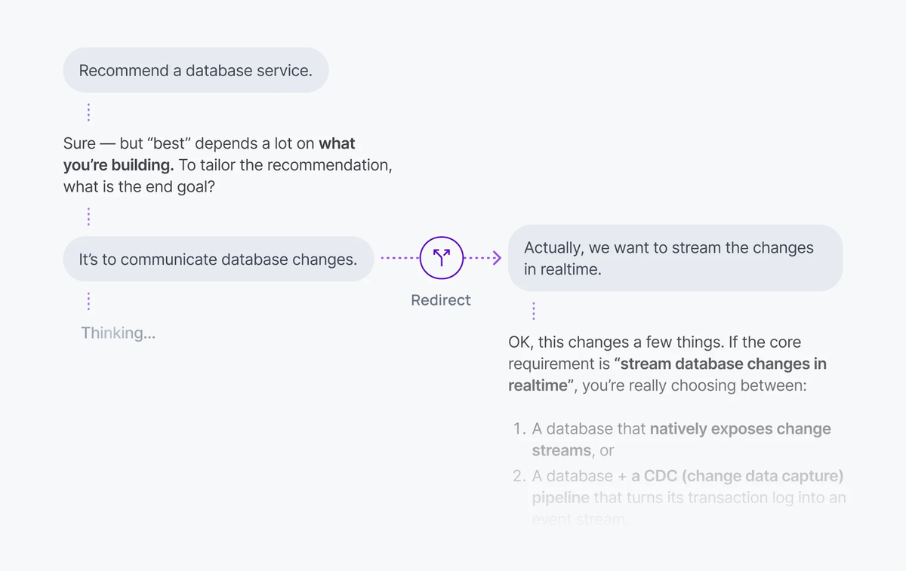

<Aside data-type='new'>
The AI Transport docs are being actively written and developed. They are available early to explain how AI Transport functions.
</Aside>

Interruption lets users send a new message while the agent is still streaming a response. When a user sends a new message, the client transport creates a new turn via an HTTP POST to the server. Because turns are independent, the new turn starts immediately regardless of whether a previous turn is still streaming.



## How it works <a id="how-it-works"/>

When the user sends a new message, the client transport posts it to the server, which starts a new turn. The user doesn't need to wait for the current response to finish before sending a new message.

There are two patterns for handling interruption:

| Pattern | Behavior | Use case |
| --- | --- | --- |
| Cancel-then-send | Cancel the current turn, then send a new message | Stop button + new prompt |
| Send-alongside | Send a new message while the current turn continues | Follow-up without waiting |

With cancel-then-send, the active turn is aborted before the new message is dispatched. The agent stops generating, cleans up, and starts a fresh turn. With send-alongside, both turns run concurrently - each with its own stream and cancel handle.

## Cancel-then-send <a id="cancel-then-send"/>

Detect whether a turn is active, cancel it, then send a new message. This is the most common interruption pattern - it mimics a user pressing a stop button and immediately re-prompting.

<Code>
```javascript
import { useActiveTurns, useClientTransport, useView } from '@ably/ai-transport/react'

function Chat({ channel, clientId }) {
  const transport = useClientTransport({ channel, clientId })
  const { nodes, send } = useView(transport)
  const activeTurns = useActiveTurns(transport)

  const handleSend = async (text) => {
    // If the agent is streaming, cancel first
    if (activeTurns.size > 0) {
      await transport.cancel()
    }

    await send([{ id: crypto.randomUUID(), role: 'user', parts: [{ type: 'text', text }] }])
  }
}
```
</Code>

`transport.cancel()` publishes a cancel signal on the channel. The server's abort signal fires, the LLM stream stops, and the turn ends with reason `'cancelled'`. The new message is then sent on a clean turn.

## Send-alongside <a id="send-alongside"/>

Send a new message without cancelling the active turn. Both turns run concurrently - the agent continues streaming the first response while processing the new input.

<Code>
```javascript
const handleSend = async (text) => {
  // Send without cancelling - both turns run concurrently
  await send([{ id: crypto.randomUUID(), role: 'user', parts: [{ type: 'text', text }] }])
}
```
</Code>

Each concurrent turn has its own stream and its own cancel handle. You can cancel them independently:

<Code>
```javascript
// Cancel a specific turn, leave others running
await transport.cancel({ turnId: specificTurnId })
```
</Code>

## Detect active turns <a id="detecting-active-turns"/>

The `useActiveTurns` hook returns a `Map<clientId, Set<turnId>>` of all currently streaming turns. Use it to check whether the agent is mid-response:

<Code>
```javascript
const activeTurns = useActiveTurns(transport)

// Check if any turns are streaming
const isStreaming = activeTurns.size > 0

// Check if a specific client has active turns
const agentTurns = activeTurns.get('agent-client-id')
const agentIsStreaming = agentTurns && agentTurns.size > 0
```
</Code>

This is useful for toggling UI between a send button and a stop button, or for disabling input while a cancellation is in progress.

<Aside data-type='note'>
Without a session layer, interruption typically requires building a separate message queue or signaling system. With AI Transport, the session handles turn management - interruption is just a new turn via HTTP POST while the previous turn's stream continues on the channel.
</Aside>

## Related features <a id="related"/>

- [Cancellation](/docs/ai-transport/features/cancellation) - cancel signals, filters, and server-side abort handling
- [Concurrent turns](/docs/ai-transport/features/concurrent-turns) - multiple turns running in parallel
- [Double texting](/docs/ai-transport/features/double-texting) - handling multiple user messages in quick succession
- [Client transport API](/docs/ai-transport/api-reference/client-transport) - reference for `cancel`, `send`, and other client methods.
- [Sessions and turns](/docs/ai-transport/how-it-works/sessions-and-turns) - how bidirectional sessions enable interruption.
- [Get started](/docs/ai-transport/getting-started/vercel-ai-sdk) - build your first AI Transport application.
