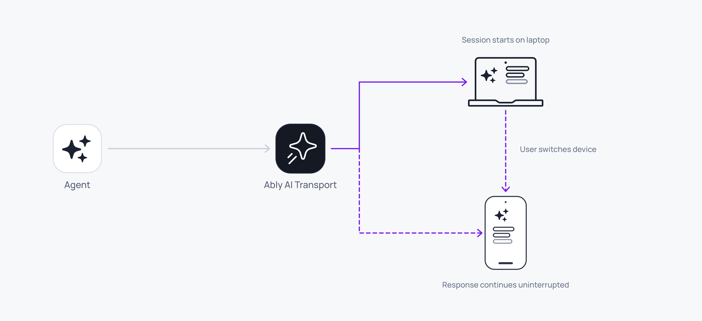

A multi-device session works because the [session](/docs/ai-transport/concepts/sessions) is backed by a shared Ably channel, not a single client-to-server HTTP connection. Any device that subscribes to the channel sees every message: user prompts, agent responses, and control signals. Open a second tab, switch to a phone, or share a session with a colleague.



Fan-out to multiple connected devices is automatic. There's no special configuration:

<Code>
```javascript
// Client A (laptop): wrap with a ClientSessionProvider for chatId.
<ClientSessionProvider channelName={chatId} codec={UIMessageCodec}>
  <Chat />
</ClientSessionProvider>

// Client B (phone): same channel name in its own ClientSessionProvider, different device.
<ClientSessionProvider channelName={chatId} codec={UIMessageCodec}>
  <Chat />
</ClientSessionProvider>

// Inside Chat, read the session from context.
const { session } = useClientSession();
```
</Code>

## How it works <a id="how-it-works"/>

Every client connected to the same Ably channel shares the same durable session. When any participant publishes (a user message, an agent response, a cancel signal), every other participant receives it through their channel subscription.

The client transport distinguishes between own turns (started by this client) and observer turns (started by someone else). Both types are tracked, decoded, and added to the conversation tree. The UI updates for every client, regardless of who initiated the action.

## Distinguish own and observer runs <a id="own-vs-observer"/>

The client session separates Runs initiated by the current client from those by other participants:

| Type | Origin | Handle |
| --- | --- | --- |
| Own Run | This client sent the HTTP POST that created the Run. | A `ClientRun` returned from `view.send`, with `runId` (populated after `started`), `inputCodecMessageId`, `cancel()`, and `toInvocation()`. |
| Observer Run | Another client or agent created the Run. | Lifecycle events and folded outputs through the tree; no per-client handle. |

Both types appear in the conversation tree and the UI. Folded outputs flow through the tree the same way regardless of origin; `RunInfo.clientId` on the view tells you which client started any given Run.

## Track active runs across clients <a id="active-runs"/>

The session's default view exposes `runs()`. It returns a snapshot of visible Runs as projection-free `RunInfo`, consistent across every connected client:

<Code>
```javascript
const { session } = useClientSession();

const runs = session.view.runs();
const isAnyoneStreaming = runs.some((r) => r.status === 'active');
const isAgentWorking = runs.some((r) => r.status === 'active' && r.clientId === 'agent-1');
```
</Code>

If client A starts a Run, client B's view updates immediately as the `ai-run-start` lands on the channel.

## Sync with useChat <a id="syncing"/>

When using Vercel's `useChat`, the `useMessageSync` hook pushes messages from other clients into `useChat`'s state:

<Code>
```javascript
const { chatTransport } = useChatTransport();
const { messages, setMessages } = useChat({ transport: chatTransport });
useMessageSync({ setMessages });
```
</Code>

Without `useMessageSync`, `useChat` only renders messages from its own sends. The sync hook bridges the gap by feeding observer messages into state.

## Handle late joiners <a id="late-joiners"/>

A client that connects after the conversation has started loads the full history from the channel:

<Code>
```javascript
const { messages, hasOlder, loadOlder } = useView({ limit: 30 });
```
</Code>

`useView` loads history on mount. If a response is currently streaming, the late joiner sees it in progress; the codec's lifecycle tracker synthesises missing events so the stream renders correctly.

## Identify the client <a id="client-identity"/>

Each client has a `clientId` that identifies it across the session. Set the client ID through Ably token authentication so it is verified and cannot be spoofed:

<Code>
```javascript
// In your token endpoint
const token = jwt.sign({
  'x-ably-clientId': 'user-123',
  // ...
}, keySecret);
```
</Code>

The `clientId` is used throughout: turn ownership, cancel authorisation in the agent's `onCancel` hook, and active turn tracking. Filter `view.runs()` by `clientId === ably.auth.clientId` when you want to act on this client's own Runs only. See [Set up authentication](/docs/ai-transport/getting-started/authentication) for the full setup.

## Edge cases and unhappy paths <a id="edge-cases"/>

- Two clients sharing the same `clientId` are indistinguishable to the transport. A cancel filter that keys on `clientId` (for example "cancel only my own Runs") cancels Runs from both. Use a unique `clientId` per device when ownership matters.
- A late joiner without channel history capability sees the live stream but not the conversation that came before. Capability scoping is part of [authentication](/docs/ai-transport/concepts/authentication).
- A client that loses connectivity mid-stream resumes its own view on reconnect. Other clients' views are unaffected.
- Two devices sending messages at the same time create two separate turns on the same session. See [concurrent turns](/docs/ai-transport/features/concurrent-turns) for the multiplexing model.
- A regenerate triggered on one device updates the conversation tree on every device. The visible branch on each device depends on its current view selection.

## FAQ <a id="faq"/>

### Do I need to write any sync code? <a id="faq-sync-code"/>

No. The channel subscription is the sync. For Vercel `useChat`, add `useMessageSync` to bridge observer messages into its state.

### How many clients connect to one session? <a id="faq-many-clients"/>

There is no fixed limit. The channel is the share point; usage scales with the number of subscribers. See [the platform pricing page](/docs/platform/pricing) for the connection and message rate limits in effect.

### Can two users have different branch selections on the same session? <a id="faq-branches"/>

Yes. Each view holds its own selection. The conversation tree is shared; the view is per-participant. See [conversation branching](/docs/ai-transport/features/branching).

### What stops a stranger from joining my session? <a id="faq-auth"/>

Channel capabilities. Issue tokens that scope `subscribe` and `publish` to the specific channel name for authenticated users. See [authentication](/docs/ai-transport/concepts/authentication) for scoping examples.

### Does presence work across devices? <a id="faq-presence"/>

Yes. Each device enters presence with its own `clientId`. See [agent presence](/docs/ai-transport/features/agent-presence) for the patterns.

## Related features <a id="related"/>

- [Reconnection and recovery](/docs/ai-transport/features/reconnection-and-recovery): each device reconnects independently.
- [Cancellation](/docs/ai-transport/features/cancellation): cancel from any device.
- [History and replay](/docs/ai-transport/features/history): late joiners load the full conversation.
- [Database hydration](/docs/ai-transport/features/database-hydration): seed a device from your own store and reconcile it with the live channel.
