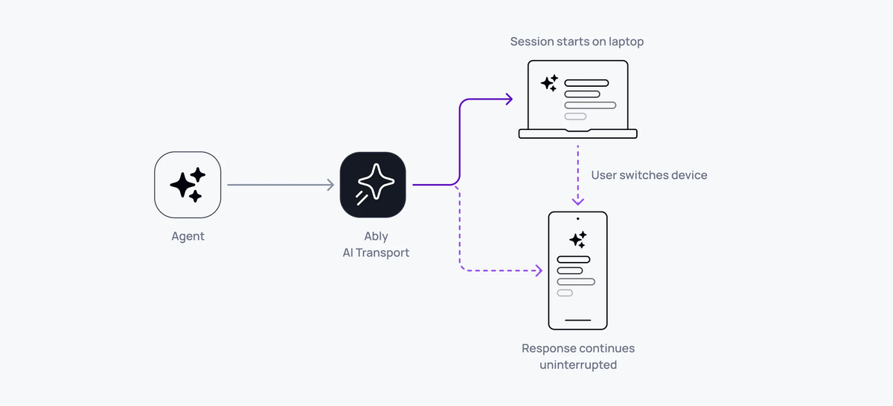

<Aside data-type='new'>
The AI Transport docs are being actively written and developed. They are available early to explain how AI Transport functions.
</Aside>

Multi-device sessions in AI Transport work because the session is a shared Ably channel, not a private connection. Any device that subscribes to the channel sees every message - user prompts, agent responses, and control signals - in real time. Open a second tab, switch to your phone, or share a session with a colleague.



## How it works <a id="how-it-works"/>

All clients connected to the same Ably channel share the same durable session. When any participant publishes (a user message, an agent response, a cancel signal), every other participant receives it through their channel subscription.

The client transport distinguishes between "own" turns (started by this client) and "observer" turns (started by someone else). Both types are tracked, decoded, and added to the conversation tree. The UI updates for all clients, regardless of who initiated the action.

Minimal code - no special configuration needed:

<Code>
```javascript
// Client A (laptop)
const transport = useClientTransport({
  channel: ably.channels.get('shared-session'),
  codec: UIMessageCodec,
  clientId: 'user-laptop',
})

// Client B (phone) - same channel name, different device
const transport = useClientTransport({
  channel: ably.channels.get('shared-session'),
  codec: UIMessageCodec,
  clientId: 'user-phone',
})
```
</Code>

Both clients see the same conversation. When Client A sends a message, Client B sees it immediately.

<Aside data-type='note'>
Without a shared session layer, each device has its own isolated connection to the agent. Syncing state between devices requires custom infrastructure - message queues, state replication, conflict resolution. With AI Transport, multi-device is a natural property of the channel.
</Aside>

## Own turns vs observer turns <a id="own-vs-observer"/>

The transport distinguishes between turns initiated by the current client and turns from other participants:

- Own turns - the client sent the HTTP POST that created this turn. It receives an `ActiveTurn` with a `stream` and `cancel()` method.
- Observer turns - another client or agent created this turn. The observer sees the turn lifecycle events and streamed messages, but doesn't have a direct stream handle.

Both types appear in the conversation tree and UI. The difference is in how they're routed internally - own turns have a dedicated stream, observer turns are accumulated from channel messages.

## Active turn tracking <a id="active-turns"/>

Track which clients have active turns using `useActiveTurns`:

<Code>
```javascript
const activeTurns = useActiveTurns(transport)
// Map<clientId, Set<turnId>>

// Check if any client is streaming
const isAnyoneStreaming = activeTurns.size > 0

// Check if a specific client is streaming
const isAgentWorking = activeTurns.has('agent-1')
```
</Code>

This works across all connected clients. If Client A starts a turn, Client B's `useActiveTurns` updates immediately.

## Sync with useChat <a id="syncing"/>

When using Vercel's `useChat`, the `useMessageSync` hook pushes messages from other clients into `useChat`'s state:

<Code>
```javascript
const { messages, setMessages } = useChat({ transport: chatTransport })
useMessageSync(transport, setMessages)
```
</Code>

Without `useMessageSync`, `useChat` only sees messages from its own sends. The sync hook bridges the gap by feeding observer messages into the state.

## Late joiners <a id="late-joiners"/>

A client that connects after the conversation has started loads the full history from the channel:

<Code>
```javascript
const { nodes, hasOlder, loadOlder } = useView(transport, { limit: 30 })
```
</Code>

`useView` loads history on mount. If a response is currently streaming, the late joiner sees it in progress - the lifecycle tracker synthesizes missing events so the stream renders correctly.

## Client identity <a id="client-identity"/>

Each client has a `clientId` that identifies it across the session. Set the client ID through Ably token authentication to ensure it's verified and can't be spoofed:

<Code>
```javascript
// In your token endpoint
const token = jwt.sign({
  'x-ably-clientId': 'user-123',
  // ...
}, keySecret)
```
</Code>

The `clientId` is used throughout: turn ownership, cancel scoping (`{ own: true }` filters by the sender's client ID), and active turn tracking.

## Related features <a id="related"/>

- [Reconnection and recovery](/docs/ai-transport/features/reconnection-and-recovery) - each device reconnects independently
- [Cancellation](/docs/ai-transport/features/cancellation) - cancel from any device
- [History and replay](/docs/ai-transport/features/history) - late joiners load full conversation
- [Concurrent turns](/docs/ai-transport/features/concurrent-turns) - multiple clients sending simultaneously
- [React hooks](/docs/ai-transport/api-reference/react-hooks) - reference for `useActiveTurns`, `useMessageSync`, and other hooks.
- [Sessions and turns](/docs/ai-transport/how-it-works/sessions-and-turns) - how shared sessions enable multi-device access.
- [Get started](/docs/ai-transport/getting-started/vercel-ai-sdk) - build your first AI Transport application.
