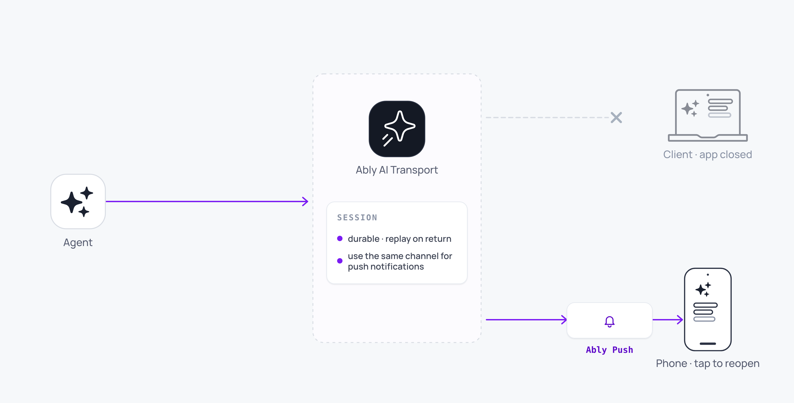

Push notifications let you notify users when an agent completes a long-running task, even if the user has closed the app. This uses Ably's native [Push Notifications](/docs/push) alongside AI Transport.



<Aside data-type='note'>
Push notifications are not built into the AI Transport SDK. They use the Ably Push API to deliver notifications to devices that are no longer connected to the session channel.
</Aside>

## The pattern <a id="the-pattern"/>

The flow works as follows:

1. A user sends a message that triggers a long-running agent task (research, code generation, data analysis).
2. The user closes the app or navigates away.
3. The agent completes the task and publishes the result to the session channel.
4. A push rule on the channel triggers a notification to the user's device.
5. The user taps the notification and returns to the completed conversation.

Because AI Transport persists messages on the Ably channel, the full response is available when the user returns. There is no need to store results separately.

## Set up push rules <a id="push-rules"/>

Configure a channel rule in the Ably dashboard to trigger push notifications when the agent publishes a completion event:

<Code>
```javascript
// Server: publish a completion event when the agent finishes
app.post('/api/chat', async (req, res) => {
  const body = await req.json()
  const { userId } = body
  const invocation = Invocation.fromJSON(body)
  const session = createAgentSession({ client: ably, channelName: invocation.sessionName, codec: createUIMessageCodec() })
  await session.connect()
  const run = session.createRun(invocation, { signal: req.signal })

  // Rebuild the conversation from run.view before run.start(): draining pages in
  // this run's triggering input (otherwise run.start() awaits it arriving live).
  while (run.view.hasOlder()) {
    await run.view.loadOlder()
  }
  const conversation = run.view.getMessages().map(({ message }) => message)

  await run.start()

  const result = streamText({
    model: openai('gpt-4o'),
    messages: conversation,
    abortSignal: run.abortSignal,
  })

  const { reason } = await run.pipe(result.toUIMessageStream())
  await run.end({ reason })
  await session.end()

  if (reason === 'complete') {
    // Publish a push-eligible event on a notification channel
    const notificationChannel = ably.channels.get(`notifications:${userId}`)
    await notificationChannel.publish('agent-complete', {
      title: 'Your agent has finished',
      body: 'Tap to view the response',
      sessionName: invocation.sessionName,
    })
  }
  res.json({ ok: true })
})
```
</Code>

On the client, register the device for push notifications and subscribe to the notification channel:

<Code>
```javascript
// Client: subscribe for push notifications
const notificationChannel = ably.channels.get(`notifications:${userId}`)
await notificationChannel.push.subscribeDevice()
```
</Code>

## Combine with AI Transport sessions <a id="combining-with-sessions"/>

The notification payload can include the session ID, so the client opens directly to the right conversation. When the user taps the notification, load the session and use [history and replay](/docs/ai-transport/features/history) to display the full conversation including the completed response.

## Edge cases and unhappy paths <a id="edge-cases"/>

- A run that ends with reason `'cancelled'` or `'error'` does not publish a completion notification. Gate the push publish on `reason === 'complete'`.
- A device that never registered for push (no `notificationChannel.push.subscribeDevice()` call) does not receive the alert. Register on first launch and after a token refresh.
- Notification payload limits apply per platform (around 4KB for APNs). Do not embed the full agent response; carry a session pointer and load history when the user returns.
- A user with several devices receives the notification on every registered device. Deduplicate at the device level if you only want one.
- The notification channel is a separate Ably channel from the session channel. Capabilities scope independently; the user's token needs `subscribe` on both, plus `push-subscribe` on the notification channel.

## FAQ <a id="faq"/>

### Do I need a separate notification channel? <a id="faq-separate-channel"/>

Yes. The push rule is per-channel; using a dedicated `notifications:{userId}` channel keeps the push policy off the conversation channel and lets you scope capabilities cleanly.

### Does AI Transport publish the notification for me? <a id="faq-sdk"/>

No. The SDK has no built-in push integration. The agent decides when the run is "done enough to notify" and calls `channel.publish` on the notification channel; Ably's push rule converts that publish into a device notification.

### Can I reuse the session channel for push? <a id="faq-reuse-channel"/>

You can, but every streamed message would then trigger the push rule. Publishing one completion event on a separate channel keeps the notification single-shot.

### What happens if the user opens a new device after the run completes? <a id="faq-new-device"/>

The notification fires only on devices that had registered for push before the publish. A new device sees the completed conversation when it loads history through [`useView`](/docs/ai-transport/api/react/core/use-view).

### How do I avoid duplicate notifications across devices? <a id="faq-dedupe"/>

Either subscribe only one device per user, or include a `messageId` in the payload and dedupe on the client. Ably itself does not dedupe across a device fleet.

## Related features <a id="related"/>

- [History and replay](/docs/ai-transport/features/history): loading completed responses after reconnecting.
- [Reconnection and recovery](/docs/ai-transport/features/reconnection-and-recovery): resuming sessions after disconnection.
- [Sessions](/docs/ai-transport/concepts/sessions): how durable sessions persist while users are offline.
- [Ably Push](/docs/push): full reference for the Push Notifications API.
