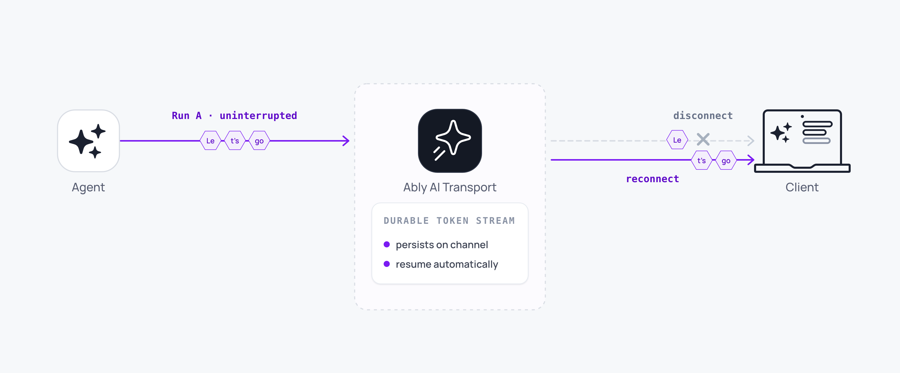

Streams survive connection drops automatically. When a client disconnects, the agent keeps streaming to the [session](/docs/ai-transport/concepts/sessions). When the client reconnects, it resumes from the exact point it left off, with no lost tokens, no broken responses, and no manual retry code.

This is built into the transport layer. Application code does not need to do anything.



## How it works <a id="how-it-works"/>

The durable session on the Ably channel persists independently of any single connection. When a client's connection drops:

1. The agent continues streaming tokens to the channel; the stream is not tied to the client's connection.
2. The Ably SDK reconnects automatically.
3. On reconnect, the client transport uses `untilAttach` to load any messages it missed during the gap.
4. The conversation state is restored. The client sees the complete response.

## Recovery scenarios <a id="recovery-scenarios"/>

Two recovery paths exist depending on how long the client was disconnected.

When the disconnection is brief, Ably's connection protocol handles it. The client reconnects and the SDK uses `untilAttach` to load any messages published during the gap. There is no missing window; the response resumes exactly where it left off.

When the client has been offline for longer than the live recovery window, it loads the full conversation from channel history on reconnect. Pagination through history uses `view.loadOlder()` to reconstruct the rest of the conversation.

## Server-side encoder recovery <a id="encoder-recovery"/>

On the server side, the encoder handles transient failures during streaming. If an append operation fails, for example due to a network blip between the server and Ably, the encoder falls back to a full message update:

1. Append the next token to the message (normal path).
2. If the append fails, send a full update with the accumulated content (recovery path).
3. Continue appending from the recovered state.

This happens inside `run.pipe()`. The accumulated response is never lost, even when individual append operations fail.

## Mid-stream joins <a id="mid-stream-joins"/>

When a client joins a channel while a response is already streaming, the lifecycle tracker delivers the correct sequence of events. Missing lifecycle events (such as the stream start) are synthesised so the client processes the in-progress stream correctly.

A second tab opened during streaming sees the streaming content immediately.

## Load history on reconnect <a id="loading-history"/>

`useView` loads conversation history using Ably's `untilAttach` parameter:

<Code>
```javascript
const { messages, hasOlder, loadOlder } = useView({ limit: 30 });
```
</Code>

`useView` loads history on mount. The `untilAttach` flag prevents a gap between historical messages and live messages; every message is accounted for.

To load older messages beyond the initial window:

<Code>
```javascript
const { messages, hasOlder, loadOlder } = useView({ limit: 30 });

if (hasOlder) {
  await loadOlder();
}
```
</Code>

## Edge cases and unhappy paths <a id="edge-cases"/>

- A client that drops mid-stream and reconnects after the live recovery window does not get every individual token replayed. It receives the accumulated content of the message up to the latest append. The user-visible result is the same.
- A client without channel history capability cannot reconnect after the live recovery window. Capability scoping is part of [authentication](/docs/ai-transport/concepts/authentication).
- An agent that crashes mid-stream leaves the partial message on the channel. Its `status` header stays at `streaming` because the stream never closed. A retry creates a new message, not a continuation of the partial one.
- The encoder fallback to a full message update is invisible to subscribers. If you log channel operations, you see periodic updates between appends.
- A client clock drift does not affect recovery. Reconnection uses the channel's serial, not wall-clock time.

## FAQ <a id="faq"/>

### What is the live recovery window? <a id="faq-window"/>

It is the period during which Ably can replay messages without falling back to history. The duration depends on the connection state and the channel configuration. After that window, the SDK switches to history-based recovery transparently.

### Does the user see the agent pause when they reconnect? <a id="faq-pause"/>

No. The view emits the accumulated content of the streamed message on reconnect, then continues with any further appends. The user sees the response as continuous.

### How long is the response retained after the agent ends the turn? <a id="faq-retention"/>

For the channel history retention period. Configure this through the channel's persistence settings. See [history and replay](/docs/ai-transport/features/history) for the recovery patterns.

### What if the agent process dies before the stream finishes? <a id="faq-agent-crash"/>

The partial message stays on the channel with its `status` header at `streaming` because the stream never closed. The session is intact. A new turn restarts the work; AI Transport does not automatically retry the LLM call.

### Does the client need special code to handle reconnection? <a id="faq-app-code"/>

No. The transport handles reconnection internally. `useView` exposes `hasOlder` and `loadOlder` for explicit history pagination, which is the only application-visible recovery primitive.

## Related features <a id="related"/>

- [Token streaming](/docs/ai-transport/features/token-streaming): what gets recovered.
- [Multi-device sessions](/docs/ai-transport/features/multi-device): the same recovery model across devices.
- [History and replay](/docs/ai-transport/features/history): loading conversation history.
