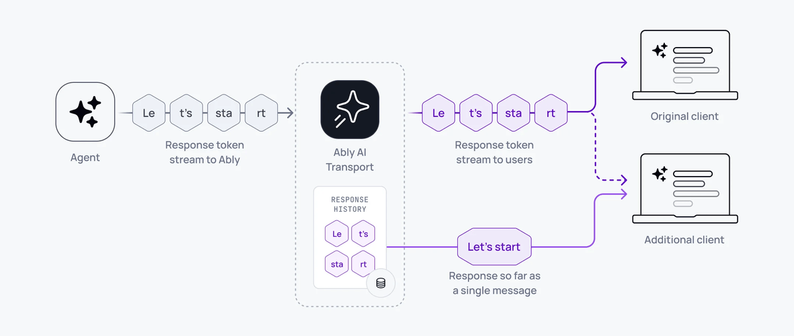

<Aside data-type='new'>
The AI Transport docs are being actively written and developed. They are available early to explain how AI Transport functions.
</Aside>

Token streaming allows progressively streaming the tokens that are generated by LLMs to clients in realtime, as the response is being generated.

The Ably channel delivers each individual token to clients subscribed in realtime and automatically compacts the tokens into full LLM responses so clients do not have to re-stream the entire conversation token-by-token when they reconnect, refresh, or load history.



## How it works

Token streaming allows clients to receive and consume tokens as they are generated by the LLM, but also allows clients to consume the full responses as a single coherent message when not subscribing in realtime. For example, when looking at history, refreshing the client, or returning to a conversation.

A key feature of AI Transport's transport layer is that it understands the relationship between responses and their individual tokens. By doing this, the service can support clients that resume an interrupted connection, or those that refresh, during a streamed response. AI Transport supports token streaming by enabling agents to form responses incrementally by appending each token to the content of a single message. Each appended token can be received immediately by a subscriber consuming in realtime. Clients that are not connected in realtime do not need to consume each individual token in order to rebuild the response, these clients can consume the entire response up to the last appended token as a single message.

Using the AI Transport SDK on the server with Vercel's AI SDK, a single call streams the entire response:

<Code>
```javascript
const { reason } = await turn.streamResponse(result.toUIMessageStream())
```
</Code>

That single line reads the LLM stream, encodes tokens through the codec, publishes messages to the Ably channel, handles abort signals, and returns when the stream completes or is cancelled.

On the client, the view updates as tokens arrive:

<Code>
```javascript
const { nodes } = useView(transport)
// nodes contains messages with streaming text that updates in real time
```
</Code>

<Aside data-type='note'>
Without a durable token streaming layer, the LLM response is tied to a single HTTP connection. If the connection drops, the stream dies and partial responses are lost. AI Transport decouples the stream from the connection - tokens persist on the channel and any client can receive them.
</Aside>

## Stream lifecycle <a id="stream-lifecycle"/>

Each streamed response goes through three states:

- `streaming` - tokens are being appended. The message grows as tokens arrive.
- `finished` - the stream completed normally. The message is final.
- `aborted` - the stream was cancelled or errored. The partial message is preserved.

The stream status is tracked in the message header (`x-ably-status`). Clients can check whether a message is still streaming or complete.

## Implement token streaming <a id="implement"/>

### Server <a id="server"/>

The server creates a turn, invokes the LLM, and streams the response:

<Code>
```javascript
import { createServerTransport } from '@ably/ai-transport/vercel'

const transport = createServerTransport({ channel })
const turn = transport.newTurn({ turnId, clientId })

await turn.start()
await turn.addMessages(messages, { clientId })

const result = streamText({
  model: anthropic('claude-sonnet-4-20250514'),
  messages: conversationHistory,
  abortSignal: turn.abortSignal,
})

const { reason } = await turn.streamResponse(result.toUIMessageStream())
await turn.end(reason)
```
</Code>

`streamResponse` accepts any `ReadableStream`. For Vercel AI SDK, `result.toUIMessageStream()` provides the right format. For other frameworks, produce a `ReadableStream` of your codec's event type.

### Client <a id="client"/>

With Vercel's `useChat`:

<Code>
```javascript
const transport = useClientTransport({ channel, codec: UIMessageCodec, clientId })
const chatTransport = useChatTransport(transport)
const { messages } = useChat({ transport: chatTransport })
```
</Code>

With generic hooks:

<Code>
```javascript
const { nodes } = useView(transport)
// Each node.message contains the streamed content, updating in real time
```
</Code>

## Under the hood <a id="under-the-hood"/>

The codec converts domain events to Ably operations:

- Start - creates a new Ably message on the channel.
- Append - appends content to the existing message (Ably message append operation).
- Close - updates the message with a terminal status (finished/aborted).

If an append fails, for example due to a transient network issue, the encoder falls back to a full message update operation to recover. This ensures the accumulated response is never lost.

## Append rollup <a id="rollup"/>

LLM token streaming introduces high-rate traffic patterns, with some models outputting upwards of 150 distinct token events per second. AI Transport automatically manages this by rolling up multiple appends into a single published message, preventing a single response stream from reaching the [message rate limit](/docs/platform/pricing/limits#connection) for a connection.

1. Your agent streams tokens to the channel at the model's output rate.
2. Ably publishes the first token immediately, then automatically rolls up subsequent tokens on receipt.
3. Clients receive the same content, delivered in fewer discrete messages.

By default, Ably delivers a single response stream at 25 messages per second or the model output rate, whichever is lower. Ably charges for the number of published messages, not for the number of streamed tokens.

### Configure rollup behaviour <a id="configure-rollup"/>

Ably concatenates all appends for a single response that are received during the rollup window into one published message. Set the rollup window for a connection using the `appendRollupWindow` [transport parameter](/docs/api/realtime-sdk#client-options):

| `appendRollupWindow` | Maximum message rate for a single response |
|---|---|
| 0ms | Model output rate |
| 20ms | 50 messages/s |
| 40ms *(default)* | 25 messages/s |
| 100ms | 10 messages/s |
| 500ms *(max)* | 2 messages/s |

<Code>
```javascript
const ably = new Ably.Realtime(
  {
    key: '{{API_KEY}}',
    transportParams: { appendRollupWindow: 100 }
  }
);
```
</Code>

<Aside data-type="important">
If you configure the `appendRollupWindow` to allow a single response to use more than your [connection inbound message rate](/docs/platform/pricing/limits#connection) you will see [limit enforcement](/docs/platform/pricing/limits#hitting) behaviour if you stream tokens faster than the allowed message rate.
</Aside>

## Related features <a id="related"/>

- [Cancellation](/docs/ai-transport/features/cancellation) - stop a stream mid-response.
- [Reconnection and recovery](/docs/ai-transport/features/reconnection-and-recovery) - resume streams after disconnection.
- [History and replay](/docs/ai-transport/features/history) - load past streamed responses from channel history.
- [Chain of thought](/docs/ai-transport/features/chain-of-thought) - stream reasoning alongside text.
- [Server transport API](/docs/ai-transport/api-reference/server-transport) - reference for `streamResponse` and other server methods.
- [Transport architecture](/docs/ai-transport/how-it-works/transport) - how the transport layer encodes and delivers tokens.
- [Get started](/docs/ai-transport/getting-started/vercel-ai-sdk) - build your first AI Transport application.
