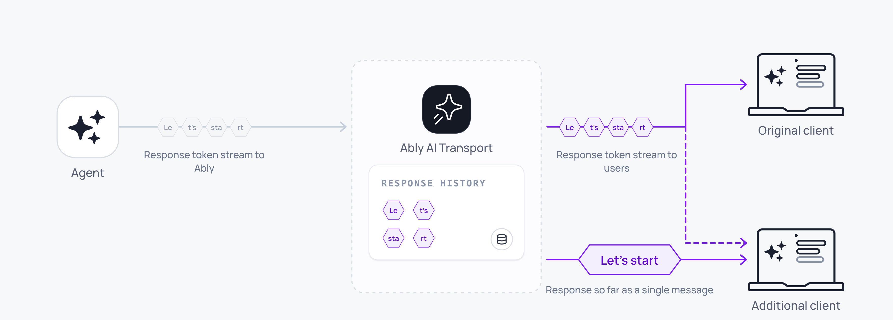

Tokens stream from the model to every connected client as the LLM generates them. The same response is also available as a single coherent message to any client that reconnects, refreshes, or loads history.



A minimal server-side stream uses one call:

<Code>
```javascript
const { reason } = await run.pipe(result.toUIMessageStream());
```
</Code>

That single line reads the LLM stream, encodes tokens through the codec, publishes messages to the Ably channel, handles abort signals, and returns when the stream completes or is cancelled.

## How it works <a id="how-it-works"/>

The transport layer treats a streamed response as one logical message built incrementally by appending each token to a single Ably channel message. A real-time subscriber receives each appended token as it arrives. A client that joins later, refreshes, or reconnects sees the accumulated content of that message up to the latest append; it does not need to replay each token to rebuild the response.

A streamed message moves through three states:

| State | Meaning |
| --- | --- |
| `streaming` | Tokens are being appended. The message grows as tokens arrive. |
| `complete` | The stream completed normally. The message is final. |
| `cancelled` | The stream was cancelled. The partial message is preserved. |

The stream status is carried in the message header `status` under the `extras.ai.codec` tier. Clients check this to detect whether a message is still streaming.

## Implement token streaming <a id="implement"/>

### Server <a id="server"/>

The server creates a turn, invokes the LLM, and streams the response:

<Code>
```javascript
import { Invocation } from '@ably/ai-transport';
import { createAgentSession } from '@ably/ai-transport/vercel';

const invocation = Invocation.fromJSON(await req.json());
const session = createAgentSession({ client: ably, channelName: invocation.sessionName });
await session.connect();
const run = session.createRun(invocation, { signal: req.signal });

// Rebuild the conversation from run.view before run.start(): draining pages in
// this run's triggering input (otherwise run.start() awaits it arriving live).
while (run.view.hasOlder()) {
  await run.view.loadOlder();
}
const conversation = run.view.getMessages().map(({ message }) => message);

await run.start();

const result = streamText({
  model: anthropic('claude-sonnet-4-20250514'),
  messages: conversation,
  abortSignal: run.abortSignal,
});

const { reason } = await run.pipe(result.toUIMessageStream());
await run.end({ reason });
await session.close();
```
</Code>

`Run.pipe` accepts any `ReadableStream`. For Vercel AI SDK, `result.toUIMessageStream()` provides the right format. For other frameworks, produce a `ReadableStream` of your codec's event type.

### Client <a id="client"/>

With Vercel's `useChat`:

<Code>
```javascript
const { chatTransport } = useChatTransport();
const { messages } = useChat({ transport: chatTransport });
```
</Code>

With the generic hooks:

<Code>
```javascript
const { messages } = useView();
// Each message updates in real time as tokens are appended on the channel.
```
</Code>

## Under the hood <a id="under-the-hood"/>

The codec converts domain events to Ably operations:

- Start: create a new Ably message on the channel.
- Append: append content to the existing message (Ably message append operation).
- Close: append a terminal status (`complete` or `cancelled`) to the message.

If an append fails, for example due to a transient network issue, the encoder falls back to a full message update operation to recover. The accumulated response is never lost.

## Append rollup <a id="rollup"/>

LLM token streaming produces high-rate traffic. Some models emit over 150 distinct token events per second. AI Transport rolls up multiple appends into a single published message, so a single response does not hit the [message rate limit](/docs/platform/pricing/limits#connection) on a connection.

1. Your agent streams tokens to the channel at the model's output rate.
2. Ably publishes the first token immediately, then rolls up subsequent tokens within the rollup window.
3. Clients receive the same content, delivered in fewer discrete messages.

By default, Ably delivers a single response stream at 25 messages per second, or the model output rate, whichever is lower. Ably charges for the number of published messages, not the number of streamed tokens.

### Configure rollup behaviour <a id="configure-rollup"/>

Set the rollup window for a connection using the `appendRollupWindow` [transport parameter](/docs/api/realtime-sdk#client-options):

| `appendRollupWindow` | Maximum message rate for a single response |
|---|---|
| 0ms | Model output rate |
| 20ms | 50 messages/s |
| 40ms (default) | 25 messages/s |
| 100ms | 10 messages/s |
| 500ms (maximum) | 2 messages/s |

<Code>
```javascript
const ably = new Ably.Realtime({
  authUrl: '/api/auth/token',
  transportParams: { appendRollupWindow: 100 },
});
```
</Code>

<Aside data-type="important">
If `appendRollupWindow` allows a single response to exceed your [connection inbound message rate](/docs/platform/pricing/limits#connection), Ably enforces [the rate limit](/docs/platform/pricing/limits#hitting) when you stream tokens faster than allowed.
</Aside>

## Edge cases and unhappy paths <a id="edge-cases"/>

- A network drop during streaming pauses delivery to the affected client. The server keeps publishing. On reconnect, the client receives the accumulated content of the message up to the latest append, not a replay of every token. This allows the client to efficiently catchup to the latest response state without replaying the response token-by-token.
- A cancelled stream leaves the partial message on the channel with status `cancelled`. Render it the same as a complete message; treat the absence of further tokens as the signal to stop animating.
- If `appendRollupWindow` is set to `0ms` to maximise model output rate, you become responsible for keeping the publish rate under your connection limit.
- An append fallback (full message update) is invisible to subscribers; the message content is consistent. If you log channel operations, you see periodic updates instead of appends.
- A turn that times out on the server before the stream finishes ends with run reason `'error'`. The partial message is closed with status `cancelled`.

## FAQ <a id="faq"/>

### What happens to the stream when the client tab closes? <a id="faq-tab-close"/>

The agent keeps streaming. The session and message persist on the channel. When the user returns, the client loads the accumulated content of the message and receives any further tokens in real time.

### Does Ably charge per token? <a id="faq-pricing"/>

No. Ably charges per published message, not per token. The append rollup reduces the publish rate; multiple tokens become one published message. See [pricing](/docs/platform/pricing) for the current rates.

### How do I stream more than one message per turn? <a id="faq-multi-message"/>

A single `run.pipe(stream)` consumes the LLM's output stream and appends each chunk as it arrives. Multiple assistant messages, tool calls, and follow-on text within one stream all flow through the same `pipe` call. If your framework produces several discrete streams in one turn (for example a planner emits a status line, then the responder streams the answer), call `run.pipe` once per stream; the Run is the unit that groups them.

### Why does my client see fewer tokens than the model emits? <a id="faq-fewer-tokens"/>

The append rollup compacts multiple tokens into single published messages within the rollup window. The content is identical; the delivery is fewer, larger updates. Set `appendRollupWindow` to `0ms` to disable rollup and deliver every model token as its own message, subject to the connection rate limit.

### What status do I see on a cancelled response? <a id="faq-cancel-status"/>

The message keeps the content it had at the time of the cancel and its `status` header transitions to `cancelled`. Use this to distinguish a partial response from a complete one.

## Related features <a id="related"/>

- [Cancellation](/docs/ai-transport/features/cancellation): stop a stream mid-response.
- [Reconnection and recovery](/docs/ai-transport/features/reconnection-and-recovery): resume streams after disconnection.
- [History and replay](/docs/ai-transport/features/history): load past streamed responses from channel history.
