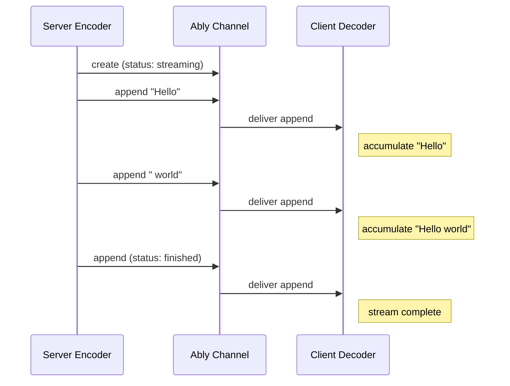

## What is token streaming

Token streaming is the delivery of agent responses incrementally, as each token is generated, instead of waiting and delivering a response only when it is complete. This style of streamed response is one of the principal differences between a conventional chat interaction with a human and the expected style of interaction with an agent. Token streaming improves the user experience in an interactive chat session because it minimises the time that the user needs to wait to see that the agent is responding; since there is usually a bound on the maximum rate at which the underlying LLM can generate tokens, the time taken to generate the full response is longer for longer responses, and this delay makes the user experience feel unresponsive. All LLM providers now use token streaming in their chat interfaces and it is an expected element of a modern agent chat experience.

Support for token streaming has typically been provided via HTTP streaming, usually using the Server-Sent Events (SSE) protocol. Simply by substituting a streamed, progressive, response for a conventional HTTP response, provides a convenient way to extend a non-streaming turn-based chat experience into a streamed experience.

## Challenges of token streaming

Clients receive fragments of text - with some granularity, not necessarily single tokens - but we'll refer to those fragments as tokens for this discussion.

When clients are receiving tokens as they are streamed, the client will append each received token to the response that it has received up to that point, incrementally updating the response until it is complete. The client, for rendering purposes, will construct a client-side model of that chat sequence that is based on responses (whether complete or partial), instead of dealing only with a sequence of tokens. Dealing with this progressive materialisation in real time is straightforward.

The situation can become more problematic for the client if it is not obtaining token events in real time, but is obtaining them after they were initially published; either because the client is catching up, resuming from a dropped connection, or hydrating its state after a refresh, or re-visiting an earlier chat session. In these cases it is awkward at best, or impractical at worst, for the client to retrieve all of the individual token events, and recreate complete responses and chat history from what might be thousands of discrete events. This problem is even more complex when handing a page refresh, for example, where the client must hydrate its state to contain an extended prior chat history, whilst simultaneously receiving tokens for in-progress responses, and ensuring that it is materialising new responses in a way that is consistent with historical state. Therefore, providing effective support for token streaming is not simply a matter of enabling incremental updates at the protocol level; it is about ensuring that the client has a way to access history that avoids having to re-materialise responses, that complements and meshes exactly with the ongoing real time delivery of streamed responses.

## AI Transport token streaming features

AIT provides support for token streaming as a first-class primitive by treating incremental token updates to a response as just that: a response is a message, and a token update is an append to the content of that message. As a transport it is capable of delivering token updates individually as deltas, but the underlying storage model, which is used as a basis of resuming streams and hydrating returning clients, is organised around messages that correpond to whole responses. Ably's persists these messages including the accumulated text, so a reconnecting or late-joining client sees the full response in channel history.

On the server side, the agent encoder creates an Ably message for each content stream (text, reasoning, tool input) and appends token deltas as they arrive. On the client side, the decoder accumulates these appends into complete messages.

AIT adopts the standard `ReadableStream<T>` abstraction of streams of events, both on the server-side and the client side.

To understand the representation of streams, it is first necessary to understand a `Turn`, which encapulates a sequence of interactions, usually initiated by a client prompt, and resulting in one or more agent responses; a `Turn` represents the fact that a sequence of agent responses are logically related both to the initiating client prompt and one another. In many realisations of agent infrastructure, a turn is also the thing that governs the lifecycle of agent invocations; a client prompt will result in a request to, say, a serverless agent function, and that agent instance will then execute based on a workflow to completion, with all of the resulting agent actions (tool calls, responses) being associated with that turn.

On the server side, an agent may generate both discrete messages and streamed responses in a single turn. The AIT SDK expects the server to surface a streamed response as a `ReadableStream`, and the library takes care of piping the response to the AIT channel, incrementally appending to the resulting Ably channel message(s), and attaching all necessary metadata to enable the client to understand and handle that response.

On the client side, a `turn` exposes a `ReadableStream`, which the client can use to obtain all events, for all responses in that turn.

### Agent code example

### Client code example
