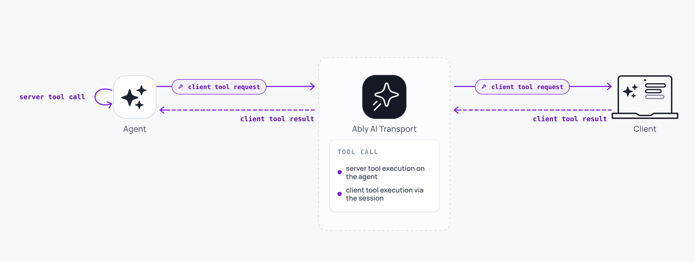

Tool calling in AI Transport supports both server-executed and client-executed tools. Tool invocations and results are published to the channel, so every client sees tool activity in real time and tool state persists in history.



## How it works <a id="how-it-works"/>

When the LLM invokes a tool, the invocation is streamed through the channel like any other turn event. Clients see tool calls appear as they are generated. If the tool runs on the server, the result is streamed back in the same run. If the tool runs on the client, the agent calls `run.suspend()` so the Run stays live; the client submits the result, and a continuation invocation resumes the same Run.

Tool state (invocations, arguments, results) is part of the channel's message history. Late joiners and reconnecting clients see the full tool activity, not just the final text.

## Server-executed tools <a id="server-executed"/>

Server-executed tools are the default path. The AI SDK handles tool execution during the LLM stream. Tool invocations and results are encoded by the codec and published to the channel as part of the turn.

<Code>
```javascript
const result = streamText({
  model: anthropic('claude-sonnet-4-20250514'),
  messages: conversationHistory,
  tools: {
    getWeather: {
      description: 'Get current weather for a location',
      inputSchema: z.object({ city: z.string() }),
      execute: async ({ city }) => {
        const data = await fetchWeather(city);
        return { temperature: data.temp, conditions: data.conditions };
      },
    },
  },
  abortSignal: run.abortSignal,
});

const { reason } = await run.pipe(result.toUIMessageStream());
await run.end({ reason });
```
</Code>

Clients see the tool invocation as it streams, then the result, then the LLM's follow-up text, all within a single turn.

## Client-executed tools <a id="client-executed"/>

Client-executed tools require a round trip between the server and the client. The LLM requests a tool call, the turn ends, the client executes the tool locally and submits the result, and a continuation turn starts.

On the server, define the tool without an `execute` function. When the LLM invokes it, the stream ends with a tool call that the client must fulfil:

<Code>
```javascript
const result = streamText({
  model: anthropic('claude-sonnet-4-20250514'),
  messages: conversationHistory,
  tools: {
    getUserLocation: {
      description: "Get the user's current location",
      inputSchema: z.object({}),
      // No execute function: the client handles this.
    },
  },
  abortSignal: run.abortSignal,
});

const pipeResult = await run.pipe(result.toUIMessageStream());
const outcome = await vercelRunOutcome(pipeResult, result.finishReason);

if (outcome.reason === 'suspend') {
  await run.suspend();
} else {
  await run.end(outcome);
}
```
</Code>

[`vercelRunOutcome`](/docs/ai-transport/api/javascript/vercel/run-outcome) returns `'suspend'` when `streamText` finishes with `finishReason: 'tool-calls'`, so the agent suspends instead of ending. The pending tool call stays on the channel for any connected client to fulfil.

On the client, find the assistant message with the pending tool call and publish a `tool-result` input addressed to its `codecMessageId`. The codec folds the result onto the suspended assistant message, and the agent picks it up to continue the run:

<Code>
```javascript
const { messages, runOf, send } = useView();

const pending = messages.find(({ message }) =>
  message.parts?.some((p) => p.type === 'dynamic-tool' && p.state === 'input-available'),
);

if (pending) {
  const toolCall = pending.message.parts.find(
    (p) => p.type === 'dynamic-tool' && p.state === 'input-available',
  );

  const location = await new Promise((resolve, reject) => {
    navigator.geolocation.getCurrentPosition(resolve, reject);
  });

  const run = await send(
    {
      kind: 'tool-result',
      codecMessageId: pending.codecMessageId,
      payload: {
        toolCallId: toolCall.toolCallId,
        output: { lat: location.coords.latitude, lng: location.coords.longitude },
      },
    },
    { runId: runOf(pending.codecMessageId).runId },
  );

  // Wake the agent so it picks up the result and resumes the run.
  await fetch('/api/chat', {
    method: 'POST',
    body: JSON.stringify(run.toInvocation().toJSON()),
  });
}
```
</Code>

The result is addressed to the suspended assistant message by `codecMessageId`. Reusing the original `runId` keeps the resume on the same run instead of starting a fresh one.

## OpenAI codec <a id="openai"/>

The examples above use the Vercel codec, but the OpenAI Responses codec supports the same tool surface: server-executed function calls, client-executed tools, tool failures, and human approvals. The suspend and resume mechanics live in the transport, so they are identical for both codecs. The wire types and the factory payload field names differ.

The OpenAI codec expresses tool state against the Responses types, so a tool call is a `function_call` item and its result is a `function_call_output` item. The client factories take snake_case payloads keyed by `call_id`, and you address each to the assistant message that holds the call:

<Code>
```javascript
import { ResponsesCodec } from '@ably/ai-transport/openai';

// A client-run tool succeeded.
await view.send(ResponsesCodec.createToolResult(codecMessageId, { call_id, output }), { runId });

// A client-run tool failed. The message becomes the output the model sees next turn.
await view.send(ResponsesCodec.createToolResultError(codecMessageId, { call_id, message }), { runId });

// A user approved or denied a gated tool. A denial resolves entirely on the client.
await view.send(ResponsesCodec.createToolApprovalResponse(codecMessageId, { call_id, approved, reason }), { runId });
```
</Code>

The Responses `function_call_output` item has no field for an approval decision or an error, so the codec holds that render-only state on `OpenAIMessage.toolCallStates`, a map keyed by `call_id`. `toResponsesInput` never reads it, so it cannot reach the model. See [OpenAI Responses](/docs/ai-transport/frameworks/openai) for the agentic loop and the approval-request output.

## History persistence <a id="history"/>

Tool invocations and results are part of the channel's message history. When a client reconnects or a late joiner loads the conversation, tool activity is replayed along with text messages. The view reconstructs tool state so the UI shows the correct status: pending, complete, or failed.

A user who starts a tool-assisted workflow on a laptop continues it on a phone without losing context.

## Durable tool execution <a id="durable-tools"/>

When the agent runs inside a workflow engine such as [Temporal](/docs/ai-transport/frameworks/temporal) or [Vercel WDK](/docs/ai-transport/frameworks/vercel-wdk), each tool execution can be its own retryable activity. Wrap the tool call in [`AgentRun.createStep({ stepId })`](/docs/ai-transport/api/javascript/core/agent-session#create-step) and publish the result via [`RunStep.send`](/docs/ai-transport/api/javascript/core/agent-session#step-send). A retry of the same tool activity re-enters `createStep` with the same `stepId`, so the retry's tool result supersedes the failed attempt on the channel rather than appending beside it. See [Durable execution](/docs/ai-transport/features/durable-execution).

## Edge cases and unhappy paths <a id="edge-cases"/>

- A client-executed tool that the user denies (for example a geolocation permission prompt) leaves the tool call pending. Submit a failure with `codec.createToolResultError(codecMessageId, { toolCallId, message })` (or the literal `{ kind: 'tool-result-error', ... }`) to unblock the LLM, or end the turn explicitly.
- A tool that takes longer than the agent's runtime budget should suspend the run rather than end it. When the result is ready, publish it as a `tool-result` input addressed to the original message on a continuation (the pattern shown above), which resumes the same run; do not start a new run just to deliver a late result.
- A server-executed tool that does not honour `run.abortSignal` keeps running after a cancel. Wire the signal into your tool implementation.
- Two clients submitting the same client-executed tool concurrently produce two continuation turns. Guard against double-submit at the application layer.
- A failed tool call is delivered with an error result. The view exposes the failure; render it in place rather than silently retrying.

## FAQ <a id="faq"/>

### Do server-executed and client-executed tools mix in one turn? <a id="faq-mix"/>

Yes. The LLM may invoke any tool the agent defines. Server-executed tools complete inline; client-executed tools end the turn and resume in a continuation turn.

### How do I cancel a tool call? <a id="faq-cancel"/>

Cancel the turn. The agent's `abortSignal` fires; if your tool implementation checks it, the tool stops. Pending client-executed tools do not invoke if the turn is cancelled before submission.

### What if my client cannot perform the tool? <a id="faq-cannot"/>

Submit a tool result with an error payload. The agent receives it on the continuation turn and decides how to respond.

### Are tool inputs and outputs visible to every participant? <a id="faq-visibility"/>

Yes. Tool calls are messages on the channel, so every subscriber sees them. Scope channel capabilities if you need to restrict visibility.

### How big can a tool result be? <a id="faq-size"/>

Subject to Ably's message size limit. See [the platform limits](/docs/platform/pricing/limits). Stream large results across multiple events or persist them externally and reference the URL.

## Related features <a id="related"/>

- [Human-in-the-loop](/docs/ai-transport/features/human-in-the-loop): approval gates built on tool calling.
- [Token streaming](/docs/ai-transport/features/token-streaming): how tool events are streamed.
- [History and replay](/docs/ai-transport/features/history): loading past tool activity from history.
- [Durable execution](/docs/ai-transport/features/durable-execution): run each tool as its own retryable Step under a workflow engine.
