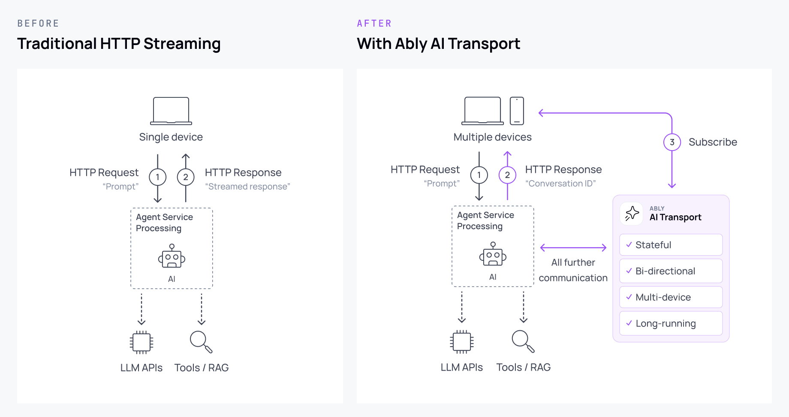

AI Transport enables you to add a realtime delivery layer to your application, providing the infrastructure required to deliver modern, stateful AI experiences to users. It works seamlessly with any AI model or framework, such as OpenAI, Anthropic, Vercel or LangChain.

AI Transport runs on Ably's [fault-tolerant](/docs/platform/architecture/fault-tolerance) and highly-available platform. The platform supports streaming data between all internet-connected devices at [low latencies](/docs/platform/architecture/latency) across the globe. Its elastic global infrastructure delivers enterprise-scale messaging that [effortlessly scales](/docs/platform/architecture/platform-scalability) to meet demand.

Drop AI Transport into your applications to transform them into modern, bi-directional AI experiences that keep users engaged. AI Transport provides the building blocks to deliver reliable, resumable token streams with robust session management and state hydration to always keep your users and agents in sync.

## Get started

Start learning the basics of AI Transport right away with a getting started guide using your agent and framework of choice:

### OpenAI

Use the following guides to get started with OpenAI:

<Tiles>
{[
  {
    title: 'Message-per-response',
    description: 'Stream OpenAI responses using message appends',
    image: 'icon-tech-javascript',
    link: '/docs/guides/ai-transport/openai-message-per-response',
  },
  {
    title: 'Message-per-token',
    description: 'Stream OpenAI responses using individual token messages',
    image: 'icon-tech-javascript',
    link: '/docs/guides/ai-transport/openai-message-per-token',
  },
]}
</Tiles>

### Anthropic

Use the following guides to get started with Anthropic:

<Tiles>
{[
  {
    title: 'Message-per-response',
    description: 'Stream Anthropic responses using message appends',
    image: 'icon-tech-javascript',
    link: '/docs/guides/ai-transport/anthropic-message-per-response',
  },
  {
    title: 'Message-per-token',
    description: 'Stream Anthropic responses using individual token messages',
    image: 'icon-tech-javascript',
    link: '/docs/guides/ai-transport/anthropic-message-per-token',
  },
]}
</Tiles>

## Features

AI Transport provides a range of features built on Ably's highly-scalable realtime platform to enable you to deliver reliable, stateful AI experiences that provide the first-class UX your users expect from modern applications.

### Token streaming <a id="tokens"/>

Token streaming is the core of how LLMs deliver their responses to users. Tokens are progressively streamed to users from your LLM so that users don't need to wait for a complete response before seeing any output.

Using AI Transport, your token streams are reliable and persistent. They survive modern environments where users change browser tabs, refresh the page or switch devices, and common interruptions such as temporary network loss. Your users can always reconnect and continue where they left off without having to start over.

[Read more about token streaming](/docs/ai-transport/token-streaming).

### Bi-directional communication <a id="communication"/>

AI Transport supports rich, bi-directional communication patterns between users and agents.

Build sophisticated AI experiences with features like accepting user input for interactive conversations, streaming chain-of-thought reasoning for transparency, attaching citations to responses for verifiability, implementing human-in-the-loop workflows for sensitive operations, and exposing tool calls for generative UI and visibility.

These messaging features work seamlessly with [token streaming](/docs/ai-transport/token-streaming) to create complete, interactive AI experiences.

[Read more about messaging features](/docs/ai-transport/messaging/accepting-user-input).

### Durable sessions <a id="sessions"/>

AI Transport enables durable sessions that persist beyond the lifetime of individual connections, allowing users and agents to connect and disconnect independently.

Communication shouldn't be tied to the connection state of either party. If a user goes offline or their connection drops, they should be able to continue their session without losing context. AI Transport provides robust session management by enabling users and agents to connect independently of one another.

Your users can start a conversation on their mobile and seamlessly continue it on their desktop. Similarly, multiple users can participate in the same conversation with a single agent and they will all remain in sync, in realtime.

[Read more about sessions and identity](/docs/ai-transport/sessions-identity).

### Automatic catch-up <a id="catch-up"/>

AI Transport enables clients to hydrate conversation and session state from the [channel](/docs/channels), including [message history](/docs/storage-history/history) and in-progress responses.

Whether a user is briefly disconnected when they drive through a tunnel, or they're rejoining a conversation the following day of work, AI Transport allows clients to resynchronise the full conversation state, including both historical messages and in-progress responses. Your users are always up to date with the full conversation, in order, anywhere.

[Read more about client hydration](/docs/ai-transport/token-streaming/message-per-response#hydration).

### Background processing <a id="background"/>

AI Transport allows agents to process jobs in the background while users go offline, with full awareness of their online status through realtime presence tracking.

Users can work asynchronously by prompting an agent to perform a task without having to monitor its progress. They can go offline and receive a push notification when the agent has completed the task, or reconnect at any time to seamlessly resume and see all progress made while they were away using [state hydration](#catch-up).

It also puts you in control of how you manage your application when there aren't any users online. For example, you can choose whether to pause a conversation when a user exits their browser tab, or allow the agent to complete its response for the user to view when they return.

[Read more about status-aware cost controls](/docs/ai-transport/sessions-identity/online-status).

### Enterprise controls <a id="enterprise"/>

Ably's platform provides [integrations](/docs/platform/integrations) and functionality to ensure that your applications always exceed the requirements of enterprise environments. Whether that's [message auditing](/docs/platform/integrations/streaming), [client identification](/docs/auth/identified-clients) or [fine-grained authorization](/docs/auth/capabilities).

## Examples

Take a look at some example code running in-browser of the sorts of features you can build with AI Transport underpinning your applications:

<Tiles>
{[
  {
    title: 'Message per response streaming',
    description: 'Stream individual tokens from AI models into a single message.',
    image: 'icon-tech-javascript',
    link: '/examples/ai-transport-message-per-response?lang=javascript',
  },
  {
    title: 'Message per response streaming',
    description: 'Stream individual tokens from AI models into a single message.',
    image: 'icon-tech-react',
    link: '/examples/ai-transport-message-per-response?lang=react',
  },
  {
    title: 'Message per token streaming',
    description: 'Stream individual tokens from AI models as separate messages.',
    image: 'icon-tech-javascript',
    link: '/examples/ai-transport-message-per-token?lang=javascript',
  },
  {
    title: 'Message per token streaming',
    description: 'Stream individual tokens from AI models as separate messages.',
    image: 'icon-tech-react',
    link: '/examples/ai-transport-message-per-token?lang=react',
  },
]}
</Tiles>

## Pricing

AI Transport uses Ably's [usage based billing model](/docs/platform/pricing) at your package rates. Your consumption costs will depend on the number of messages inbound (published to Ably) and outbound (delivered to subscribers), and how long channels or connections are active. [Contact Ably](https://ably.com/contact) to discuss options for Enterprise pricing and volume discounts.

The cost of streaming token responses over Ably depends on:

- the number of tokens in the LLM responses that you are streaming. For example, a simple support chatbot response might be around 300 tokens, a coding session can be 2,000-3,000 tokens and a deep reasoning response could be over 50,000 tokens.
- the rate at which your agent publishes tokens to Ably and the number of messages it uses to do so. Some LLMs output every token as a single event, while others batch multiple tokens together. Similarly, your agent may publish tokens as they are received from the LLM or perform its own processing and batching first.
- the number of subscribers receiving the response.
- the [token streaming pattern](/docs/ai-transport/token-streaming#token-streaming-patterns) you choose.

For example, suppose an AI support chatbot sends a response of 300 tokens, each as a discrete update, using the [message-per-response](/docs/ai-transport/token-streaming/message-per-response) pattern, and with a single client subscribed to the channel. With AI Transport's [append rollup](/docs/ai-transport/messaging/token-rate-limits#per-response),those 300 input tokens will be conflated to 100 discrete inbound messages, resulting in 100 outbound messages and 100 persisted messages. See the [AI support chatbot pricing example](/docs/platform/pricing/examples/ai-chatbot) for a full breakdown of the costs in this scenario.
