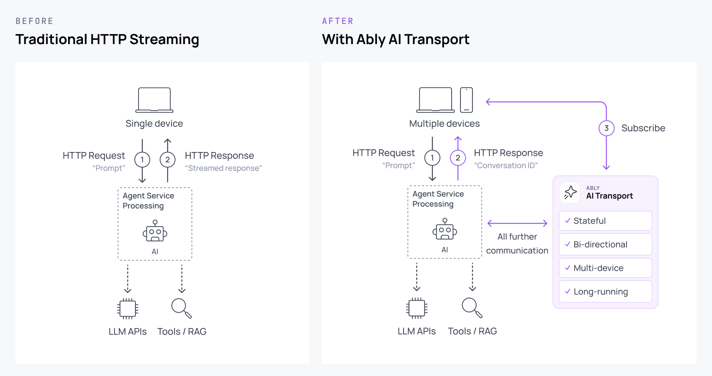

AI Transport gives your AI agents a session that outlives the connection. Tokens stream over a session, not a single HTTP request, so a client reconnects without losing the response. The same session is open to any device the user picks up. Any participant publishes to the session, so a stop button on the phone cancels a turn that started on the laptop.

It works with any AI model or framework: OpenAI, Anthropic, Vercel AI SDK, LangChain, or your own stack. AI Transport runs on Ably's [fault-tolerant](/docs/platform/architecture/fault-tolerance) global platform, with messaging at [low latency](/docs/platform/architecture/latency) across regions and [elastic scale](/docs/platform/architecture/platform-scalability).

## Get started <a id="get-started"/>

<Tiles>
{[
  {
    title: 'Getting started',
    description: 'Build a working app with Vercel AI SDK or the Core SDK in a few minutes.',
    image: 'icon-tech-javascript',
    link: '/docs/ai-transport/getting-started/vercel-ai-sdk',
  },
  {
    title: 'Frameworks',
    description: 'See how AI Transport composes with the AI framework you already use.',
    image: 'icon-tech-javascript',
    link: '/docs/ai-transport/frameworks/vercel-ai-sdk-ui',
  },
  {
    title: 'Features',
    description: 'Browse what AI Transport does once you have a session running.',
    image: 'icon-tech-javascript',
    link: '/docs/ai-transport/features/token-streaming',
  },
  {
    title: 'Why AI Transport',
    description: 'Understand the production problems that direct HTTP streaming leaves on the table.',
    image: 'icon-tech-javascript',
    link: '/docs/ai-transport/why',
  },
]}
</Tiles>

## Read next <a id="read-next"/>

- [Concepts](/docs/ai-transport/concepts): the building blocks (sessions, turns, transport, codec, conversation tree, infrastructure).
- [Going to production](/docs/ai-transport/going-to-production): the production checklist for shipping AI Transport.
