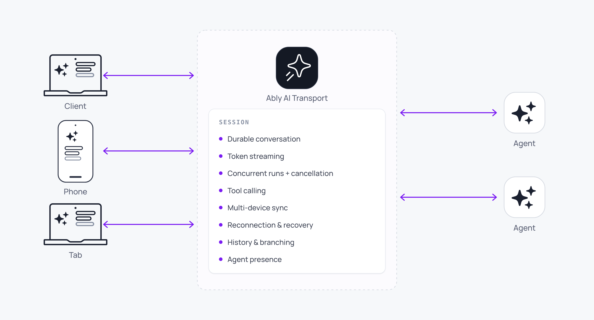

Most AI frameworks connect a client to an agent over an HTTP request and streamed response. The pattern is simple and every framework supports it, and it works for one-off interactions and demos. It also limits everything that comes after that first interaction.

Streams die with the connection. Sessions cannot span devices. Clients have no mechanism to re-contact the agent once the original request is in flight. Each of these is a real production problem; together they bound the quality of AI experiences you build on direct HTTP streaming. See [HTTP streaming and AI](/docs/ai-transport/why/http-streaming-and-ai) for the detail.

## What breaks without it <a id="what-breaks-without-it"/>

The root cause is tight coupling. The client and the agent are connected by a single HTTP request and response, and both sides are locked to that connection for the lifetime of the interaction. Five consequences follow:

- Streams cannot resume: when the connection drops (network switch, page refresh, laptop lid closes), the response is gone. The agent keeps generating tokens; there is nowhere to deliver them.
- Sessions do not span devices: the stream exists only for the client that opened it. A second tab or a phone has no way in.
- No way back to the agent: HTTP streams are server-to-client. The only upstream signal a client has is to close the connection, which is indistinguishable from a disconnect.
- Agents cannot recover from their own restarts: a serverless agent that restarts mid-stream loses its outbound stream. The client sees a dead response.
- No stateful capabilities: presence, shared mutable state, multi-participant observation: none of these exist over a one-shot HTTP request.

See [HTTP streaming and AI](/docs/ai-transport/why/http-streaming-and-ai) for each consequence in technical detail.

## Durable sessions change the model <a id="durable-sessions"/>

A durable session drops in between your agent framework and your users. Persistent, shared, stateful. It handles reconnection, ordering, multi-device sync, presence, and failover so you do not engineer them. It is the layer your AI product runs on; it is not what you build.



A minimal adoption surface:

<Code>
```javascript
import * as Ably from 'ably';
import { createClientSession } from '@ably/ai-transport/vercel';

const ably = new Ably.Realtime({ authUrl: '/api/auth/token' });
const session = createClientSession({
  client: ably,
  channelName: 'chat-123',
});

await session.connect();
```
</Code>

Three capabilities define what the layer is for:

- Durable streaming: token streams persist, accumulate, and resume. Reconnecting clients receive assembled state, not a replay of every token. Disconnects become a non-event for your users. See [token streaming](/docs/ai-transport/features/token-streaming) and [reconnection and recovery](/docs/ai-transport/features/reconnection-and-recovery).
- Session continuity: the session follows the user, not the connection. Multi-device, multi-user, multi-surface. Users switch devices; the session continues with full state. Agents hand off to humans without losing context. See [multi-device sessions](/docs/ai-transport/features/multi-device) and [human-in-the-loop](/docs/ai-transport/features/human-in-the-loop).
- Visibility and control: bidirectional. Cancel, interrupt, and steer mid-response. Push to users when they are offline. The session is stateful, not just a message pipe. See [agent presence](/docs/ai-transport/features/agent-presence), [interruption](/docs/ai-transport/features/interruption), and [push notifications](/docs/ai-transport/features/push-notifications).

The shape this changes for you:

| Capability | Direct HTTP | Durable session |
| --- | --- | --- |
| Resume after disconnect | Build from scratch: buffer, order, sequence-number, and add a resume endpoint. | Automatic. Client reconnects and picks up where it left off. |
| Multi-device sync | Not possible without custom infrastructure. | Any device subscribes to the same session. |
| Cancel mid-stream | Close the connection (and lose the ability to resume). | Publish a cancel signal. Stream and session survive. |
| Steer or interrupt | Requires a separate back channel. | Signal the agent through the session. |
| Multi-agent visibility | Route all updates through a single HTTP orchestrator. | Each agent publishes directly to the session. |

## How AI Transport implements this <a id="how-ai-transport-implements-this"/>

AI Transport is built on [Ably channels](/docs/channels). The properties a durable session requires are properties Ably channels already have:

- Any client or agent connects by specifying a channel name.
- Messages outlive any single connection, device, or agent process.
- Events arrive at subscribers in publish order, even across disconnects.
- A client that drops reconnects and picks up where it left off.
- Any participant publishes. Cancel, steer, and interrupt all happen through the same session.
- Multiple participants subscribe; every participant sees every event.

No participant is special. A client that drops and reconnects, a serverless agent that spins up for one Run and terminates, a second client joining from another device, an orchestrator delegating to sub-agents: all interact with the same session on equal terms.

The SDK provides the abstractions that make the model practical:

- A [codec layer](/docs/ai-transport/concepts/codecs) that bridges your framework's event types (Vercel `UIMessage`, or your own) and Ably's message primitives, with type-safe `TInput` and `TOutput` directions and stream-append accumulation.
- A [conversation tree](/docs/ai-transport/concepts/conversation-tree) that materialises session state into a branching structure with views for pagination and branch navigation.
- [Client and agent sessions](/docs/ai-transport/concepts/connections) that own channel attach, [Run lifecycle](/docs/ai-transport/concepts/runs), and cancel routing.
- React hooks for building UIs with streaming, pagination, and branch navigation.
- Adapters that drop into existing frameworks. AI Transport plugs directly into Vercel AI SDK's `useChat` via the `ChatTransport` interface.

## When you don't need this <a id="when-you-dont-need-this"/>

Quick, single-turn chatbots do not need this. AI Transport is for experiences that are long-lived, agentic, and interactive, where sessions span conversations, devices, and time. If your users start and finish in one request, direct HTTP streaming is the simpler choice.
AI Transport is also not the right tool for conversations between people: for human-to-human chat such as group messaging or human-staffed support, use the [Chat SDK](/docs/chat).

## Why Ably <a id="why-ably"/>

AI Transport runs on infrastructure that has been delivering realtime experiences at scale for over a decade:

- Trillions of realtime transactions monthly.
- Billions of devices reached.
- Seven years of zero global downtime.
- Global edge network, multi-region, SOC 2 Type II, HIPAA-compliant.

The hard problems of running stateful infrastructure (ordering, persistence, replication, presence, failover) are already solved. AI Transport inherits all of it. Your transport layer stops being something you engineer and becomes something you build on. See [Infrastructure](/docs/ai-transport/concepts/infrastructure) for the platform detail.

## Read next <a id="next"/>

- [HTTP streaming and AI](/docs/ai-transport/why/http-streaming-and-ai): the detailed problem statement.
- [Get started with Vercel AI SDK](/docs/ai-transport/getting-started/vercel-ai-sdk): build a working app.
- [Concepts](/docs/ai-transport/concepts): sessions, Runs, invocations, the conversation tree.
- [Frameworks](/docs/ai-transport/frameworks/vercel-ai-sdk-ui): how AI Transport composes with the framework you already use.
