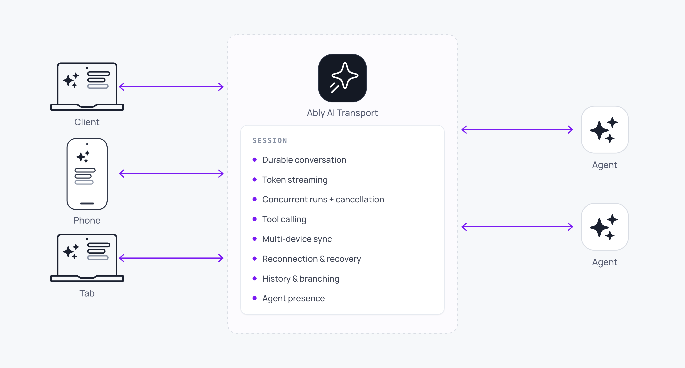

Most AI frameworks connect a client to an agent over [direct HTTP streaming](/docs/ai-transport/why/http-streaming-and-ai). A single HTTP request with a single streamed response. The pattern is simple and every framework supports it, and it works for one-off interactions and demos. But in production environments connections die or reconnect, and clients come and go during a long running request.

With direct HTTP streaming, the client and agent are locked to a single connection, and if that connection is broken, the interaction is lost. This limits both the quality of those AI user experiences, and the kinds of experiences you can build.

## What breaks without it <a id="what-breaks-without-it"/>

The client and the agent are coupled by a single HTTP request and response for the lifetime of the interaction. With simple HTTP streaming:

- Streams cannot resume: when the connection drops (network switch, page refresh, laptop lid closes), the response is gone. The agent keeps generating tokens; there is nowhere to deliver them.
- Sessions do not span devices: the stream exists only for the client that opened it. A second tab or a phone has no way in.
- No way back to the agent: HTTP streams are server-to-client. The only upstream signal a client has is to close the connection, which is indistinguishable from a disconnect.
- Agents cannot recover from their own restarts: a serverless agent that restarts mid-stream loses its outbound stream. The client sees a dead response.
- No stateful features: presence, shared mutable state, and multi-participant observation do not exist over a one-shot HTTP request.

[HTTP streaming and AI](/docs/ai-transport/why/http-streaming-and-ai) works through each of these issues in detail.

## Durable sessions change the model <a id="durable-sessions"/>

A durable session drops in between your agent framework and your users. It is persistent, shared, and stateful, and it handles reconnection, ordering, multi-device sync, presence, and failover so you don't need to build them.



On the client, the minimal code to adopt it:

<Code>
```javascript
import * as Ably from 'ably';
import { createClientSession } from '@ably/ai-transport/vercel';

const ably = new Ably.Realtime({ authUrl: '/api/auth/token' });
const session = createClientSession({
  client: ably,
  channelName: 'chat-123',
});

await session.connect();
```
</Code>

A durable session provides:

- Durable streaming: [token streams](/docs/ai-transport/features/token-streaming) persist, accumulate, and resume. Reconnecting clients [receive assembled state](/docs/ai-transport/features/reconnection-and-recovery) rather than a replay of every token.
- Session continuity: the session follows the user rather than the connection, across devices, users, and tabs. Users switch devices; the [session continues with full state](/docs/ai-transport/features/multi-device). Agents [hand off to humans](/docs/ai-transport/features/human-in-the-loop) without losing context.
- Visibility and control: the session is bidirectional. [Cancel, interrupt, and steer](/docs/ai-transport/features/interruption-and-steering) mid-response. [Push to users](/docs/ai-transport/features/push-notifications) when they are offline. Know which [agents are online](/docs/ai-transport/features/agent-presence). The session also holds state of its own.

How direct HTTP and a durable session compare:

| Feature | Direct HTTP | Durable session |
| --- | --- | --- |
| Resume after disconnect | Build from scratch: buffer, order, sequence-number, and add a resume endpoint. | Automatic. Client reconnects and picks up where it left off. |
| Multi-device sync | Not possible without custom infrastructure. | Any device subscribes to the same session. |
| Cancel mid-stream | Close the connection (and lose the ability to resume). | Publish a cancel signal. Stream and session survive. |
| Steer or interrupt | Requires a separate back channel. | Signal the agent through the session. |
| Multi-agent visibility | Route all updates through a single HTTP orchestrator. | Each agent publishes directly to the session. |

## How AI Transport implements this <a id="how-ai-transport-implements-this"/>

The sessions in AI Transport are built on [Ably channels](/docs/channels), allowing:

- Any client or agent to connect by specifying a channel name.
- Messages outlive any single connection, device, or agent process.
- Events arrive at subscribers in publish order, even across disconnects.
- A client that drops reconnects and picks up where it left off.
- Any participant publishes. Cancel, steer, and interrupt all happen through the same session.
- Multiple participants subscribe; every participant sees every event.

No participant is special. A client that drops and reconnects, a serverless agent that spins up for one run and terminates, a second client joining from another device, and an orchestrator delegating to sub-agents all interact with the same session in the same way.

The SDK provides:

- A [codec layer](/docs/ai-transport/internals/codec-architecture) that bridges your framework's event types and Ably's message primitives, with type-safe input and output messages and [message-append](/docs/messages/updates-deletes#append) accumulation.
- A [conversation tree](/docs/ai-transport/concepts/conversation-tree) that materialises session state into a branching structure with views for pagination and branch navigation.
- [Client and agent sessions](/docs/ai-transport/concepts/sessions#connect) that own connecting to the session, the [run lifecycle](/docs/ai-transport/concepts/runs), and cancel routing.
- React hooks for building UIs with streaming, pagination, and branch navigation.
- Adapters that drop into existing frameworks. AI Transport plugs directly into Vercel AI SDK, Temporal, and Vercel WDK.

## When you don't need this <a id="when-you-dont-need-this"/>

Quick, single-turn chatbots do not need this. AI Transport is for experiences that are long-lived, agentic, and interactive, where sessions span conversations, devices, and time. If your users start and finish in one request, direct HTTP streaming is the simpler choice.
AI Transport is also not the right tool for conversations between people: for human-to-human chat such as group messaging or human-staffed support, use the [Chat SDK](/docs/chat).

## Why Ably <a id="why-ably"/>

AI Transport runs on infrastructure that has been delivering realtime experiences at scale for over a decade:

- Trillions of realtime transactions monthly.
- Billions of devices reached.
- Seven years of zero global downtime.
- Global edge network, multi-region, SOC 2 Type II, HIPAA-compliant.

The hard problems of running stateful infrastructure (ordering, persistence, replication, presence, failover) are already solved. AI Transport inherits all of it. Ably also runs a bug bounty programme with independent security researchers, and [security and compliance](https://ably.com/security-and-compliance) lists the current certifications.

## Read next <a id="next"/>

- [HTTP streaming and AI](/docs/ai-transport/why/http-streaming-and-ai): the detailed problem statement.
- [Get started with Vercel AI SDK](/docs/ai-transport/getting-started/vercel-ai-sdk): build a working app.
- [Concepts](/docs/ai-transport/concepts): sessions, runs, invocations, the conversation tree.
- [Frameworks](/docs/ai-transport/frameworks/vercel-ai-sdk-ui): how AI Transport composes with the framework you already use.
