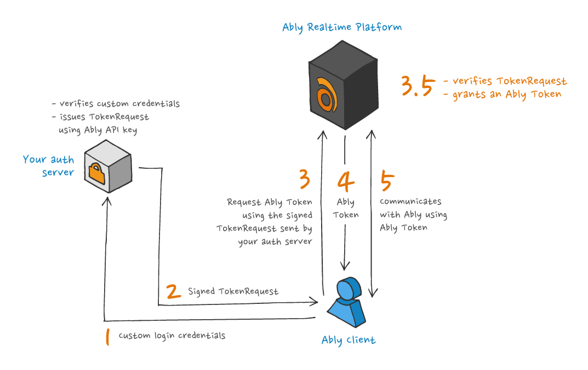

The primary way that token authentication is supported in Ably is [JWTs](/docs/auth/jwt). However, Ably tokens are an alternative mechanism that predates Ably's support for JWT. Unlike JWTs, Ably tokens are not generated by a client but are issued by the Ably service via a `/requestToken` endpoint; a client generates a signed *Token Request* and this is exchanged for a token by the Ably service. This means that, in general, integrating an application to use Ably tokens is more involved; Ably tokens also do not support all of the functionality now available with JWTs. However, there are still some circumstances where the use of Ably tokens is recommended:

- Your capability list is too large and exceeds JWT size limits (JWTs must fit within HTTP header limits, typically around 8 KB).
- You need to keep your capability list confidential, as JWTs can be decoded by clients.

<Aside data-type='note'>
JWTs are recommended for most use cases. JWTs require no Ably SDK on your server and support [channel-scoped claims](/docs/auth/jwt#channel-claims) and [per-connection rate limits](/docs/auth/jwt#rate-limits).
</Aside>

## Choosing between TokenRequest and Ably Token (direct)

Ably tokens are always issued by the Ably service via a token request. The two flows differ in who performs the request and what is passed to the client:

### Server passes TokenRequest to client

Your server creates a signed `TokenRequest` using the Ably SDK. The client then exchanges this with Ably to get an actual token.

1. Your server creates a signed `TokenRequest` using the Ably SDK (no Ably API call needed).
2. Your server sends the `TokenRequest` to the client.
3. The client sends the `TokenRequest` to Ably, which returns an Ably Token.

Key characteristics:

- Server never contacts Ably. It just creates and signs the request locally.
- Client makes the token request to Ably.

### Server passes token to client

Your server requests a token directly from Ably and passes the ready-to-use token to the client.

1. Your server requests an Ably Token from Ably using the Ably SDK.
2. Ably returns the Ably Token to your server.
3. Your server sends the Ably Token to the client.
4. The client uses the Ably Token directly (no additional Ably contact needed).

Key characteristics:

- Server contacts Ably to get the token
- Client saves one round trip (doesn't need to contact Ably)
- Trade-off: server must communicate with Ably for each token

## TokenRequest <a id="token-request"/>

Using an Ably SDK, a `TokenRequest` is [generated from your server](/docs/api/realtime-sdk/authentication#create-token-request) and returned to the client-side SDK instance. The client-side SDK instance then uses the [`TokenRequest`](/docs/api/realtime-sdk/types#token-request) to request an Ably Token from Ably.



Key characteristics:

* A `TokenRequest` can be generated by your servers without communicating with Ably.
* Your secret API key is never shared with Ably or your clients.
* A `TokenRequest` cannot be tampered with due to being signed, must be used soon after creation, and can only be used once.

### Server examples

<Code>
```javascript
const ably = new Ably.Rest({ key: '{{API_KEY}}' });
const tokenRequest = await ably.auth.createTokenRequest({ clientId: 'client@example.com' });
// Return tokenRequest to client as JSON
```

```python
ably = AblyRest('{{API_KEY}}')
token = await ably.auth.create_token_request(
{
    "clientId": "client@example.com",
    "capability": {
        "your-channel": ["publish", "subscribe"],
    },
    'ttl': 3600 * 1000, # ms
})
```

```java
ClientOptions options = new ClientOptions("{{API_KEY}}");
AblyRest rest = new AblyRest(options);

Auth.TokenParams tokenParams = new Auth.TokenParams();
tokenParams.clientId = "client@example.com";

Auth.TokenRequest tokenDetails = rest.auth.createTokenRequest(tokenParams, null);
```

```php
$rest = new Ably\AblyRest(
    ['key' => '{{API_KEY}}']
);

$tokenRequest = $rest->auth->createTokenRequest(
    ['clientId' => 'client@example.com']
);
```

```go
rest, err := ably.NewREST(
  ably.WithKey("{{API_KEY}}"))
if err != nil {
  log.Fatalf("Error creating Ably client: %v", err)
}

tokenParams := &ably.TokenParams{ClientID: "client@example.com"}
tokenRequest, _ := rest.Auth.CreateTokenRequest(tokenParams)
```

```flutter
final clientOptions = ably.ClientOptions(
  key: '{{API_KEY}}',
);
final rest = ably.Rest(options: clientOptions);
const tokenParams = ably.TokenParams(
  clientId: 'client@example.com'
);
final tokenRequest = rest.auth.createTokenRequest(tokenParams: tokenParams);
```
</Code>

### Client usage

The client SDK automatically handles TokenRequests returned from your auth endpoint:

<Code>
```realtime_javascript
const realtime = new Ably.Realtime({
  authCallback: async (tokenParams, callback) => {
    try {
      const response = await fetch('/api/ably-token');
      const tokenRequest = await response.json();
      callback(null, tokenRequest);
    } catch (error) {
      callback(error, null);
    }
  },
});
```

```realtime_nodejs
const realtime = new Ably.Realtime({
  authCallback: async (tokenParams, callback) => {
    try {
      const response = await fetch('/api/ably-token');
      const tokenRequest = await response.json();
      callback(null, tokenRequest);
    } catch (error) {
      callback(error, null);
    }
  },
});
```

```realtime_python
import aiohttp

async def get_token_request(*args, **kwargs):
    async with aiohttp.ClientSession() as session:
        async with session.get('/api/ably-token') as response:
            if response.status != 200:
                raise Exception(f"Auth failed: {response.status}")
            return await response.json()

realtime = AblyRealtime(auth_callback=get_token_request)
```

```realtime_java
ClientOptions options = new ClientOptions();
options.authCallback = new Auth.TokenCallback() {
    @Override
    public Object getTokenRequest(Auth.TokenParams params) throws AblyException {
        // Make HTTP request to your auth server and return TokenRequest
        return fetchTokenRequestFromServer();
    }
};
AblyRealtime realtime = new AblyRealtime(options);
```

```realtime_kotlin
val options = ClientOptions()
options.authCallback = Auth.TokenCallback { params ->
    // Make HTTP request to your auth server and return TokenRequest
    fetchTokenRequestFromServer()
}
val realtime = AblyRealtime(options)
```

```realtime_swift
let options = ARTClientOptions()
options.authCallback = { tokenParams, callback in
    fetchTokenRequest { result in
        switch result {
        case .success(let tokenRequest):
            callback(tokenRequest, nil)
        case .failure(let error):
            callback(nil, error)
        }
    }
}
let realtime = ARTRealtime(options: options)
```

```realtime_objc
ARTClientOptions *options = [[ARTClientOptions alloc] init];
options.authCallback = ^(ARTTokenParams *tokenParams, void (^callback)(id<ARTTokenDetailsCompatible>, NSError *)) {
    [self fetchTokenRequest:^(id tokenRequest, NSError *error) {
        if (error) {
            callback(nil, error);
        } else {
            callback(tokenRequest, nil);
        }
    }];
};
ARTRealtime *realtime = [[ARTRealtime alloc] initWithOptions:options];
```

```realtime_csharp
ClientOptions options = new ClientOptions();
options.AuthCallback = async tokenParams =>
{
    // Make HTTP request to your auth server and return TokenRequest
    return await FetchTokenRequestFromServerAsync();
};
AblyRealtime realtime = new AblyRealtime(options);
```

```realtime_go
client, err := ably.NewRealtime(
    ably.WithAuthCallback(func(ctx context.Context, params ably.TokenParams) (ably.Tokener, error) {
        // Fetch TokenRequest from your auth server
        return fetchTokenRequestFromServer()
    }))
```

```realtime_ruby
realtime = Ably::Realtime.new(auth_callback: -> (token_params) {
  # Fetch TokenRequest from your auth server
  fetch_token_request_from_server()
})
```

```realtime_flutter
final clientOptions = ably.ClientOptions(
    authCallback: (tokenParams) async {
        // Fetch TokenRequest from your auth server
        return await fetchTokenRequestFromServer();
    },
);
final realtime = ably.Realtime(options: clientOptions);
```
</Code>

## Ably Token (direct) <a id="ably-token"/>

Using an Ably SDK, an Ably Token is [requested by your server](/docs/api/realtime-sdk/authentication#request-token) from Ably and then passed to the client. The client uses this token directly to authenticate. The client does not need to make an additional round trip to Ably.


Having the server obtain the token directly is generally more reliable. It minimizes the time delay between creation of the TokenRequest and requesting the token, and eliminates reliance on the accuracy of the clock in the client.

The main reason to prefer having the client request the token (via a TokenRequest) is scalability: if the server obtains the token directly, it must make a request to Ably for each client token, and this scales with the rate of token requests from clients.

### Server examples

<Code>
```javascript
const ably = new Ably.Rest({ key: '{{API_KEY}}' });
const tokenDetails = await ably.auth.requestToken({ clientId: 'client@example.com' });
// Return tokenDetails.token to client
```

```python
rest = AblyRest(key='{{API_KEY}}')
token_request_params = {
    'clientId': 'client@example.com',
}

token_details = await rest.auth.request_token(token_params=token_request_params)
```

```java
ClientOptions options = new ClientOptions("{{API_KEY}}");
AblyRest rest = new AblyRest(options);

Auth.TokenParams tokenParams = new Auth.TokenParams();
tokenParams.clientId = "client@example.com";

Auth.TokenDetails tokenDetails = rest.auth.requestToken(tokenParams, null);
```

```php
$rest = new Ably\AblyRest(
    ['key' => '{{API_KEY}}']
);

$tokenDetails = $rest->auth->requestToken(
    ['clientId' => 'client@example.com']
);
```

```go
rest, err := ably.NewREST(
  ably.WithKey("API_KEY"))
if err != nil {
  log.Fatalf("Error creating Ably client: %v", err)
}

tokenParams := &ably.TokenParams{ClientID: "client@example.com"}
tokenRequest, _ := rest.Auth.RequestToken(context.Background(), tokenParams)
```

```flutter
final clientOptions = ably.ClientOptions(
  key: '{{API_KEY}}',
);
final rest = ably.Rest(options: clientOptions);

const tokenParams = ably.TokenParams(
  clientId: 'client@example.com',
);
final tokenDetails = await rest.auth.requestToken(
    tokenParams: tokenParams
);
```
</Code>

### Client usage

The client code for Ably Token direct is the same as for TokenRequest — the SDK handles the token transparently:

<Code>
```realtime_javascript
const realtime = new Ably.Realtime({
  authCallback: async (tokenParams, callback) => {
    try {
      const response = await fetch('/api/ably-token');
      const tokenDetails = await response.json();
      callback(null, tokenDetails);
    } catch (error) {
      callback(error, null);
    }
  },
});
```

```realtime_nodejs
const realtime = new Ably.Realtime({
  authCallback: async (tokenParams, callback) => {
    try {
      const response = await fetch('/api/ably-token');
      const tokenDetails = await response.json();
      callback(null, tokenDetails);
    } catch (error) {
      callback(error, null);
    }
  },
});
```

```realtime_python
import aiohttp

async def get_ably_token(*args, **kwargs):
    async with aiohttp.ClientSession() as session:
        async with session.get('/api/ably-token') as response:
            if response.status != 200:
                raise Exception(f"Auth failed: {response.status}")
            return await response.json()

realtime = AblyRealtime(auth_callback=get_ably_token)
```

```realtime_java
ClientOptions options = new ClientOptions();
options.authCallback = new Auth.TokenCallback() {
    @Override
    public Object getTokenRequest(Auth.TokenParams params) throws AblyException {
        // Make HTTP request to your auth server and return token details
        return fetchAblyTokenFromServer();
    }
};
AblyRealtime realtime = new AblyRealtime(options);
```

```realtime_kotlin
val options = ClientOptions()
options.authCallback = Auth.TokenCallback { params ->
    // Make HTTP request to your auth server and return token details
    fetchAblyTokenFromServer()
}
val realtime = AblyRealtime(options)
```

```realtime_swift
let options = ARTClientOptions()
options.authCallback = { tokenParams, callback in
    fetchAblyToken { result in
        switch result {
        case .success(let tokenDetails):
            callback(tokenDetails, nil)
        case .failure(let error):
            callback(nil, error)
        }
    }
}
let realtime = ARTRealtime(options: options)
```

```realtime_objc
ARTClientOptions *options = [[ARTClientOptions alloc] init];
options.authCallback = ^(ARTTokenParams *tokenParams, void (^callback)(id<ARTTokenDetailsCompatible>, NSError *)) {
    [self fetchAblyToken:^(ARTTokenDetails *tokenDetails, NSError *error) {
        if (error) {
            callback(nil, error);
        } else {
            callback(tokenDetails, nil);
        }
    }];
};
ARTRealtime *realtime = [[ARTRealtime alloc] initWithOptions:options];
```

```realtime_csharp
ClientOptions options = new ClientOptions();
options.AuthCallback = async tokenParams =>
{
    // Make HTTP request to your auth server and return token details
    return await FetchAblyTokenFromServerAsync();
};
AblyRealtime realtime = new AblyRealtime(options);
```

```realtime_go
client, err := ably.NewRealtime(
    ably.WithAuthCallback(func(ctx context.Context, params ably.TokenParams) (ably.Tokener, error) {
        // Fetch Ably Token from your auth server
        return fetchAblyTokenFromServer()
    }))
```

```realtime_ruby
realtime = Ably::Realtime.new(auth_callback: -> (token_params) {
  # Fetch Ably Token from your auth server
  fetch_ably_token_from_server()
})
```

```realtime_flutter
final clientOptions = ably.ClientOptions(
    authCallback: (tokenParams) async {
        // Fetch Ably Token from your auth server
        return await fetchAblyTokenFromServer();
    },
);
final realtime = ably.Realtime(options: clientOptions);
```
</Code>

For embedded token JWTs, where you embed an Ably Token within an outer JWT used by your existing authentication system, see [Embedded Token JWT](/docs/auth/token#embedded).
