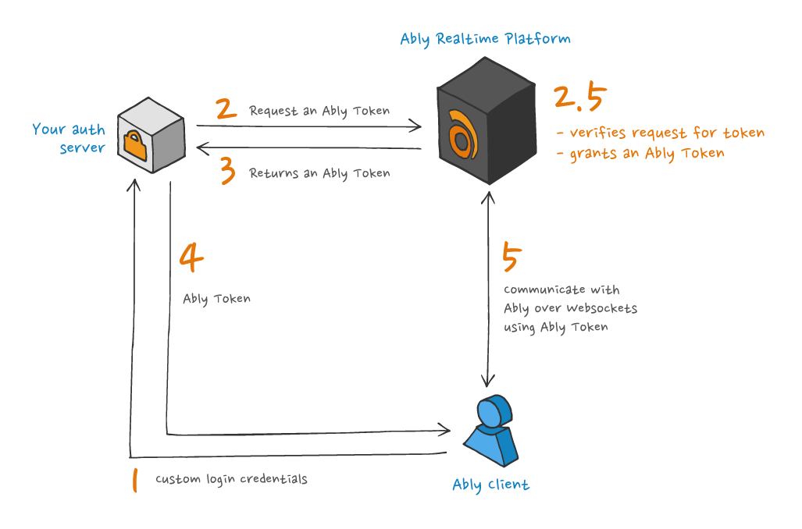

Ably Tokens are the native token formats for token authentication. Use native Ably Tokens when:

- Your capability list is too large and exceeds JWT size limits (JWTs must fit within HTTP header limits, typically around 8 KB). Use a TokenRequest or Ably Token.
- You need to keep your capability list confidential, as JWTs can be decoded by clients.
- You already have a JWT-based auth system and want to embed Ably tokens within your existing JWTs.

Token formats are composable. For example, you can wrap Ably credentials in an outer JWT used by your application while still using JWT-based or native Ably token flows underneath.

<Aside data-type='note'>
JWTs are recommended for most use cases. JWTs require no Ably SDK on your server and support [channel-scoped claims](/docs/auth/jwt#channel-claims) and [per-connection rate limits](/docs/auth/jwt#rate-limits).
</Aside>

## Choosing between TokenRequest and Ably Token (direct)

Ably Tokens can be issued in two ways:

### TokenRequest

Your server creates a signed `TokenRequest` using the Ably SDK. The client then exchanges this with Ably to get an actual token.

1. Your server creates a signed `TokenRequest` using the Ably SDK (no Ably API call needed).
2. Your server sends the `TokenRequest` to the client.
3. The client sends the `TokenRequest` to Ably, which returns an Ably Token.

Key characteristics:

- Server never contacts Ably. It just creates and signs the request locally.
- Client makes the token request to Ably
- API key secret never leaves your server in any form

### Ably Token (direct)

Your server requests a token directly from Ably and passes the ready-to-use token to the client.

1. Your server requests an Ably Token from Ably using the Ably SDK.
2. Ably returns the Ably Token to your server.
3. Your server sends the Ably Token to the client.
4. The client uses the Ably Token directly (no additional Ably contact needed).

Key characteristics:

- Server contacts Ably to get the token
- Client saves one round trip (doesn't need to contact Ably)
- Trade-off: server must communicate with Ably for each token

### Comparison

| Aspect | TokenRequest | Ably Token (direct) |
|--------|--------------|---------------------|
| Server contacts Ably | No | Yes |
| Client contacts Ably | Yes (to exchange) | No (token ready to use) |
| Client round trips | 1 extra | 0 extra |
| Server complexity | Lower | Higher |

## TokenRequest <a id="token-request"/>

Using an Ably SDK, a `TokenRequest` is [generated from your server](/docs/api/realtime-sdk/authentication#create-token-request) and returned to the client-side SDK instance. The client-side SDK instance then uses the [`TokenRequest`](/docs/api/realtime-sdk/types#token-request) to request an Ably Token from Ably.


Key characteristics:

* A `TokenRequest` can be generated by your servers without communicating with Ably.
* Your secret API key is never shared with Ably or your clients.
* A `TokenRequest` cannot be tampered with due to being signed, must be used soon after creation, and can only be used once.

### Server examples

<Code>
```javascript
const ably = new Ably.Rest({ key: '{{API_KEY}}' });
const tokenRequest = await ably.auth.createTokenRequest({ clientId: 'client@example.com' });
// Return tokenRequest to client as JSON
```

```python
ably = AblyRest('{{API_KEY}}')
token = await ably.auth.create_token_request(
{
    "clientId": "client@example.com",
    "capability": {
        "your-channel": ["publish", "subscribe"],
    },
    'ttl': 3600 * 1000, # ms
})
```

```java
ClientOptions options = new ClientOptions("{{API_KEY}}");
AblyRest rest = new AblyRest(options);

Auth.TokenParams tokenParams = new Auth.TokenParams();
tokenParams.clientId = "client@example.com";

Auth.TokenRequest tokenDetails = rest.auth.createTokenRequest(tokenParams, null);
```

```php
$rest = new Ably\AblyRest(
    ['key' => '{{API_KEY}}']
);

$tokenRequest = $rest->auth->createTokenRequest(
    ['clientId' => 'client@example.com']
);
```

```go
rest, err := ably.NewREST(
  ably.WithKey("{{API_KEY}}"))
if err != nil {
  log.Fatalf("Error creating Ably client: %v", err)
}

tokenParams := &ably.TokenParams{ClientID: "client@example.com"}
tokenRequest, _ := rest.Auth.CreateTokenRequest(tokenParams)
```

```flutter
final clientOptions = ably.ClientOptions(
  key: '{{API_KEY}}',
);
final rest = ably.Rest(options: clientOptions);
const tokenParams = ably.TokenParams(
  clientId: 'client@example.com'
);
final tokenRequest = rest.auth.createTokenRequest(tokenParams: tokenParams);
```
</Code>

### Client usage

The client SDK automatically handles TokenRequests returned from your auth endpoint:

<Code>
```realtime_javascript
const realtime = new Ably.Realtime({
  authCallback: async (tokenParams, callback) => {
    try {
      const response = await fetch('/api/ably-token');
      const tokenRequest = await response.json();
      callback(null, tokenRequest);
    } catch (error) {
      callback(error, null);
    }
  },
});
```

```realtime_nodejs
const realtime = new Ably.Realtime({
  authCallback: async (tokenParams, callback) => {
    try {
      const response = await fetch('/api/ably-token');
      const tokenRequest = await response.json();
      callback(null, tokenRequest);
    } catch (error) {
      callback(error, null);
    }
  },
});
```

```realtime_python
import aiohttp

async def get_token_request(*args, **kwargs):
    async with aiohttp.ClientSession() as session:
        async with session.get('/api/ably-token') as response:
            if response.status != 200:
                raise Exception(f"Auth failed: {response.status}")
            return await response.json()

realtime = AblyRealtime(auth_callback=get_token_request)
```

```realtime_java
ClientOptions options = new ClientOptions();
options.authCallback = new Auth.TokenCallback() {
    @Override
    public Object getTokenRequest(Auth.TokenParams params) throws AblyException {
        // Make HTTP request to your auth server and return TokenRequest
        return fetchTokenRequestFromServer();
    }
};
AblyRealtime realtime = new AblyRealtime(options);
```

```realtime_kotlin
val options = ClientOptions()
options.authCallback = Auth.TokenCallback { params ->
    // Make HTTP request to your auth server and return TokenRequest
    fetchTokenRequestFromServer()
}
val realtime = AblyRealtime(options)
```

```realtime_swift
let options = ARTClientOptions()
options.authCallback = { tokenParams, callback in
    fetchTokenRequest { result in
        switch result {
        case .success(let tokenRequest):
            callback(tokenRequest, nil)
        case .failure(let error):
            callback(nil, error)
        }
    }
}
let realtime = ARTRealtime(options: options)
```

```realtime_objc
ARTClientOptions *options = [[ARTClientOptions alloc] init];
options.authCallback = ^(ARTTokenParams *tokenParams, void (^callback)(id<ARTTokenDetailsCompatible>, NSError *)) {
    [self fetchTokenRequest:^(id tokenRequest, NSError *error) {
        if (error) {
            callback(nil, error);
        } else {
            callback(tokenRequest, nil);
        }
    }];
};
ARTRealtime *realtime = [[ARTRealtime alloc] initWithOptions:options];
```

```realtime_csharp
ClientOptions options = new ClientOptions();
options.AuthCallback = async tokenParams =>
{
    // Make HTTP request to your auth server and return TokenRequest
    return await FetchTokenRequestFromServerAsync();
};
AblyRealtime realtime = new AblyRealtime(options);
```

```realtime_go
client, err := ably.NewRealtime(
    ably.WithAuthCallback(func(ctx context.Context, params ably.TokenParams) (ably.Tokener, error) {
        // Fetch TokenRequest from your auth server
        return fetchTokenRequestFromServer()
    }))
```

```realtime_ruby
realtime = Ably::Realtime.new(auth_callback: -> (token_params) {
  # Fetch TokenRequest from your auth server
  fetch_token_request_from_server()
})
```

```realtime_flutter
final clientOptions = ably.ClientOptions(
    authCallback: (tokenParams) async {
        // Fetch TokenRequest from your auth server
        return await fetchTokenRequestFromServer();
    },
);
final realtime = ably.Realtime(options: clientOptions);
```
</Code>

## Ably Token (direct) <a id="ably-token"/>

Using an Ably SDK, an Ably Token is [requested by your server](/docs/api/realtime-sdk/authentication#request-token) from Ably and then passed to the client. The client uses this token directly to authenticate. No additional round trip to Ably is needed.



When to use:

- When you want to save the client a round trip (e.g., mobile devices with poor connectivity)
- When your server needs to track token issuance

Trade-off: Your server must communicate with Ably each time an Ably Token is required.

### Server examples

<Code>
```javascript
const ably = new Ably.Rest({ key: '{{API_KEY}}' });
const tokenDetails = await ably.auth.requestToken({ clientId: 'client@example.com' });
// Return tokenDetails.token to client
```

```python
rest = AblyRest(key='{{API_KEY}}')
token_request_params = {
    'clientId': 'client@example.com',
}

token_details = await rest.auth.request_token(token_params=token_request_params)
```

```java
ClientOptions options = new ClientOptions("{{API_KEY}}");
AblyRest rest = new AblyRest(options);

Auth.TokenParams tokenParams = new Auth.TokenParams();
tokenParams.clientId = "client@example.com";

Auth.TokenDetails tokenDetails = rest.auth.requestToken(tokenParams, null);
```

```php
$rest = new Ably\AblyRest(
    ['key' => '{{API_KEY}}']
);

$tokenDetails = $rest->auth->requestToken(
    ['clientId' => 'client@example.com']
);
```

```go
rest, err := ably.NewREST(
  ably.WithKey("API_KEY"))
if err != nil {
  log.Fatalf("Error creating Ably client: %v", err)
}

tokenParams := &ably.TokenParams{ClientID: "client@example.com"}
tokenRequest, _ := rest.Auth.RequestToken(context.Background(), tokenParams)
```

```flutter
final clientOptions = ably.ClientOptions(
  key: '{{API_KEY}}',
);
final rest = ably.Rest(options: clientOptions);

const tokenParams = ably.TokenParams(
  clientId: 'client@example.com',
);
final tokenDetails = await rest.auth.requestToken(
    tokenParams: tokenParams
);
```
</Code>

### Client usage

The client code for Ably Token direct is the same as for TokenRequest — the SDK handles the token transparently:

<Code>
```realtime_javascript
const realtime = new Ably.Realtime({
  authCallback: async (tokenParams, callback) => {
    try {
      const response = await fetch('/api/ably-token');
      const tokenDetails = await response.json();
      callback(null, tokenDetails);
    } catch (error) {
      callback(error, null);
    }
  },
});
```

```realtime_nodejs
const realtime = new Ably.Realtime({
  authCallback: async (tokenParams, callback) => {
    try {
      const response = await fetch('/api/ably-token');
      const tokenDetails = await response.json();
      callback(null, tokenDetails);
    } catch (error) {
      callback(error, null);
    }
  },
});
```

```realtime_python
import aiohttp

async def get_ably_token(*args, **kwargs):
    async with aiohttp.ClientSession() as session:
        async with session.get('/api/ably-token') as response:
            if response.status != 200:
                raise Exception(f"Auth failed: {response.status}")
            return await response.json()

realtime = AblyRealtime(auth_callback=get_ably_token)
```

```realtime_java
ClientOptions options = new ClientOptions();
options.authCallback = new Auth.TokenCallback() {
    @Override
    public Object getTokenRequest(Auth.TokenParams params) throws AblyException {
        // Make HTTP request to your auth server and return token details
        return fetchAblyTokenFromServer();
    }
};
AblyRealtime realtime = new AblyRealtime(options);
```

```realtime_kotlin
val options = ClientOptions()
options.authCallback = Auth.TokenCallback { params ->
    // Make HTTP request to your auth server and return token details
    fetchAblyTokenFromServer()
}
val realtime = AblyRealtime(options)
```

```realtime_swift
let options = ARTClientOptions()
options.authCallback = { tokenParams, callback in
    fetchAblyToken { result in
        switch result {
        case .success(let tokenDetails):
            callback(tokenDetails, nil)
        case .failure(let error):
            callback(nil, error)
        }
    }
}
let realtime = ARTRealtime(options: options)
```

```realtime_csharp
ClientOptions options = new ClientOptions();
options.AuthCallback = async tokenParams =>
{
    // Make HTTP request to your auth server and return token details
    return await FetchAblyTokenFromServerAsync();
};
AblyRealtime realtime = new AblyRealtime(options);
```

```realtime_go
client, err := ably.NewRealtime(
    ably.WithAuthCallback(func(ctx context.Context, params ably.TokenParams) (ably.Tokener, error) {
        // Fetch Ably Token from your auth server
        return fetchAblyTokenFromServer()
    }))
```

```realtime_ruby
realtime = Ably::Realtime.new(auth_callback: -> (token_params) {
  # Fetch Ably Token from your auth server
  fetch_ably_token_from_server()
})
```

```realtime_flutter
final clientOptions = ably.ClientOptions(
    authCallback: (tokenParams) async {
        // Fetch Ably Token from your auth server
        return await fetchAblyTokenFromServer();
    },
);
final realtime = ably.Realtime(options: clientOptions);
```
</Code>

## Embedded Token JWT <a id="embedded"/>

If you have an existing [JWT](https://jwt.io/) authentication system, you can embed an Ably Token as a claim within your JWT. This allows you to use your existing auth infrastructure while providing Ably authentication.


### Requirements

* The embedded token must be an Ably Token (not a JWT).
* The embedded token is included under the `x-ably-token` key in the [JOSE Header](https://tools.ietf.org/html/rfc7519), or if using JWS, in the payload claims.
* The expiry time of the embedded token must not be earlier than the outer JWT's expiry time (`exp` claim). Ably will reject any JWT if it is unencrypted and its `exp` claim is later than the expiry of the enclosed token.

### When to use

- You already have a JWT-based authentication system
- You want to avoid changing your client authentication flow
- You need the capability hiding features of Ably Tokens but want to use your existing JWT infrastructure

### Server examples

<Code>
```javascript
const ably = new Ably.Rest({ key: '{{API_KEY}}' });
const tokenDetails = await ably.auth.requestToken({ clientId: 'client@example.com' });
const header = {
  "typ":"JWT",
  "alg":"HS256",
  "x-ably-token": tokenDetails.token
}
const claims = {
  "exp": currentTime + 3600
}
const base64Header = btoa(header);
const base64Claims = btoa(claims);
/* Apply the hash specified in the header */
const signature = hash((base64Header + "." + base64Claims), SECRET);
const jwt = base64Header + "." + base64Claims + "." + signature;
/* Send jwt to client */
```

```python
  rest = AblyRest(key='{{API_KEY}}')
  token_request_data = {
      'clientId': 'client@example.com',
  }

  token_details = await rest.auth.request_token(token_params=token_request_data)

  header = {
      "typ": "JWT",
      "alg": "HS256",
      "x-ably-token": token_details.token
  }
  claims = {
      "exp": int(time.time()) + 3600
  }

  base64_header = base64.urlsafe_b64encode(bytes(json.dumps(header), 'utf-8')).decode('utf-8')
  base64_claims = base64.urlsafe_b64encode(bytes(json.dumps(claims), 'utf-8')).decode('utf-8')

  signature = hashlib.sha256((base64_header + "." + base64_claims + "{{API_KEY_SECRET}}").encode('utf-8')).digest()
  signature_base64 = base64.urlsafe_b64encode(signature).decode('utf-8')

  jwt_token = base64_header + "." + base64_claims + "." + signature_base64
```

```java
ClientOptions options = new ClientOptions("{{API_KEY}}");
AblyRest rest = new AblyRest(options);

Auth.TokenParams tokenParams = new Auth.TokenParams();
tokenParams.clientId = "client@example.com";

Auth.TokenDetails tokenDetails = rest.auth.requestToken(tokenParams, null);

Map<String, Object> headerClaims = new HashMap<>();
headerClaims.put("typ", "JWT");
headerClaims.put("alg", "HS256");
headerClaims.put("x-ably-token", tokenDetails.token);

// Time of expiration in seconds (an hour)
long currentTimeInSeconds = System.currentTimeMillis() / 1000;

// Define the claims
Map<String, Object> claims = new HashMap<>();
claims.put("exp", currentTimeInSeconds + 3600);

// Create the JWT
Algorithm algorithm = Algorithm.HMAC256("{{API_KEY_SECRET}}");
String token = JWT.create()
        .withHeader(headerClaims)
        .withPayload(claims)
        .sign(algorithm);
```

```php
$rest = new Ably\AblyRest(
    ['key' => '{{API_KEY}}']
);
$tokenDetails = $rest->auth->requestToken(
    ['clientId' => 'client@example.com']
);
$header = [
    'typ' => 'JWT',
    'alg' => 'HS256',
    'x-ably-token' => $tokenDetails->token
];
$currentTime = time();
$claims = [
    'exp' => $currentTime + 3600 /* time of expiration in seconds (an hour) */
];
$base64Header = base64_encode(json_encode($header));
$base64Claims = base64_encode(json_encode($claims));
$secret = 'YOUR_SECRET';
$signature = hash_hmac('sha256', $base64Header . '.' . $base64Claims, $secret, true);
$base64Signature = base64_encode($signature);
$jwt = $base64Header . '.' . $base64Claims . '.' . $base64Signature;
```

```go
rest, err := ably.NewREST(ably.WithKey("{{API_KEY}}"))
if err != nil {
	log.Fatalf("Failed to create Ably REST client: %v", err)
}

// Request a token
tokenParams := &ably.TokenParams{
	ClientID: "client@example.com",
}
tokenDetails, err := rest.Auth.RequestToken(context.Background(), tokenParams)
if err != nil {
	log.Fatalf("Failed to request token: %v", err)
}

// Get the current time in seconds
currentTime := time.Now().Unix()

// Create JWT header
header := map[string]interface{}{
	"typ":          "JWT",
	"alg":          "HS256",
	"x-ably-token": tokenDetails.Token,
}

// Create JWT claims
claims := map[string]interface{}{
	"exp": currentTime + 3600, // time of expiration in seconds
}

// Encode header to base64
headerJSON, err := json.Marshal(header)
if err != nil {
	log.Fatalf("Failed to marshal header: %v", err)
}
base64Header := base64.RawURLEncoding.EncodeToString(headerJSON)

// Encode claims to base64
claimsJSON, err := json.Marshal(claims)
if err != nil {
	log.Fatalf("Failed to marshal claims: %v", err)
}
base64Claims := base64.RawURLEncoding.EncodeToString(claimsJSON)

// Create the signature
dataToSign := base64Header + "." + base64Claims
h := hmac.New(sha256.New, []byte("SECRET"))
h.Write([]byte(dataToSign))
signature := base64.RawURLEncoding.EncodeToString(h.Sum(nil))

// Combine the parts to form the final JWT
jwt := base64Header + "." + base64Claims + "." + signature
log.Println("JWT:", jwt)

// Send JWT to client (for demonstration, print it here)
```

```flutter
final clientOptions = ably.ClientOptions(
  key: '{{API_KEY}}',
);
final rest = ably.Rest(options: clientOptions);
const tokenParams = ably.TokenParams(
  clientId: 'client@example.com',
);
final tokenDetails = await rest.auth.requestToken(
    tokenParams: tokenParams
);

final header = {
  "typ": "JWT",
  "alg": "HS256",
  "x-ably-token": tokenDetails.token
};

final currentTime = (DateTime.now().millisecondsSinceEpoch / 1000).round();
final claims = {
  "iat": currentTime, /* current time in seconds */
  "exp": currentTime + 3600, /* time of expiration in seconds */
  "x-ably-capability": "{\"*\":[\"*\"]}"
};

final base64Header = base64UrlEncode(utf8.encode(json.encode(header)));
final base64Claims = base64UrlEncode(utf8.encode(json.encode(claims)));
final hmacSha256 = Hmac(sha256, utf8.encode("$base64Header.$base64Claims"));
final digest = hmacSha256.convert(utf8.encode("{{API_KEY_SECRET}}"));
final signature = base64UrlEncode(digest.bytes);
final ablyJwt = "$base64Header.$base64Claims.$signature";
```
</Code>

<Aside data-type='note'>
The authenticity of the outer JWT will not be verified by Ably, as Ably does not have access to your secret key. You are responsible for verifying the outer JWT in your own systems if needed.
</Aside>

For a comparison of all token mechanisms, see [choosing a token mechanism](/docs/auth/token#comparison).
