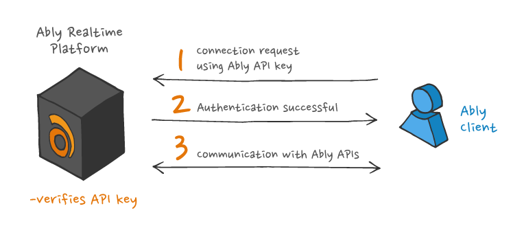

Basic authentication is the simplest way to authenticate with Ably. It requires passing an [API key](/docs/auth#api-key) when instancing an SDK.

<Aside data-type='important'>
Private API keys should never be shared with untrusted parties, and as such, should only be used by your trusted secure servers when authenticating with Ably.
</Aside>

The following is an example of using basic authentication:

<Code>
```realtime_javascript
const realtime = new Ably.Realtime({
  key: '{{API_KEY}}'
});
```

```rest_javascript
var rest = new Ably.Rest({ key: '{{API_KEY}}' });
```

```realtime_nodejs
const realtime = new Ably.Realtime({
  key: '{{API_KEY}}'
});
```

```rest_nodejs
var rest = new Ably.Rest({ key: '{{API_KEY}}' });
```

```realtime_ruby
realtime = Ably::Realtime.new(key: '{{API_KEY}}')
```

```rest_ruby
rest = Ably::Rest.new(key: '{{API_KEY}}')
```

```realtime_python
realtime = AblyRealtime(key='{{API_KEY}}')
```

```rest_python
rest = AblyRest(key='{{API_KEY}}')
```

```realtime_java
ClientOptions options = new ClientOptions();
options.key = "{{API_KEY}}";
AblyRealtime realtime = new AblyRealtime(options);
```

```rest_java
ClientOptions options = new ClientOptions();
options.key = "{{API_KEY}}";
AblyRest rest = new AblyRest(options);
```

```realtime_swift
let realtime = ARTRealtime(key: "{{API_KEY}}")
```

```rest_swift
let rest = ARTRest(key: "{{API_KEY}}")
```

```realtime_objc
ARTRealtime *realtime = [[ARTRealtime alloc] initWithKey:@"{{API_KEY}}"];
```

```rest_objc
ARTRest *rest = [[ARTRest alloc] initWithKey:@"{{API_KEY}}"];
```

```realtime_csharp
AblyRealtime realtime = AblyRealtime("{{API_KEY}}");
```

```rest_csharp
AblyRest rest = new AblyRest("{{API_KEY}}");
```

```realtime_go
client, err := ably.NewRealtime(ably.WithKey("{{API_KEY}}"))
```

```rest_go
client, err := ably.NewREST(ably.WithKey("{{API_KEY}}"))
```

```realtime_flutter
final clientOptions = ably.ClientOptions(
  key: '{{API_KEY}}'
);
final realtime = ably.Realtime(options: clientOptions);
```

```rest_flutter
final clientOptions = ably.ClientOptions(
  key: '{{API_KEY}}'
);
ably.Rest rest = ably.Rest(options: clientOptions);
```

```rest_php
$rest = new Ably\AblyRest(['key' => '{{API_KEY}}']);
```
</Code>

## Basic auth architecture <a id="diagram"/>

The process used by Ably SDKs to authenticate with Ably using basic authentication is illustrated in the following diagram:



## When to use basic auth <a id="when"/>

Ably recommends that basic authentication is only used server-side because of the following potential issues:

* The secret is passed directly by the client to Ably, so it is only permitted for connections that are over TLS, to prevent the key secret being intercepted.
* All of the configured [capabilities](/docs/auth/capabilities) of the key are implicitly possible in any request, and clients that legitimately obtain this key may then abuse the rights for that key.
* A client that authenticates using an API key can claim any client ID it chooses. Therefore this client ID cannot be trusted to represent the genuine identity of the client. Client IDs should be assigned by the server, once the client's credentials have been authenticated.

<Aside data-type='note'>
When selecting an Ably SDK for implementing basic authentication with Ably, you don't need to use the realtime interface.

As basic authentication is primarily designed for authenticating a secure server, it is more efficient to use the REST interface of an Ably SDK. This is because the overhead associated with maintaining a realtime connection is not required. However, this is only true when the server is used solely for authentication.
</Aside>
