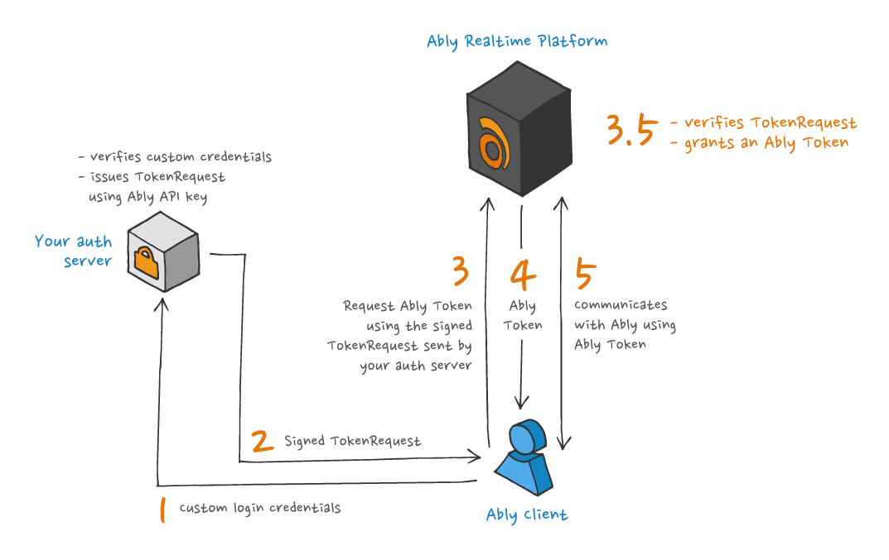
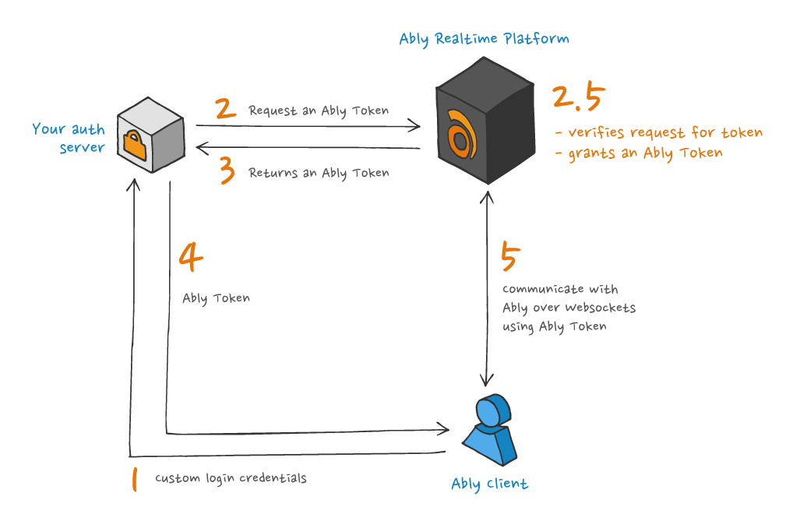
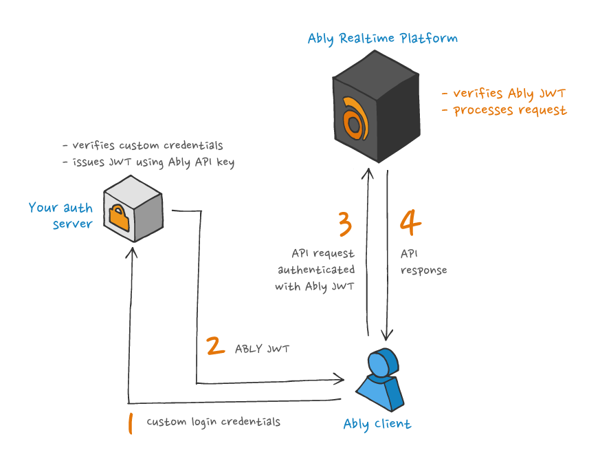
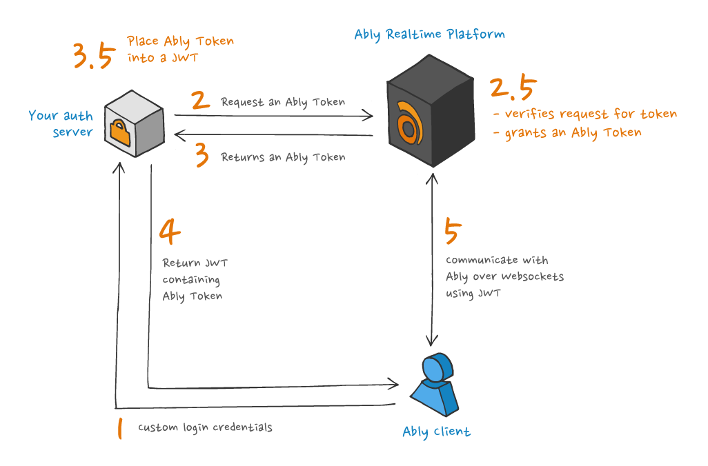

Token authentication uses a trusted device with an [API key](/docs/auth#api-key) to issue time-limited tokens to untrusted clients. Tokens have a limited set of access rights, known as [capabilities](/docs/auth/capabilities), and can have a specific [identity](/docs/auth/identified-clients) using a `clientId`.

Token authentication is the recommended authentication method to use client-side as it provides more fine-grained access control and limits the risk of credentials being exposed.

Any of the following cause an SDK to use token authentication:

* An [`authUrl`](/docs/api/realtime-sdk/types#client-options) or [`authCallback`](/docs/api/realtime-sdk/types#client-options) is provided that returns an Ably-compatible token or an Ably [`TokenRequest`](/docs/api/realtime-sdk/types#token-request)
* [`useTokenAuth`](/docs/api/realtime-sdk/types#client-options) is true
* A [`token`](/docs/api/realtime-sdk/types#client-options) or [`tokenDetails`](/docs/api/realtime-sdk/types#client-options) property is provided

Providing a literal `token` or `tokenDetails` is typically used for testing: since tokens are short-lived, in production you typically want to use an authentication method that allows the client library to renew the token automatically before the current token expires.

Authentication using tokens can be achieved requesting and issuing [Ably Tokens](#tokens) or passing a [JSON Web Tokens (JWT)](#jwt) to the Ably service.

## Token refresh <a id="refresh"/>

One of the important benefits of using an Ably SDK is that the automatic refresh of tokens will be handled for you.

To use automatic refresh of tokens, provide either an `authUrl` or an `authCallback`. When the token is near to expiry the `authUrl` or `authCallback` is invoked and a new token is automatically requested.

### Automatic renewal timing

**The Ably SDK will automatically renew the authentication token when it is within 30 seconds of expiry** to ensure no loss of service. This automatic renewal process ensures that connections remain active without interruption due to token expiration.

### Token authentication workflow

Understanding how token authentication works helps clarify why automatic renewal is essential:

1. Token Request creation: Your server uses the Ably API key to request a 'Token Request' object from Ably
2. Token acquisition: Your client uses this 'Token Request' object to request the actual token from the Ably server every time it needs to authenticate
3. Token expiration: These tokens are short-lived and expire after a certain period of time
4. Automatic renewal: The client SDK automatically requests a new token just before the previous one expires, ensuring the connection never drops due to authentication failure

Using an `authUrl` or `authCallback` ensures your client automatically requests a new token when needed, making the authentication process seamless and preventing service interruptions.

An `authURL` is recommended for use with web-based clients as they can easily utilize cookies and other web-only features. For non-web clients, `authCallback` is the recommended strategy.

### Token TTL limits

Ably enforces maximum TTL (time-to-live) limits on different types of tokens:

- **Access tokens**: Maximum TTL of **24 hours**
- **Device tokens** (for push notifications): Maximum TTL of **5 years**
- **Revocable tokens**: Maximum TTL of **1 hour** (when [token revocation](/docs/auth/revocation#revocable-tokens) is enabled)

<Aside data-type="important">
Attempting to create a token with a TTL that exceeds these limits will result in an error code [40003](/docs/platform/errors/codes#40003).
</Aside>

### authUrl <a id="auth-url"/>

You can specify an `authUrl` when you create the Ably client. For example:

<Code>
```realtime_javascript
const realtime = new Ably.Realtime({ authUrl: '/auth' });
```

```realtime_nodejs
const realtime = new Ably.Realtime({ authUrl: '/auth' });
```

```realtime_ruby
realtime = Ably::Realtime.new(auth_url: '/auth')
```

```realtime_python
  realtime = AblyRealtime(auth_url='/auth')
```

```realtime_java
ClientOptions options = new ClientOptions();
options.authUrl = "/auth";
AblyRealtime realtime = new AblyRealtime(options);
```

```realtime_objc
ARTClientOptions *options = [[ARTClientOptions alloc] init];
options.authUrl = [NSURL URLWithString:@"/auth"];
ARTRealtime *realtime = [[ARTRealtime alloc] initWithOptions:options];
```

```realtime_swift
let options = ARTClientOptions()
options.authUrl = NSURL(string: "/auth")
let realtime = ARTRealtime(options: options)
```

```realtime_csharp
ClientOptions options = new ClientOptions();
options.AuthUrl = new Uri("/auth");
AblyRealtime realtime = new AblyRealtime(options);
```

```realtime_go
client, err := ably.NewRealtime(ably.WithAuthURL("/auth"))
```

```realtime_flutter
final clientOptions = ably.ClientOptions(
    authUrl: '/auth'
);
final realtime = ably.Realtime(options: clientOptions);
```

```rest_javascript
  const rest = new Ably.Rest({ authUrl: '/auth' });
```

```rest_nodejs
  const rest = new Ably.Rest({ authUrl: '/auth' });
```

```rest_ruby
  rest = Ably::Rest.new(auth_url: '/auth')
```

```rest_python
  rest = AblyRest(auth_url='/auth')
```

```rest_php
  $rest = new Ably\AblyRest(['authUrl' => '/auth']);
```

```rest_java
  ClientOptions options = new ClientOptions();
  options.authUrl = "/auth";
  AblyRest rest = new AblyRest(options);
```

```rest_csharp
  AblyRest rest = new AblyRest(new ClientOptions { AuthUrl = new Uri("/auth") });
```

```rest_objc
  ARTClientOptions *options = [[ARTClientOptions alloc] init];
  options.authUrl = [NSURL URLWithString:@"/auth"];
  ARTRest *rest = [[ARTRest alloc] initWithOptions:options];
```

```rest_swift
  let options = ARTClientOptions()
  options.authUrl = NSURL(string: "/auth")
  let rest = ARTRest(options: options)
```

```rest_go
  client, err := ably.NewREST(ably.WithAuthURL("/auth"))
```

```rest_flutter
final clientOptions = ably.ClientOptions(
    authUrl: '/auth'
);
final rest = ably.Rest(options: clientOptions);
```
</Code>

The client will obtain a token, JWT, or tokenRequest from the URL and use it to authenticate requests to Ably. Before token expiry, a request for a new token will be made automatically by the client to the `authUrl`.

### authCallback <a id="auth-callback"/>

You can specify an authentication callback function when you create the Ably client. Inside `authCallback`, you can make a network request to your servers to generate the `tokenRequest`. For example:

<Code>
```realtime_javascript
const ablyClient = new Realtime({
    authCallback: async (tokenParams, callback) => {
        let tokenRequest;
        try {
            tokenRequest = await obtainTokenRequest(); // Make a network request to your server
        } catch (err) {
            callback(err, null);
            return;
        }
        callback(null, tokenRequest);
    }
});
```

```realtime_nodejs
const ablyClient = new Realtime({
    authCallback: async (tokenParams, callback) => {
        let tokenRequest;
        try {
            tokenRequest = await obtainTokenRequest(); // Make a network request to your server
        } catch (err) {
            callback(err, null);
            return;
        }
        callback(null, tokenRequest);
    }
});
```

```realtime_python
realtime = AblyRealtime(auth_callback=get_token_request)

async def get_token_request(*args, **kwargs):
    create_token_request = await get_token_request() // Implement this function to get a token request from your server

    if create_token_request.status_code == 200:
        token_request = create_token_request.json()

        return token_request
    else:
        raise Exception(f"Failed to retrieve token request: {create_token_request.status_code} - {create_token_request.text}")
```

```realtime_go
realtime, _ := ably.NewRealtime(
  ably.WithAuthCallback(func(context.Context, ably.TokenParams) (ably.Tokener, error) {
    createTokenRequest := getTokenRequest() // Implement this function to get a token request from your server

    if (createTokenRequest.StatusCode == 200) {
      return createTokenRequest
    }

    return "Failed to retrieve token request: '%v' - '%v'", createTokenRequest.StatusCode, createTokenRequest.Text
  })
)
```

```realtime_flutter
ably.ClientOptions clientOptions = ably.ClientOptions(
    authCallback: (ably.TokenParams tokenParams) async {
      // `createTokenRequest` should be implemented to communicate with user server
      ably.TokenRequest tokenRequest = await createTokenRequest(tokenParams);
      // `authCallback` has to return an instance of TokenRequest
      return tokenRequest;
    }
);

ably.Realtime realtime = ably.Realtime(options: clientOptions);
```

```realtime_java
ClientOptions options = new ClientOptions();

options.authCallback = new Auth.TokenCallback() {
    @Override
    public Object getTokenRequest(Auth.TokenParams params) throws AblyException {
        // Implement this function to get a token request from your server
        return getTokenRequestFromServer();
    }
};

AblyRealtime realtime = new AblyRealtime(options);
```

```rest_javascript
const rest = new Ably.Rest({
  authCallback: (tokenParams, callback) => {
    // implement your callback here
  },
});
```

```rest_nodejs
const rest = new Ably.Rest({
  authCallback: (tokenParams, callback) => {
    // implement your callback here
  },
});
```

```rest_python
rest = AblyRest(auth_callback=get_token_request)

async def get_token_request(*args, **kwargs):
    create_token_request = await get_token_request() // Implement this function to get a token request from your server

    if create_token_request.status_code == 200:
        token_request = create_token_request.json()

        return token_request
    else:
        raise Exception(f"Failed to retrieve token request: {create_token_request.status_code} - {create_token_request.text}")
```

```rest_java
ClientOptions options = new ClientOptions();

options.authCallback = new Auth.TokenCallback() {
    @Override
    public Object getTokenRequest(Auth.TokenParams params) throws AblyException {
        // Implement this function to get a token request from your server
        return getTokenRequestFromServer();
    }
};

AblyRest rest = new AblyRest(options);
```

```rest_php
$rest = new Ably\AblyRest(
    [
        'authCallback' => function(Ably\Models\TokenParams $params) {
            $curl = curl_init('/auth');
            curl_setopt($curl, CURLOPT_RETURNTRANSFER, true);
            $response = curl_exec($curl);
            curl_close($curl);

            $tokenRequestData = json_decode($response, true);
            $tokenRequest = new Ably\Models\TokenRequest($tokenRequestData);

            return $tokenRequest;
        }
    ]
);
```

```rest_go
rest, _ := ably.NewREST(
  ably.WithAuthCallback(func(context.Context, ably.TokenParams) (ably.Tokener, error) {
    createTokenRequest := getTokenRequest() // Implement this function to get a token request from your server

    if (createTokenRequest.StatusCode == 200) {
      return createTokenRequest
    }

    return "Failed to retrieve token request: '%v' - '%v'", createTokenRequest.StatusCode, createTokenRequest.Text
  })
)
```

```rest_flutter
ably.ClientOptions clientOptions = ably.ClientOptions(
    authCallback: (ably.TokenParams tokenParams) async {
      // `createTokenRequest` should be implemented to communicate with user server
      ably.TokenRequest tokenRequest = await createTokenRequest(tokenParams);
      // `authCallback` has to return an instance of TokenRequest
      return tokenRequest;
    }
);

ably.Rest rest = ably.Rest(options: clientOptions);
```
</Code>

The [`tokenParams`](/docs/api/realtime-sdk/authentication#token-params) argument in `authCallback` is available for convenience, allowing you to see the capabilities, `clientId`, and other details requested by the client. However, `tokenParams` should not be trusted or used to generate the `tokenRequest` on the server side. Instead it is recommended that your `createTokenRequest` API authenticates clients separately, for example based on cookies, headers, or HTTP body.

## AuthOptions <a id="auth-options"/>

Use properties set with [`AuthOptions`](/docs/api/realtime-sdk/authentication#auth-options) to override the default authentication values set when instantiating a client. You can also embed `AuthOptions` into your [`ClientOptions`](/docs/api/realtime-sdk#client-options) while instantiating.

There are several `AuthOptions` you can specify along with `authUrl` and `authCallback`:

- `authMethod` :- when `authUrl` is called, the default `GET` method will be used, unless `POST` is specified.
- `authHeaders` :- allows you to pass additional headers as required, depending on your use case.
- `authParams` :- allows you to pass additional query parameters, depending on your use case.

The following is an example of passing `AuthOptions`:

<Code>
```realtime_javascript
const realtime = new Ably.Realtime({
  authUrl: "/auth",
  authMethod: "POST",
  authParams: {p1: param1, b: param2},
  authHeaders: {h1: header1, h2: header2}
});
```

```realtime_nodejs
const realtime = new Ably.Realtime({
  authUrl: "/auth",
  authMethod: "POST",
  authParams: {p1: param1, b: param2},
  authHeaders: {h1: header1, h2: header2}
});
```

```realtime_python
realtime = AblyRealtime(auth_url='/auth',
                        auth_method="GET",
                        auth_headers={'h1': 'v1'},
                        auth_params={'param1': 'param2'})
```

```realtime_go
headers := http.Header{}
headers.Set("h1", "header1")
headers.Set("h2", "header2")

client, err := ably.NewRealtime(
  ably.WithAuthURL("/auth"),
  ably.WithAuthMethod("GET"),
  ably.WithAuthHeaders(headers),
  ably.WithAuthParams(url.Values{
    "p1": {"param1"},
    "p2": {"param2"},
  }))
if err != nil {
  panic(err)
}
```

```realtime_flutter
final clientOptions = ably.ClientOptions(
  authUrl: '/auth',
  authMethod: 'GET',
  authParams: {
    'p1': 'param1',
    'b': 'param2',
  },
  authHeaders: {
    'h1': 'header1',
    'h2': 'header2',
  },
);
final realtime = ably.Realtime(options: clientOptions);
```

```realtime_java
ClientOptions options = new ClientOptions();
options.authUrl = "/auth";
options.authMethod = "POST";
options.authParams = new Param[]{
        new Param("p1", "param1"),
        new Param("p2", "param2")
};
options.authHeaders = new Param[]{
        new Param("h1", "header1"),
        new Param("h2", "header2")
};

AblyRealtime realtime = new AblyRealtime(options);
```

```rest_javascript
const rest = new Ably.Rest({
  authUrl: "/auth",
  authMethod: "POST",
  authParams: {p1: param1, b: param2},
  authHeaders: {h1: header1, h2: header2}
});
```

```rest_nodejs
const rest = new Ably.Rest({
  authUrl: "/auth",
  authMethod: "POST",
  authParams: {p1: param1, b: param2},
  authHeaders: {h1: header1, h2: header2}
});
```

```rest_python
rest = AblyRest(auth_url='/auth',
                    auth_method="GET",
                    auth_headers={'h1': 'v1'},
                    auth_params={'param1': 'param2'})
```

```rest_go
headers := http.Header{}
headers.Set("h1", "header1")
headers.Set("h2", "header2")

client, err := ably.NewREST(
  ably.WithAuthURL("/auth"),
  ably.WithAuthMethod("GET"),
  ably.WithAuthHeaders(headers),
  ably.WithAuthParams(url.Values{
    "p1": {"param1"},
    "p2": {"param2"},
  }))
if err != nil {
  panic(err)
}
```

```rest_flutter
final clientOptions = ably.ClientOptions(
  authUrl: '/auth',
  authMethod: 'GET',
  authParams: {
    'p1': 'param1',
    'b': 'param2',
  },
  authHeaders: {
    'h1': 'header1',
    'h2': 'header2',
  },
);
final rest = ably.Rest(options: clientOptions);
```

```rest_java
ClientOptions options = new ClientOptions();
options.authUrl = "/auth";
options.authMethod = "POST";
options.authParams = new Param[]{
        new Param("p1", "param1"),
        new Param("p2", "param2")
};
options.authHeaders = new Param[]{
        new Param("h1", "header1"),
        new Param("h2", "header2")
};

AblyRest rest = new AblyRest(options);
```
</Code>

## Ably Tokens <a id="tokens"/>

Ably Tokens can be used to authenticate with Ably in the following ways:

* Ably [TokenRequest](#token-request) is created by your servers and passed to clients.
* An [Ably Token](#ably-token) is issued by your servers and passed to clients.

Note that the machine on which you are running your auth server should have an accurate clock, as tokens and `TokenRequest` contain a timestamp. You can use an [NTP daemon](https://en.wikipedia.org/wiki/Ntpd), or if you are not able to control your server's clock, you can wish to use the `queryTime` [auth option](/docs/api/rest-sdk/types#auth-options).

### Ably TokenRequest <a id="token-request"/>

Using an Ably SDK, a `TokenRequest` is [generated from your server](/docs/api/realtime-sdk/authentication#create-token-request) and returned to the client-side SDK instance. The client-side SDK instance then uses the [`TokenRequest`](/docs/api/realtime-sdk/types#token-request) to request an [Ably Token](/docs/api/realtime-sdk/authentication#request-token) from Ably, and subsequently authenticates using that [Ably Token](/docs/api/realtime-sdk/authentication#token-details).

This is the recommended approach for client-side authentication, for the following reasons:

* An Ably `TokenRequest` can be generated securely by your servers without communicating with Ably.
* Your secret API key is never shared with Ably or your clients.
* An Ably `TokenRequest` cannot be tampered with due to being signed, must be used soon after creation, and can only be used once.

The process used by Ably SDKs to authenticate with Ably using a `TokenRequest` is illustrated in the following diagram:



The following is an example of creating an Ably `TokenRequest`:

<Code>
```javascript
const ably = new Ably.Rest({ key: '{{API_KEY}}' });
const tokenRequest = await ably.auth.createTokenRequest({ clientId: 'client@example.com' });
```

```python
ably = AblyRest('{{API_KEY}}')
token = await ably.auth.create_token_request(
{
    "clientId": "client@example.com",
    "capability": {
        "channel1": ["publish", "subscribe"],
    },
    'ttl': 3600 * 1000, # ms
})
```

```java
ClientOptions options = new ClientOptions("{{API_KEY}}");
AblyRest rest = new AblyRest(options);

Auth.TokenParams tokenParams = new Auth.TokenParams();
tokenParams.clientId = "client@example.com";

Auth.TokenRequest tokenDetails = rest.auth.createTokenRequest(tokenParams, null);
```

```php
$rest = new Ably\AblyRest(
    ['key' => '{{API_KEY}}']
);

$tokenRequest = $rest->auth->createTokenRequest(
    ['clientId' => 'client@example.com']
);
```

```go
rest, err := ably.NewREST(
  ably.WithKey("{{API_KEY}}"))
if err != nil {
  log.Fatalf("Error creating Ably client: %v", err)
}

tokenParams := &ably.TokenParams{ClientID: "client@example.com"}
tokenRequest, _ := rest.Auth.CreateTokenRequest(tokenParams)
```

```flutter
final clientOptions = ably.ClientOptions(
  key: '{{API_KEY}}',
);
final rest = ably.Rest(options: clientOptions);
const tokenParams = ably.TokenParams(
  clientId: 'client@example.com'
);
final tokenRequest = rest.auth.createTokenRequest(tokenParams: tokenParams);
```
</Code>

Clients can pass this server-side generated `TokenRequest` to Ably to authenticate with Ably automatically.

### Ably Token <a id="ably-token"/>

Using an Ably SDK, an Ably Token is [requested by your servers](/docs/api/realtime-sdk/authentication#request-token) from Ably and then passed to the client-side SDK instance. The client-side SDK instance then uses that [Ably Token](/docs/api/realtime-sdk/authentication#tokens) to authenticate with Ably. This is an alternative approach for authentication that enables you to issue"Ably Tokens directly as opposed to providing Ably `TokenRequests` from your servers.

The advantage for clients is that it saves one round trip request as they do not need to request an Ably Token themselves. The disadvantage is that your servers must communicate with Ably each time an Ably Token is required.

The process used by Ably SDKs to authenticate with Ably using an Ably Token is illustrated in the following diagram:



The following is an example of issuing an Ably Token from a server:

<Code>
```javascript
const ably = new Ably.Rest({ key: '{{API_KEY}}' });
const tokenDetails = await ably.auth.requestToken({ clientId: 'client@example.com' });
```

```python
rest = AblyRest(key='{{API_KEY}}')
token_request_params = {
    'clientId': 'client@example.com',
}

token_details = await rest.auth.request_token(token_params=token_request_params)
```

```java
ClientOptions options = new ClientOptions("{{API_KEY}}");
AblyRest rest = new AblyRest(options);

Auth.TokenParams tokenParams = new Auth.TokenParams();
tokenParams.clientId = "client@example.com";

Auth.TokenDetails tokenDetails = rest.auth.requestToken(tokenParams, null);
```

```php
$rest = new Ably\AblyRest(
    ['key' => '{{API_KEY}}']
);

$tokenDetails = $rest->auth->requestToken(
    ['clientId' => 'client@example.com']
);
```

```go
rest, err := ably.NewREST(
  ably.WithKey("API_KEY"))
if err != nil {
  log.Fatalf("Error creating Ably client: %v", err)
}

tokenParams := &ably.TokenParams{ClientID: "client@example.com"}
tokenRequest, _ := rest.Auth.RequestToken(context.Background(), tokenParams)
```

```flutter
final clientOptions = ably.ClientOptions(
  key: '{{API_KEY}}',
);
final rest = ably.Rest(options: clientOptions);

const tokenParams = ably.TokenParams(
  clientId: 'client@example.com',
);
final tokenDetails = await rest.auth.requestToken(
    tokenParams: tokenParams
);
```
</Code>

## JSON Web Tokens (JWT) <a id="jwt"/>

JSON Web Tokens (JWT) can be used to authenticate with Ably in the following ways:

* [Ably JWT](#standard) is created by your servers and passed to clients.
* [Ably Token](#embedded) is embedded in a JWT from your server and passed to clients.

Note that the machine on which you are running your auth server should have an accurate clock, as tokens contain a timestamp. You can use an [NTP daemon](https://en.wikipedia.org/wiki/Ntpd), or if you are not able to control your server's clock, you can wish to use the `queryTime` [auth option](/docs/api/rest-sdk/types#auth-options).

### JWT using your API key <a id="standard"/>

It is possible to use a [JWT](https://jwt.io) as a form of token for authentication with Ably, so long as it is structured appropriately, in what will be referred to as an [Ably JWT](/docs/api/realtime-sdk/authentication#ably-jwt). It is possible for an Ably JWT to contain claims indicating its `clientId`, capabilities and expiry - in an analogous way to an [Ably Token](#tokens) - and it is signed with the applicable [Ably API key's secret part](/docs/auth#api-key).

This is similar to signing an Ably [`TokenRequest`](#token-request), but the client does not need to request an Ably Token, instead being able to use the Ably JWT as a token in itself. Any compliant third-party JWT library may be used to create the JWT without requiring the token to be issued by Ably. This can be useful for situations where an Ably client library is not available, such as an embedded device connecting to Ably via [MQTT](/docs/protocols/mqtt).

The process used by Ably SDKs to authenticate with Ably using JWTs is illustrated in the following diagram:



The following is an example of creating an Ably JWT:

<If lang="flutter">
To generate a JWT token in Flutter, you will need to install the [`crypto`](https://pub.dev/packages/crypto) library
</If>

<If lang="java">
To generate a JWT token in Java, you will need to install the [`java-jwt`](https://github.com/auth0/java-jwt) library.
</If>

<Code>
```javascript
  var header = {
    "typ":"JWT",
    "alg":"HS256",
    "kid": "{{API_KEY_NAME}}"
  }
  var currentTime = Math.round(Date.now()/1000);
  var claims = {
    "iat": currentTime, /* current time in seconds */
    "exp": currentTime + 3600, /* time of expiration in seconds */
    "x-ably-capability": "{\"*\":[\"*\"]}"
  }
  var base64Header = btoa(header);
  var base64Claims = btoa(claims);
  /* Apply the hash specified in the header */
  var signature = hash((base64Header + "." + base64Claims), "{{API_KEY_SECRET}}");
  var ablyJwt = base64Header + "." + base64Claims + "." + signature;
```

```python
  import jwt
  import time

  def createAblyJwt(ably_api_key: str):
      # Split the API key into key ID and secret
      parts = ably_api_key.split(":")
      kid = parts[0]

      # Prepare JWT headers
      headers = {
          "typ": "JWT",
          "alg": "HS256",
          "kid": kid
      }

      # Prepare JWT claims
      claims = {
          "iat": int(time.time()),  # Issued at time
          "exp": int(time.time()) + 120,  # Expiration time (2 minutes from now)
          "x-ably-capability": "{\"*\":[\"*\"]}"  # Full capability
      }

      # Encode the JWT
      jwtToken = jwt.encode(headers=headers, payload=claims, key=parts[1])
      return jwtToken
```

```java
Map<String, Object> headerClaims = new HashMap<>();
headerClaims.put("typ", "JWT");
headerClaims.put("alg", "HS256");
headerClaims.put("kid", "{{API_KEY_NAME}}");

// Define the current time
long currentTimeInSeconds = System.currentTimeMillis() / 1000;

// Define the claims
Map<String, Object> claims = new HashMap<>();
claims.put("iat", currentTimeInSeconds);
claims.put("exp", currentTimeInSeconds + 3600);
claims.put("x-ably-capability", "{\"*\":[\"*\"]}");

// Create the JWT
Algorithm algorithm = Algorithm.HMAC256("{{API_KEY_SECRET}}");
String token = JWT.create()
        .withHeader(headerClaims)
        .withPayload(claims)
        .sign(algorithm);
```

```php
$header = [
    'typ' => 'JWT',
    'alg' => 'HS256',
    'kid' => '{{API_KEY_NAME}}'
];
$currentTime = time();
$claims = [
    'iat' => $currentTime, /* current time in seconds */
    'exp' => $currentTime + 3600, /* time of expiration in seconds (an hour) */
    'x-ably-capability' => '{\"*\":[\"*\"]}'
];
$base64Header = base64_encode(json_encode($header));
$base64Claims = base64_encode(json_encode($claims));
$signature = hash_hmac(
    'sha256',
    $base64Header . '.' . $base64Claims,
    '{{API_KEY_SECRET}}',
    true
);
$jwt = $base64Header . '.' . $base64Claims . '.' . $signature;
```

```go
  // Create JWT header
  header := map[string]string{
    "typ": "JWT",
    "alg": "HS256",
    "kid": "{{API_KEY_NAME}}",
  }

  // Get current time in seconds
  currentTime := time.Now().Unix()

  // Create JWT claims
  claims := map[string]interface{}{
    "iat":               currentTime,        // current time in seconds
    "exp":               currentTime + 3600, // time of expiration in seconds
    "x-ably-capability": "{\"*\":[\"*\"]}",
  }

  // Encode header to base64
  headerJSON, err := json.Marshal(header)
  if err != nil {
    log.Fatalf("Failed to marshal header: %v", err)
  }
  base64Header := base64.RawURLEncoding.EncodeToString(headerJSON)

  // Encode claims to base64
  claimsJSON, err := json.Marshal(claims)
  if err != nil {
    log.Fatalf("Failed to marshal claims: %v", err)
  }
  base64Claims := base64.RawURLEncoding.EncodeToString(claimsJSON)

  // Create the signature
  dataToSign := base64Header + "." + base64Claims
  h := hmac.New(sha256.New, []byte("{{API_KEY_SECRET}}"))
  h.Write([]byte(dataToSign))
  signature := base64.RawURLEncoding.EncodeToString(h.Sum(nil))

  // Combine the parts to form the final JWT
  ablyJwt := base64Header + "." + base64Claims + "." + signature
  log.Println("Ably JWT:", ablyJwt)
```

```flutter
final header = {
  "typ": "JWT",
  "alg": "HS256",
  "kid": "{{API_KEY_NAME}}"
};

final currentTime = (DateTime.now().millisecondsSinceEpoch / 1000).round();
final claims = {
  "iat": currentTime, /* current time in seconds */
  "exp": currentTime + 3600, /* time of expiration in seconds */
  "x-ably-capability": "{\"*\":[\"*\"]}"
};

final base64Header = base64UrlEncode(utf8.encode(json.encode(header)));
final base64Claims = base64UrlEncode(utf8.encode(json.encode(claims)));
final hmacSha256 = Hmac(sha256, utf8.encode("$base64Header.$base64Claims"));
final digest = hmacSha256.convert(utf8.encode("{{API_KEY_SECRET}}"));
final signature = base64UrlEncode(digest.bytes);
final ablyJwt = "$base64Header.$base64Claims.$signature";
```
</Code>

At present Ably does not support asymmetric signatures based on a key pair belonging to a third party.

### Embed an Ably Token in a JWT <a id="embedded"/>

If a system has an existing [JWT](https://jwt.io/) scheme, it's possible to embed an Ably Token as a claim within it.

The JWT and embedded token need to meet the following requirements:

* The embedded token is an [Ably Token](#tokens).
* The embedded token is included under the `x-ably-token` key in the [JOSE Header](https://tools.ietf.org/html/rfc7519), or if using JWS, the embedded token is included using the `x-ably-token` claim in the payload.
* The expiry time of the embedded token must not be earlier than the outer JWT's expiry time (`exp` claim). Ably will reject any JWT if it is unencrypted and its `exp` claim is later than the expiry of the enclosed token. This helps to ensure that tokens are renewed prior to expiry.

The process used by Ably SDKs to authenticate with Ably using an Ably Token embedded in a JWT is illustrated in the following diagram:



The following is an example of issuing an Ably Token inside the of header of a JWT. Note that the authenticity of the JWT will not be checked, due to Ably not having access to your `SECRET` key.

<Code>
```javascript
const ably = new Ably.Rest({ key: '{{API_KEY}}' });
const tokenDetails = await ably.auth.requestToken({ clientId: 'client@example.com' });
const header = {
  "typ":"JWT",
  "alg":"HS256",
  "x-ably-token": tokenDetails.token
}
const claims = {
  "exp": currentTime + 3600
}
const base64Header = btoa(header);
const base64Claims = btoa(claims);
/* Apply the hash specified in the header */
const signature = hash((base64Header + "." + base64Claims), SECRET);
const jwt = base64Header + "." + base64Claims + "." + signature;
/* Send jwt to client */
```

```python
  rest = AblyRest(key='{{API_KEY}}')
  token_request_data = {
      'clientId': 'client@example.com',
  }

  token_details = await rest.auth.request_token(token_params=token_request_data)

  header = {
      "typ": "JWT",
      "alg": "HS256",
      "x-ably-token": token_details.token
  }
  claims = {
      "exp": int(time.time()) + 3600
  }

  base64_header = base64.urlsafe_b64encode(bytes(json.dumps(header), 'utf-8')).decode('utf-8')
  base64_claims = base64.urlsafe_b64encode(bytes(json.dumps(claims), 'utf-8')).decode('utf-8')

  signature = hashlib.sha256((base64_header + "." + base64_claims + "{{API_KEY_SECRET}}").encode('utf-8')).digest()
  signature_base64 = base64.urlsafe_b64encode(signature).decode('utf-8')

  jwt_token = base64_header + "." + base64_claims + "." + signature_base64
```

```java
ClientOptions options = new ClientOptions("{{API_KEY}}");
AblyRest rest = new AblyRest(options);

Auth.TokenParams tokenParams = new Auth.TokenParams();
tokenParams.clientId = "client@example.com";

Auth.TokenDetails tokenDetails = rest.auth.requestToken(tokenParams, null);

Map<String, Object> headerClaims = new HashMap<>();
headerClaims.put("typ", "JWT");
headerClaims.put("alg", "HS256");
headerClaims.put("x-ably-token", tokenDetails.token);

// Time of expiration in seconds (an hour)
long currentTimeInSeconds = System.currentTimeMillis() / 1000;

// Define the claims
Map<String, Object> claims = new HashMap<>();
claims.put("exp", currentTimeInSeconds + 3600);

// Create the JWT
Algorithm algorithm = Algorithm.HMAC256("{{API_KEY_SECRET}}");
String token = JWT.create()
        .withHeader(headerClaims)
        .withPayload(claims)
        .sign(algorithm);
```

```php
$rest = new Ably\AblyRest(
    ['key' => '{{API_KEY}}']
);
$tokenDetails = $rest->auth->requestToken(
    ['clientId' => 'client@example.com']
);
$header = [
    'typ' => 'JWT',
    'alg' => 'HS256',
    'x-ably-token' => $tokenDetails->token
];
$currentTime = time();
$claims = [
    'exp' => $currentTime + 3600 /* time of expiration in seconds (an hour) */
];
$base64Header = base64_encode(json_encode($header));
$base64Claims = base64_encode(json_encode($claims));
$secret = 'YOUR_SECRET';
$signature = hash_hmac('sha256', $base64Header . '.' . $base64Claims, $secret, true);
$base64Signature = base64_encode($signature);
$jwt = $base64Header . '.' . $base64Claims . '.' . $base64Signature;
```

```go
rest, err := ably.NewREST(ably.WithKey("{{API_KEY}}"))
if err != nil {
	log.Fatalf("Failed to create Ably REST client: %v", err)
}

// Request a token
tokenParams := &ably.TokenParams{
	ClientID: "client@example.com",
}
tokenDetails, err := rest.Auth.RequestToken(context.Background(), tokenParams)
if err != nil {
	log.Fatalf("Failed to request token: %v", err)
}

// Get the current time in seconds
currentTime := time.Now().Unix()

// Create JWT header
header := map[string]interface{}{
	"typ":          "JWT",
	"alg":          "HS256",
	"x-ably-token": tokenDetails.Token,
}

// Create JWT claims
claims := map[string]interface{}{
	"exp": currentTime + 3600, // time of expiration in seconds
}

// Encode header to base64
headerJSON, err := json.Marshal(header)
if err != nil {
	log.Fatalf("Failed to marshal header: %v", err)
}
base64Header := base64.RawURLEncoding.EncodeToString(headerJSON)

// Encode claims to base64
claimsJSON, err := json.Marshal(claims)
if err != nil {
	log.Fatalf("Failed to marshal claims: %v", err)
}
base64Claims := base64.RawURLEncoding.EncodeToString(claimsJSON)

// Create the signature
dataToSign := base64Header + "." + base64Claims
h := hmac.New(sha256.New, []byte("SECRET"))
h.Write([]byte(dataToSign))
signature := base64.RawURLEncoding.EncodeToString(h.Sum(nil))

// Combine the parts to form the final JWT
jwt := base64Header + "." + base64Claims + "." + signature
log.Println("JWT:", jwt)

// Send JWT to client (for demonstration, we print it here)
```

```flutter
final clientOptions = ably.ClientOptions(
  key: '{{API_KEY}}',
);
final rest = ably.Rest(options: clientOptions);
const tokenParams = ably.TokenParams(
  clientId: 'client@example.com',
);
final tokenDetails = await rest.auth.requestToken(
    tokenParams: tokenParams
);

final header = {
  "typ": "JWT",
  "alg": "HS256",
  "x-ably-token": tokenDetails.token
};

final currentTime = (DateTime.now().millisecondsSinceEpoch / 1000).round();
final claims = {
  "iat": currentTime, /* current time in seconds */
  "exp": currentTime + 3600, /* time of expiration in seconds */
  "x-ably-capability": "{\"*\":[\"*\"]}"
};

final base64Header = base64UrlEncode(utf8.encode(json.encode(header)));
final base64Claims = base64UrlEncode(utf8.encode(json.encode(claims)));
final hmacSha256 = Hmac(sha256, utf8.encode("$base64Header.$base64Claims"));
final digest = hmacSha256.convert(utf8.encode("{{API_KEY_SECRET}}"));
final signature = base64UrlEncode(digest.bytes);
final ablyJwt = "$base64Header.$base64Claims.$signature";
```
</Code>

## Dynamic channel access control <a id="dynamic-access"/>

Token authentication allows you to dynamically change a client's channel access permissions without disconnecting. Use the [`authorize()`](/docs/api/realtime-sdk/authentication#authorize) method to re-authenticate with updated [capabilities](/docs/auth/capabilities).

When you call `client.auth.authorize()`:

1. The client obtains a new token with different capabilities from your authentication server.
2. The new token is sent to Ably using the existing realtime connection.
3. The updated permissions are automatically applied without disconnecting.

### Use cases

You can trigger re-authentication in response to:
- Detect error code [40160](/docs/platform/errors/codes#40160) when a client attempts to attach to a channel.
- Instruct clients to re-authenticate via Ably channels or other communication methods.

The following example shows how to re-authenticate with updated capabilities:

<Code>
```javascript
// Re-authenticate to get new capabilities
try {
  const newTokenDetails = await client.auth.authorize({
    clientId: 'user123',
    // Your auth server will return a token with updated capabilities
  });
  console.log('Successfully updated permissions');
} catch (error) {
  console.error('Failed to re-authenticate:', error);
}
```
</Code>

For security purposes, handle non-compliant clients by:
- Set shorter token TTL expiry times to force frequent re-authentication (minimum 10 minutes recommended).
- Use the [token revocation API](/docs/auth/revocation) to immediately invalidate tokens.

<Aside data-type="important">
The `authorize()` method maintains the existing connection while updating permissions, making it ideal for real-time applications where connection continuity is important.
</Aside>

## When to use token auth <a id="when"/>

Ably recommends that token authentication is used client-side for the following reasons:

* Tokens ensure that an Ably API key isn't exposed in client applications.
* Tokens are short-lived so there is only a short period of time during which a compromised token can be used.
* Tokens provide more fine-grained access control, which also limits the area of exposure a compromised token can access.

<Aside data-type='note'>
When selecting an Ably SDK for implementing token authentication with Ably, you don't need to use the realtime interface on the auth server.

As basic authentication is primarily designed for authenticating a secure server, in this situation, and assuming the server is only used for authentication, it is more efficient to use the REST interface, as the overhead associated with maintaining a realtime connection, is not required to issue tokens.
</Aside>
