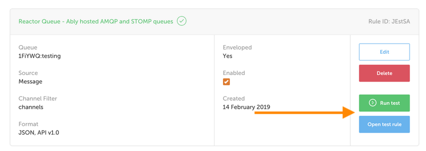

The [Ably Reactor](https://ably.com/reactor) provides data stream processing pipelines to easily link the Ably network to your other systems.

Setting up pipelines is a simple matter of configuring rules in the Ably dashboard. But testing those rules has been a bit trickier, requiring the dev console or command line to do so.

**As of today you’ll find a test option in the rule management dashboard.**

With a single button click you can test a rule and receive rapid feedback on whether it works or not. No more dev console or command line.

This will greatly speed up the initial configuration process and provide increased clarity on whether rules are operating as intended. Future edits and debugging will also be much easier.

Head over to [your dashboard](https://ably.com/login#login-box) to see the new testing in action. If you’ve got any questions we’d be [happy to help](https://ably.com/contact).
