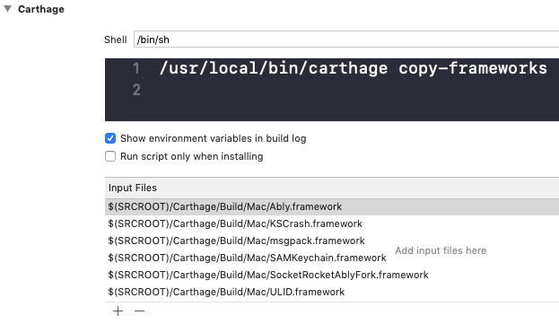

## Important changes

Fixed bugs:

- Lexical or Preprocessor Issue: 'SRWebSocket.h' file not found [#840](https://github.com/ably/ably-cocoa/issues/840)

- KSCrashAblyFork ksthread_getQueueName [#846](https://github.com/ably/ably-cocoa/issues/846)

## Breaking changes

We changed the name of our `SocketRocket` framework to `SocketRocketAblyFork`. In case you're using the library with [Carthage](https://github.com/Carthage/Carthage#if-youre-building-for-ios-tvos-or-watchos), then you need to update the path of the `SocketRocket` framework on your application targets’ _Build Phases_ settings tab:

## Podfile

`pod 'Ably', '1.1.6'`

## Cartfile

`github "ably/ably-cocoa" == 1.1.6`

## Objective-C

`#import <Ably/Ably.h>`

## Swift

`import Ably`

Here's the [complete list of changes](https://github.com/ably/ably-cocoa/blob/1.1.6/CHANGELOG.md#116-2019-06-12).
