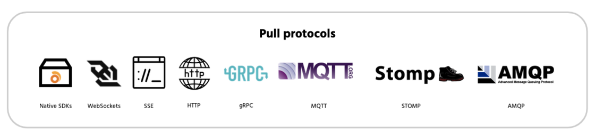

As of today, anyone building on Ably can seamlessly stream data over the [Server-Sent Events (SSE)](https://www.w3schools.com/html/html5_serversentevents.asp) protocol using the [Ably Adapter](https://ably.com/adapters?utm_source=changelog).

[SSE](https://ably.com/docs/sse?utm_source=changelog) becomes the fifth supported protocol for the Ably Adapter, with existing support for [MQTT](https://ably.com/docs/mqtt?utm_source=changelog), [STOMP](https://ably.com/docs/general/queues?utm_source=changelog), [AMQP](https://ably.com/docs/general/queues?utm_source=changelog), and other [proprietary realtime protocols](https://ably.com/support). Note that this is a beta release but fully operational and production-ready.

## What is SSE?

It’s a server push technology enabling a browser or device to receive automatic updates from a server via HTTP connection. With SSE, servers initiate data transmission towards clients once an initial client connection has been established.

It’s commonly used to send message updates, new events, or continuous data streams to a browser client. It’s designed to enhance native, cross-browser streaming through a JavaScript API called EventSource. Using this API, a client can easily receive an event stream by sending a request to a particular URL endpoint.

For the technical detail and to jump right in, check out the:

- [SSE concept piece](https://ably.com/concepts/sse)

- [Announcement blog post](https://ably.com/blog/server-sent-events-and-ably?utm_source=changelog)

- [SSE docs](https://ably.com/docs/sse?utm_source=changelog)

- [Tutorials](https://ably.com/tutorials/sse-and-http-streaming)

- [5-minute video](https://www.youtube.com/watch?v=Z4ni7GsiIbs)

As always, feel free to [contact us](https://ably.com/contact?utm_source=changelog) about how you can best use SSE and Ably.
