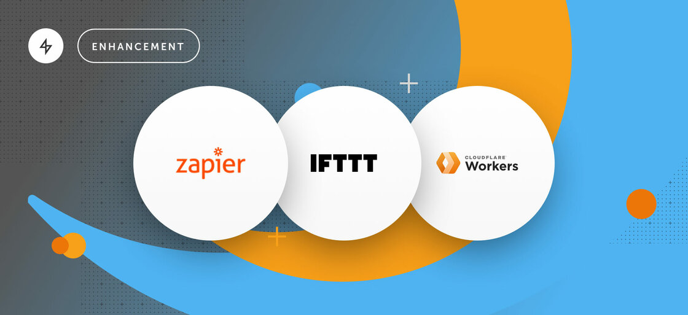

As of today Ably integrates with three new services, allowing you to act on realtime events in the Ably network by triggering actions and executing business logic across **Zapier, IFTTT, and Cloudflare Workers**. And, in the case of Zapier, publish to an Ably channel as part of a Zap workflow.

A common requirement in realtime messaging applications is for developers to be able to insert some business logic into a message processing pipeline. Typical use-cases might be to perform filtering or payload transformation on a message-by-message basis, either when first ingested into the messaging service, or as part of a rule that captures messages from one channel, applies the business logic, and then forwards the message to another channel.

Ably supports these use-cases through Reactor Integration rules that invoke cloud functions (e.g. AWS Lambdas or Google Cloud Functions). By providing a gateway to cloud functions from cloud services providers, we believe we provide the best available mechanism for these use-cases while making it easier to build with the ecosystems you’re already operating in.

## Get started

- Read the [announcement blog post](https://ably.com/blog/zapier-ifttt-cloudflare-workers/)

- Check out the docs for [Zapier](https://ably.com/docs/general/events/zapier), [IFTTT](https://ably.com/docs/general/events/ifttt), [Cloudflare Workers](https://ably.com/docs/general/events/cloudflare)

- Browse the tutorials for [Zapier](https://ably.com/tutorials/reactor-event-zapier#title), [IFTTT](https://ably.com/tutorials/reactor-event-ifttt#title), [Cloudflare Workers](https://ably.com/tutorials/reactor-event-cloudflare#title)

## How these new integrations work

All three integrations essentially use webhooks to communicate with these services. You can set up a Reactor Rule in your [app dashboard](https://www.ably.com/accounts/) to control exactly how and what you wish to communicate with your endpoint. This can vary from the data you want to send (message or presence events), which of your channels to send from, and which endpoint to send to. Once that’s done, Ably handles the logic, execution, and delivery.

## IFTTT has known limitations

The IFTTT integration is fully functional but the capabilities are more limited than other integrations. This is down to how IFTTT accepts HTTP requests. Please read the [IFTTT documentation](https://ably.com/docs/general/events/ifttt) for more info on this.

If you have any questions about these new integrations, or Reactor Integrations in general, please [get in touch](https://ably.com/contact).
