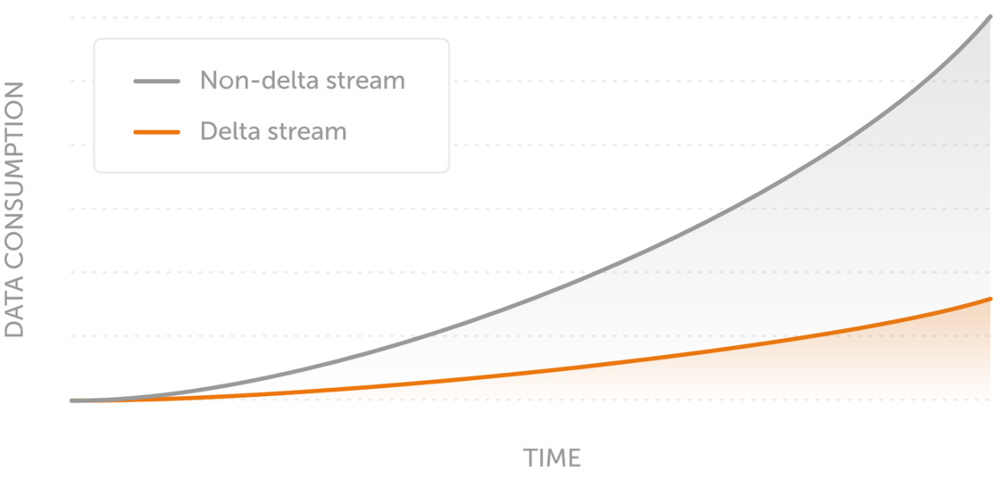

Message Delta Compression reduces the bandwidth required to transmit realtime messages by sending only the changes from the previous message to subscribers each time there’s an update, instead of the entire message.

Let’s say the first message sent over a channel is 16KiB and the message after that is the same but with an additional 4KiB of new data. With Delta Compression that message will have a payload of only 4KiB instead of 20KiB.

This reduces bandwidth costs, improves latencies for end-users, and simplifies development by taking care of message size optimization.

Message Delta Compression is a stable feature: we expect it to be forwards-compatible with future Ably updates.

## Using Message Delta Compression with an Ably Client Library SDK

When we released Channel Rewind we introduced channel parameters, expressed as a query string in the connection request or channel name itself. This was a first step to specifying parameters on a per channel basis.

With Ably’s 1.2 Client Library SDKs, available today, there’s now a proper ChannelOptions interface to express channel parameters, of which there are three:

- `delta` to enable [Message Delta Compression](https://ably.com/docs/realtime/channels/channel-parameters/deltas)

- `rewind` to enable and specify Ably’s existing [Rewind functionality](https://ably.com/docs/realtime/channels/channel-parameters/rewind)

- `cipherParams` to manage [encryption](https://ably.com/docs/realtime/channels#setting-encryption-options) on a channel

The libraries available in this 1.2 release are:

- [JavaScript](https://github.com/ably/ably-js/releases)

- [Java](https://github.com/ably/ably-java/releases)

- [Cocoa](https://github.com/ably/ably-cocoa/releases)

- [.NET](https://github.com/ably/ably-dotnet/releases)

Check our [Client Library SDK feature support matrix](https://ably.com/download/sdk-feature-support-matrix) for full feature coverage across all Client Library SDKs.

### A note on ably-js

We're aware of Ably’s JavaScript Client Library SDK footprint and we're actively avoiding bloat. As such we’ve split out the VCDIFF decoder from the core of ably-js. In order to use Delta Compression with ably-js you need to plug in a separate VCDIFF decoder library. This is hosted on Ably’s CDN. We will be modularizing this in the future, but right now this is something you will need to consider.

## Message Delta Compression using a non-Ably library

If you need to use a non-Ably library, say to stream over MQTT, and want to use Delta Compression you’ll need to reconstruct the messages yourself using the deltas. Ably provides a [VCDIFF decoder library](https://github.com/ably?q=delta&type=&language=) to decode messages yourself for Java, Cocoa, .NET, and JavaScript. The limitations with this is that you must use [channel qualifiers](https://ably.com/docs/realtime/channels/channel-parameters/overview). Read [the docs](https://ably.com/docs/realtime/channels/channel-parameters/deltas#using-deltas-non-ably) for more.

## Get started

- The announcement [blog post](https://ably.com/blog/message-delta-compression)

- Documentation for [Message Delta Compression](https://ably.com/docs/realtime/channels/channel-parameters/deltas)

- Documentation for [ChannelOptions](https://ably.com/docs/realtime/channels/channel-parameters/overview)

- Ably's [practical guide to diff algorithms and delta file formats](https://ably.com/blog/practical-guide-to-diff-algorithms/)
