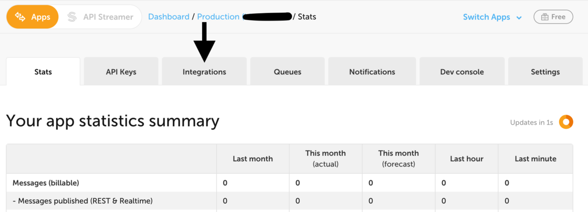

[Incoming webhooks](https://ably.com/docs/general/incoming-webhooks) are an easy way to publish messages to Ably from a 3rd party integration. You can use the URL from an incoming webhook with Ably to scale messages globally. This is useful for applications that aren’t built to scale or that can’t easily communicate directly to different devices.

For example, you may want to send a message over Ably every time there is an incoming SMS in your Nexmo account. You can set up a Nexmo webhook using the URL from Ably's incoming webhooks menu. You'll be connected and up and running in just a few minutes.

To register an incoming webhook, in your [Ably dashboard](https://ably.com/dashboard) navigate to the Ably App you want to register an incoming webhook for and head to the Integrations tab (formerly the Reactor tab).

Register an incoming webhook with a friendly name and a channel to which messages posted via webhook will be published. This will generate a URL to use in other systems' webhook which you can paste as the callback URL.

For more info, please [check out the docs](https://ably.com/docs/general/incoming-webhooks) or [get in touch](https://ably.com/contact).
