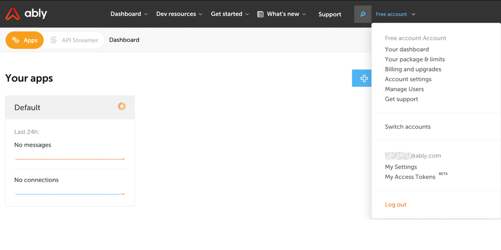

Control API gives you an easy way to configure Ably programmatically. It is a REST API that can be used to create, configure and delete the following Ably resources:

- Apps

- API keys

- Channel rules/Namespaces

- Queues

- Rules

- Stats (not available in beta)

Control API is useful when you need to create a testing or acceptance environment that is identical to production. You can provision and tear down Ably apps through the Control API with one script that runs multiple times. Or, you can track and synchronize changes to production from config management tools such as Terraform or CloudFormation via Control API .

To access Control API, log into your [Ably dashboard](https://ably.com/accounts/any), go to 'My Access Tokens' in the top menu bar, then create [an access token](https://ably.com/users/access_tokens). Specify the capabilities and rights for your access tokens, then create them. You can revoke or edit tokens at any time.

For more information, [check out the docs](http://ably.com/documentation/control-api). You can also test out requests, see responses, and [test your client app against a mock server](https://ably.com/documentation/control-api/api-reference?utm_source=twitter&utm_medium=sc&utm_campaign=control-api). And you can always [get in touch with our experts](https://ably.com/contact).
