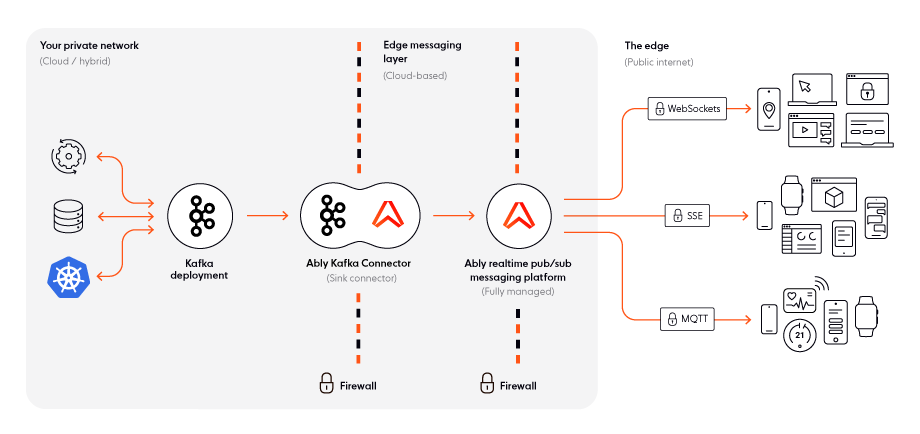

We are very excited to introduce the Ably Kafka Connector. It provides a ready-made integration between Kafka and Ably, allowing for realtime event distribution from Kafka to web, mobile, and IoT clients, over Ably’s feature-rich, multi-protocol pub/sub channels. This connector is verified by Confluent as [Gold](https://www.confluent.io/hub/ably/kafka-connect-ably), following the guidelines set forth by [Confluent’s Verified Integrations Program](https://www.confluent.io/verified-integrations-program/).

The Ably Kafka Connector makes it easy and seamless to use Ably as an internet-facing extension of Kafka. Both Ably and Kafka are event-driven solutions, sharing similar guarantees, messaging semantics, and characteristics. Kafka was built to work within a private network, and is not designed for distributing events between internal systems and consumers over the public internet. Ably was designed for edge streaming, and can act as the Internet-facing messaging layer to [sit between Kafka and client devices when you’re extending Kafka to the edge](https://ably.com/blog/ably-kafka-connector-extend-kafka-to-the-edge).

## How does the Ably Kafka Connector work?

The Ably Kafka Connector is a sink connector built on top of Kafka Connect. It can be self-hosted or hosted with a third-party provider — the most common being the Confluent Platform. You can download it from either GitHub or Confluent Cloud and install it into your Kafka Connect workers.

The Ably Kafka Connector provides a ready-made integration between Kafka and Ably via API Key. Once installed, you can configure the connector with your Ably API key to enable data from one or more Kafka topics to be published into a single Ably channel. Events are then distributed in realtime to web, mobile, and IoT clients over feature-rich, multi-protocol pub/sub Ably channels optimized for last-mile delivery.

To see Ably and Kafka working together connected by the Ably Kafka Connector, you can follow this step-by-step [technical tutorial for building a realtime ticket booking solution with Kafka, FastAPI, and Ably](https://ably.com/blog/realtime-ticket-booking-solution-kafka-fastapi-ably).

## How do I get started?

The Ably Kafka Connector is a verified Gold connector on the [Confluent Platform](https://www.confluent.io/hub/ably/kafka-connect-ably) and can be installed from there if you’re deploying Kafka with Confluent. It can also be deployed locally using Docker. For more information on deployment and configuration, [check out the documentation](https://github.com/ably/kafka-connect-ably).

## How do I give feedback?

[The Ably Kafka Connector](https://github.com/ably/kafka-connect-ably) is available under the Apache 2 open source license and we are planning to continue extending and improving it, so we encourage feedback and feature requests; please either raise issues or pull requests if you would like to talk about contributing or feature requests. You can also [contact us](https://ably.com/contact) at any time.
