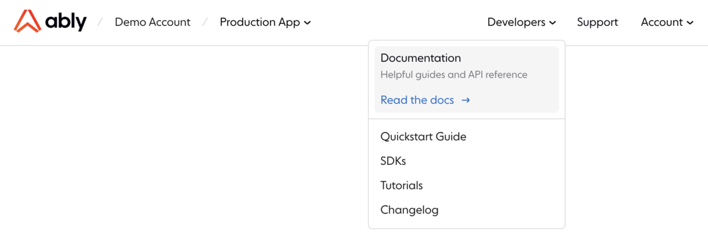
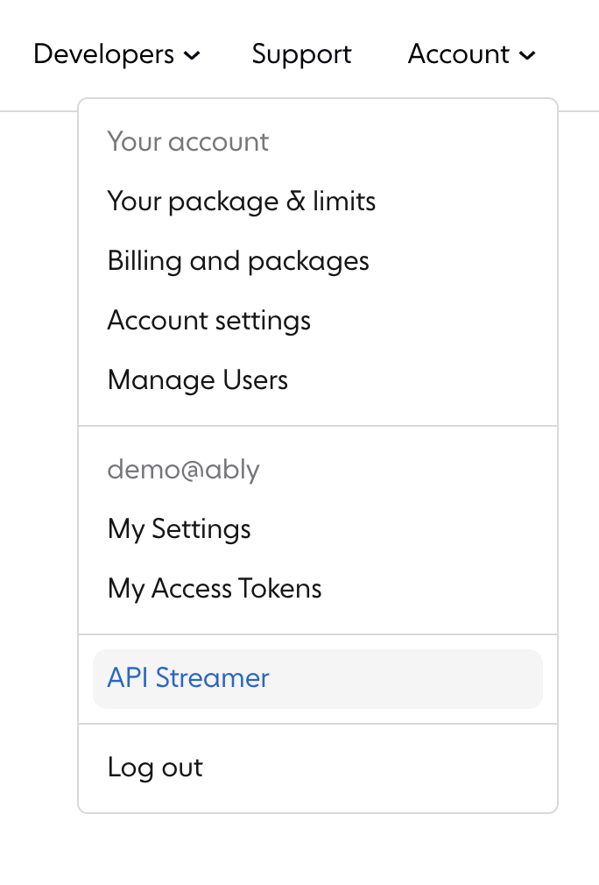

Our improved primary navigation makes it easier to get around the product with useful features that help you know where you are within the dashboard. Improvements include:

- Breadcrumbs of the current account and app to show where you are.

- Quickly switch between multiple accounts or multiple apps using the breadcrumbs.

- Reorganized navigation menu helps you access key developer resources and pages faster.

## Impacts

- For users who use API Streamer, this can be accessed from the account menu in the top-right corner of the dashboard.

- Marketing content has been removed from the dashboard and can now be accessed from the [Ably](https://ably.com) website.

## How do I give feedback?

We rely on your feedback and feature requests to improve it. You can [contact us](https://ably.com/contact) at any time if you would like to talk about contributing or feature requests
