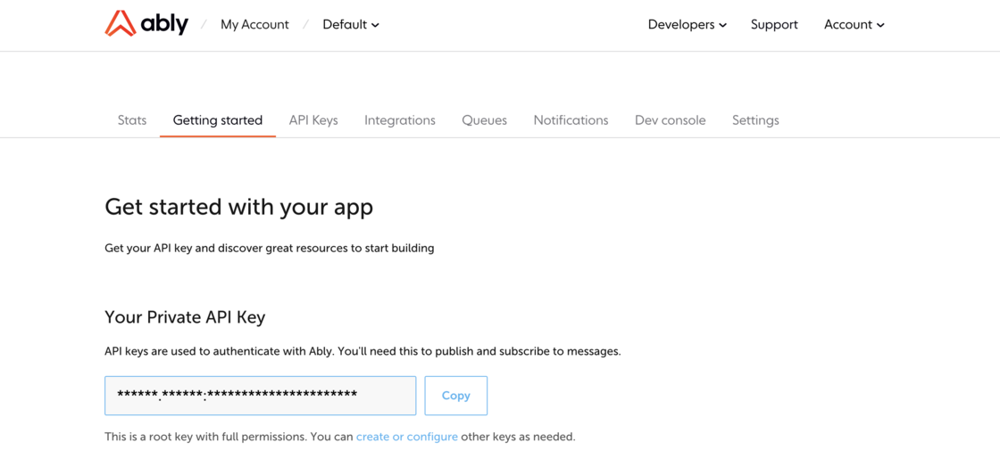

We have improved the look and feel of our tabs at the app level.

- [Getting Started](https://ably.com/accounts/any/apps/any/getting_started) is now located in the secondary navigation menu for easy access from any page at the app level.

- Key resources such as the "Quickstart guide" and "SDK library" can be accessed on the page to help you start building with Ably.

## Impact

- The completion page for sign-ups and for creating new apps have been replaced by the "Getting Started" page

## How do I give feedback?

We rely on your feedback and feature requests to improve it. You can [contact us](https://ably.com/contact) at any time if you would like to talk about contributing or feature requests
