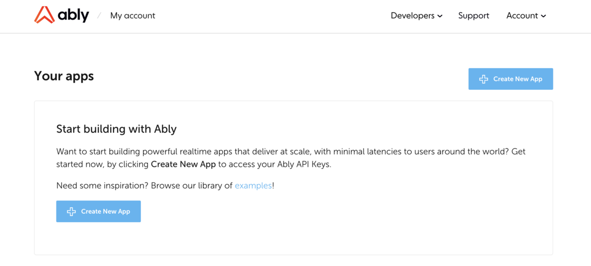
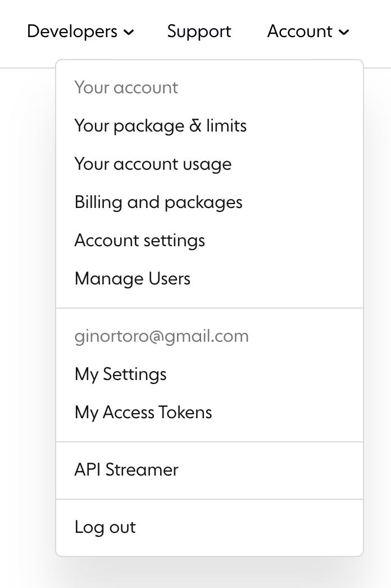

We have made some changes to the dashboard to improve your experience working with Ably

- The "Account Usage" page to see stats across your whole account, can be accessed from the account menu in the top-right corner.

- We have moved the account [limits](https://ably.com/accounts/any/package_limits), [usage](https://ably.com/accounts/any/usage) and [billing](https://ably.com/accounts/any/package) information from the main dashboard to their own separate pages.

- If you're new to Ably, we have provided guidance to help you publish your first message.

## Impacts

- Account [limits](https://ably.com/accounts/any/package_limits), [usage](https://ably.com/accounts/any/usage) and [billing](https://ably.com/accounts/any/package) is no longer accessible from the main dashboard. However, they are available as separate pages from the account menu.

## How do I give feedback?

We rely on your feedback and feature requests to improve it. You can [contact us](https://ably.com/contact) at any time if you would like to talk about contributing or feature requests
