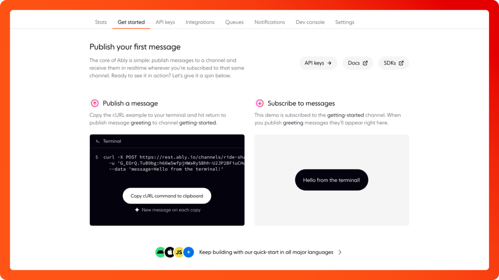

We have improved the **Getting Started** guide within the Dashboard to make it easier to understand how Pub/Sub works with Ably.

- Added links to key resources to help you start your first project; API Keys, SDK and Docs.

- Included a visual way to see pub/sub in action with Ably using a curl command and a live demo.

- Added links to more technical resources to help you on your coding journey with Ably. Take a look at our quick start guide, tutorials or key concepts of Ably.

## How do I give feedback?

We rely on your feedback and feature requests to improve it. You can [contact us](https://ably.com/contact) at any time if you would like to talk about contributing or feature requests
