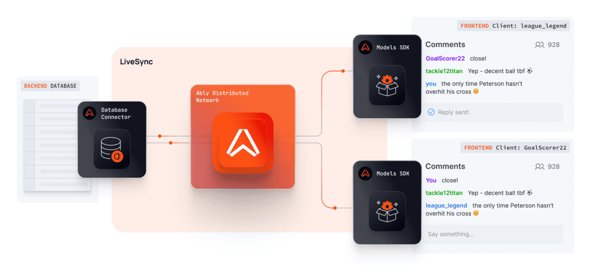
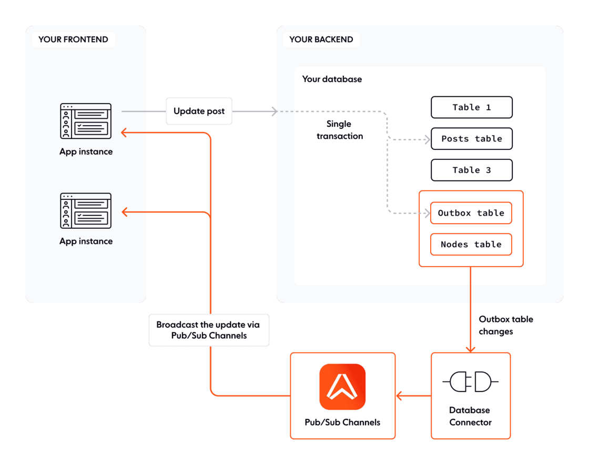

Today, we are excited to announce that [LiveSync](https://ably.com/docs/products/livesync) is now available in public alpha. As a reminder for anyone who noticed it in its early access version — LiveSync enables you to stream changes in your database to frontend clients at scale.

It is designed to be database agnostic with support for PostgreSQL in this version. It uses Ably's global message delivery network to sync app data in realtime.

LiveSync is a powerful tool because you can effectively publish messages to Ably Channels transactionally as you write to your database while maintaining your database as the single source of truth for the app state. This avoids a dual-write scenario, which is a common cause of data inconsistencies and also the thundering-herd problem where your frontend clients are constantly polling the database or doing so at the same time causing a sudden surge in traffic and overwhelming the database's capacity to respond effectively.

LiveSync has three key components, 1) a Database Connector at the backend that can watch changes in your database table using the outbox pattern and broadcast those updates and 2) the default Ably Pub/Sub channels that form the mechanism behind the scenes to broadcast those updates at scale and 3) a Models SDK that facilitates optimistic updates for the changes made and helps merge the confirmed changes from the backend with the overall frontend state.

In the alpha release, you get two options to host the Database Connector: 1) Host it yourself using the docker image or 2) Host it easily on Ably’s infra by setting up an integration rule for PostgreSQL on the dashboard.

Dive into the [documentation](https://ably.com/docs/products/livesync) to give it a try and please [share your feedback](https://docs.google.com/forms/d/e/1FAIpQLSd00n1uxgXWPGvMjKwMVL1UDhFKMeh3bSrP52j9AfXifoU-Pg/viewform) to help us prioritise improvements and fixes in subsequent releases.

If you are interested in being an alpha tester for LiveSync, [please get in touch with us](https://docs.google.com/forms/d/e/1FAIpQLScGwhNTl2yI1oGMk9ukmZYvk3VHbfz5T-DsNaxGr-_GZ8xTmQ/viewform), we’d love to work with you!
